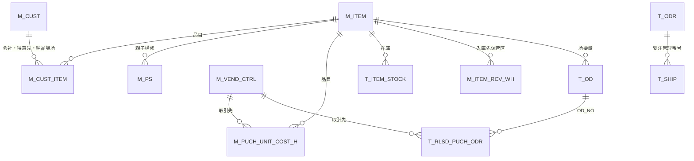

# MARI 基幹システム（Oracle）テーブル定義書

本書は、Oracle DBMS_METADATA 等から出力された DDL（スキーマ `EXPJ`）に基づき、指定されたテーブルの論理名・主キー・外部キー・役割を整理したものです。ソースは `d:\` 配下の各 `.sql` ファイルです。

## 1. 全体像

| 区分 | プレフィックス | 内容 |
|------|----------------|------|
| マスタ | `M_` | 得意先・品目・取引先・構成など参照系 |
| トランザクション | `T_` | 受注・出荷・発注・所要量など業務トラン |
| ワーク | `T_U_` | 帳票・バッチ用の一時／作業テーブル |

多くのテーブルに監査列（`CREATED_DATE` / `UPDATED_DATE` / `MODIFY_COUNT` 等）が共通定義されています。

## 2. テーブル間の主な関連（概念）

## 3. テーブル別定義

### 3.1 `M_CUST`（得意先）

| 項目 | 内容 |
|------|------|
| 主キー | `(COMPANY_CD, CUST_CD)` |
| 外部キー | DDL 上は未記載 |
| 概要 | 得意先の名称・分類・通貨・税・EDI・与信・リベート・内示有効期間など販売条件の中核マスタ。 |

主要カラム例: `CUST_NAME`（得意先名）、`CUR_CD`（通貨）、`TAX_APPLY_TYP`（消費税適用区分）、`UNCONFIRM_ODR_EFF_PRIOD`（内示有効期間）、`DEPO_TYP`（預託倉庫区分）、`CUST_CLASS_01_TYP`～`CUST_CLASS_10_NM`（得意先分類01～10）。

---

### 3.2 `M_CUST_ITEM`（得意先品目）

| 項目 | 内容 |
|------|------|
| 主キー | `(COMPANY_CD, CUST_CD, DLV_LOC_CD, CUST_ITEM_CD, ITEM_CD_OPTION_CHANGE_VALUE, EFF_PHASE_IN_DATE)` |
| 外部キー | DDL 上は未記載 |
| 概要 | 得意先視点の品目コードと自社 `ITEM_CD` の対応、有効期間、かんばん・税・用途別など。 |

---

### 3.3 `M_ITEM`（品目）

| 項目 | 内容 |
|------|------|
| 主キー | `(ITEM_CD)` |
| 外部キー | なし |
| 概要 | 品目マスタ。MRP・在庫単位・リードタイム・安全在庫・ロット・分類（`ITEM_CLASS_01`～12）、かんばん・原価関連拡張など大規模な属性を保持。 |

補助索引: `M_ITEM_IDX01 (ITEM_CD, MRP_ODR_TYP)`。

---

### 3.4 `M_PS`（製品構成）

| 項目 | 内容 |
|------|------|
| 主キー | `(PARENT_ITEM_CD, COMP_ITEM_CD, PS_EDITION)` |
| 外部キー | `PARENT_ITEM_CD` → `M_ITEM.ITEM_CD`、`COMP_ITEM_CD` → `M_ITEM.ITEM_CD` |
| 概要 | BOM（親子構成）、版数、有効期間、構成あたり数量（分子・分母）、所要展開・原価積上区分など。 |

---

### 3.5 `M_VEND_CTRL`（取引先マスタ）

| 項目 | 内容 |
|------|------|
| 主キー | `(COMPANY_CD, VEND_CD)` |
| 外部キー | なし |
| 概要 | 仕入先／支払条件・税・発注手段（帳票／FAX／EDI／メール）・リベート・輸入区分・取引先分類01～10 など。 |

補助索引: `PAYEE_CD`、`CUR_CD`、`COMPANY_CD`。

---

### 3.6 `M_PUCH_UNIT_COST_H`（購入単価ヘッダ）

| 項目 | 内容 |
|------|------|
| 主キー | `(COMPANY_CD, VEND_CD, ITEM_CD, PLANT_CD)` |
| 外部キー | `(COMPANY_CD, VEND_CD)` → `M_VEND_CTRL`；`ITEM_CD` → `M_ITEM`（`ON DELETE CASCADE`） |
| 概要 | 仕入先・工場・品目単位の購入単価ヘッダ。優先順位、取引先品目、材質・寸法など。 |

---

### 3.7 `M_ITEM_RCV_WH`（品目別入庫先保管区）

| 項目 | 内容 |
|------|------|
| 主キー | `(ITEM_CD, WH_CD)` |
| 外部キー | `ITEM_CD` → `M_ITEM.ITEM_CD` |
| 概要 | 品目ごとの標準的な入庫先保管区（`PLANT_CD` あり）。 |

---

### 3.8 `T_ODR`（確定受注）

| 項目 | 内容 |
|------|------|
| 主キー | `(ODR_CTL_NO)` |
| 外部キー | DDL 上は未記載 |
| 概要 | 確定受注の中核。数量・金額・納期・出荷累計・返品・EDI・かんばん・手配特性・承認など。`SHIP_FLG`（出荷指示済）、`DEL_FLG`（削除）。 |

`T_SHIP.ODR_CTL_NO` と論理的に連携。

---

### 3.9 `T_UNCNFM_ODR`（内示受注）

| 項目 | 内容 |
|------|------|
| 主キー | `(UNCNFM_ODR_CTL_NO)` |
| 外部キー | なし |
| 概要 | 内示（未確定）数量・所要日・計画取込・マニュアル更新フラグなど。確定受注（`T_ODR`）への前段データ。 |

---

### 3.10 `T_UNITE_ODR`（統合受注）

| 項目 | 内容 |
|------|------|
| 主キー | `(UNITE_ODR_CTL_NO)` |
| 外部キー | なし |
| 概要 | 確定・内示・デポ計画数量を束ねた統合ビュー用トラン。`FIX_ODR_QTY` / `UNOFFICIAL_ODR_QTY` / `DEPOT_QTY`、`OD_NO`（オーダデマンド）など。 |

---

### 3.11 `T_OD`（所要量）

| 項目 | 内容 |
|------|------|
| 主キー | `(OD_NO)` |
| 外部キー | `ITEM_CD` → `M_ITEM.ITEM_CD` |
| 概要 | MRP／製番連係のオーダデマンド。デマンド数・オーダ数・入出庫累計・構成版・親子 `PARENT_OD_NO` など。 |

`T_RLSD_PUCH_ODR.OD_NO` から参照される。

---

### 3.12 `T_RLSD_PUCH_ODR`（発注残）

| 項目 | 内容 |
|------|------|
| 主キー | `(PUCH_ODR_CD)` |
| 外部キー | `(COMPANY_CD, VEND_CD)` → `M_VEND_CTRL`；`OD_NO` → `T_OD.OD_NO`（有効）。`ITEM_CD` → `M_ITEM` は **DISABLE** |
| 概要 | 発注残・金額・税・EDI/FAX/MAIL 出力、受入完了、検査、直送、製番・管理No など購買実行の中心。 |

---

### 3.13 `T_PAST_INSPC_ACPT`（検収履歴）

| 項目 | 内容 |
|------|------|
| 主キー | `(PUCH_ODR_CD, ACPT_NO, INSPC_ACPT_NO)` |
| 外部キー | DDL 上は未記載 |
| 概要 | 発注に紐づく受入・検収の履歴。数量・金額・訂正・伝票種別など。 |

---

### 3.14 `T_SHIP`（出荷実績）

| 項目 | 内容 |
|------|------|
| 主キー | `(SHIP_SEQ_NO)` |
| 外部キー | DDL 上は未記載 |
| 概要 | `ODR_CTL_NO` で受注と連携。出荷日・数量・金額、仮売上・売上計上対象、納品書／出荷案内書出力フラグなど。 |

---

### 3.15 `T_SALES_TEMP`（仮売上実績）

| 項目 | 内容 |
|------|------|
| 主キー | `(SALES_SEQ_NO)` |
| 外部キー | なし |
| 概要 | 出荷連係の仮売上明細。税額の内外訳、`SALES_FLG`（売上計上）、`SHIP_SEQ_NO` 等で `T_SHIP` と論理連携。 |

---

### 3.16 `T_ITEM_STOCK`（保管区別品目在庫）

| 項目 | 内容 |
|------|------|
| 主キー | `(ITEM_CD, WH_CD)` |
| 外部キー | `ITEM_CD` → `M_ITEM.ITEM_CD` |
| 概要 | 保管区単位の手持・不良・前日末／前月末在庫、引当済数量など。 |

※DDL 上 `PLANT_CD` は主キーに含まれないが列として存在。

---

### 3.17 `T_U_MONTHLY_ODR_WORK`（月次発注ワーク）

| 項目 | 内容 |
|------|------|
| 主キー | **なし**（ワークテーブル） |
| 外部キー | なし |
| 概要 | ログインユーザ・仕入先・管理年月に紐づく日別数量（`DAY_01`～`26` / `QTY_01`～`26`）、次月内示、前後工程数量など、月次発注帳票用のフラットな作業領域。 |

---

## 4. 命名・プレフィックス早見

| 略語例 | 意味の目安 |
|--------|------------|
| `CUST` | 得意先 |
| `VEND` | 取引先（仕入先含む） |
| `ITEM` | 品目 |
| `ODR` | 受注（Order） |
| `OD` | オーダデマンド（所要） |
| `PUCH` | 購買（Purchase） |
| `DLV` | 納品・配送 |
| `SHIP` | 出荷 |
| `WH` | 保管区（倉庫） |
| `PS` | 製品構成（Product Structure） |
| `INSPC_ACPT` | 検収 |
| `UNCNFM` | 未確定（内示） |

---

## 5. 出典・注意

- スキーマ名は DDL 上 **`EXPJ`**。本番／検証でスキーマが異なる場合は置き換えてください。
- 一部 DDL では `COMMENT` が `)COMMENT ON TABLE` のように改行なしで連結されているため、エクスポートツール由来の形式差異があります。
- インデックス定義は本書では省略し、業務キー・外部キー中心に記載しています。

---

*作成: DDL コメントおよび制約定義に基づく整理（2026-05-11）。*
