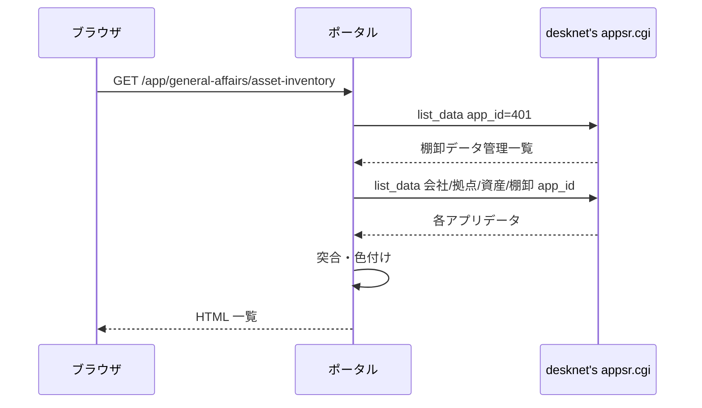

# 資産棚卸結果 機能仕様書

本書は、desknet's NEO 上の **棚卸データ管理・資産データ・棚卸データ** を AppSuite API で取得し、**資産台帳と現地棚卸実績を突合した結果** を総務担当者が Web 上で確認・CSV 出力するための要件を定義する。

提供された CSV ファイル（資産データ・棚卸データ・棚卸データ管理）は **API レスポンスのスキーマ確認用サンプル** であり、本機能では **CSV 取込は行わない**。データは **画面表示のたびに desknet's API から再取得** する。

## 1. 文書情報

| 項目 | 内容 |
|------|------|
| プログラム名 | **資産棚卸結果** |
| 親システム | 業務支援ポータル |
| 配置メニュー | 総務 > 資産棚卸結果 |
| 文書の目的 | desknet's 連携・突合ロジック・表示・CSV 出力を実装可能な粒度で固定する |
| 想定読者 | 業務担当（総務）、ベンダー開発者、テスト担当、プロジェクト関係者 |
| 関連実装（予定） | Django アプリ `asset_inventory` 配下の domain / usecase / infrastructure / views / templates / static |
| 関連ドキュメント | [資産棚卸結果_テスト仕様書.md](./資産棚卸結果_テスト仕様書.md)、[アプリケーション仕様書.md](../../アプリケーション仕様書.md) §6（認証）、[desknet's AppSuite API 仕様](https://www.desknets.com/neo/help_apps/ja_JP/appendix/api/001.html) |

### 1.1 実装技術（ポータル共通前提）

| 区分 | 内容 |
|------|------|
| Web | Python + Django |
| 認証 | Django 認証 + desknet's NEO Login API（暫定） / Microsoft Entra ID（将来） |
| 業務データ | desknet's NEO **AppSuite API**（`appsr.cgi`、`action=list_data`）。**読取のみ** |
| ポータル DB | PostgreSQL（本機能では業務データを **永続化しない**。認可・お気に入り等はポータル共通） |
| CSV 出力 | サーバー側で **UTF-8 BOM 付き** CSV を生成（エクスポート専用。取込なし） |

### 1.2 レイヤー構成（クリーンアーキテクチャ・5年9組準拠）

| レイヤー | パス | 責務 |
|----------|------|------|
| インターフェース | `views.py`, `templates/` | HTTP 入出力。`composition` 経由でユースケース呼び出し |
| コンポジション | `composition.py` | ユースケース組み立て・desknet ゲートウェイ注入 |
| ユースケース | `usecase/usecase_*.py` | ユースケース（画面・API 単位） |
| ドメイン | `domain/` | 突合キー正規化・重複解決・変化点判定・行色区分・表示列マッピング |
| インフラ | `infrastructure/desknet/` | AppSuite API クライアント・レスポンス正規化 |

**ユースケース一覧（`usecase/`）**

| ファイル | クラス | 概要 |
|----------|--------|------|
| `usecase_list_page.py` | `ListPageUsecase` | 棚卸データ管理一覧・突合結果一覧（SSR） |
| `usecase_reconcile.py` | `ReconcileUsecase` | 選択した管理行に基づく API 取得・突合 |
| `usecase_export_csv.py` | `ExportCsvUsecase` | 突合結果 CSV 出力 |

補助モジュールは domain に集約する。`domain/match_key.py`（突合キー）、`domain/inventory_dedup.py`（棚卸重複解決）、`domain/field_compare.py`（変化点・工場変化判定）、`domain/row_display.py`（表示列・行色）、`domain/list_filter.py`（突合結果・拠点フィルタ）、`domain/reconcile.py`（突合本体）、`domain/ports.py`（DTO・ポート型）が担当する。desknet's への HTTP は `infrastructure/desknet/client.py` と `infrastructure/desknet/record_mapper.py` が担当する。`usecase/` には `usecase_*.py` のみを置く。

**identity 連携（前提改修）**

AppSuite API 呼び出しには Login API の `access_key` が必要である（[共通 API 仕様](https://www.desknets.com/neo/help_apps/ja_JP/appendix/api/002.html)）。現行の `desknet_login` は `desknet_user_id` / `desknet_default_group_id` のみセッション保存しており **`access_key` を保持していない**。本アプリ実装と同時に、ログイン成功時に `request.session["desknet_access_key"]` を保存する改修を行う（有効期限は desknet's 仕様どおりログイン後 3 日間）。

---

## 2. 背景・業務目的

### 2.1 背景

固定資産の棚卸は desknet's NEO 上で **資産台帳（資産データ）** と **現地読取結果（棚卸データ）** を別アプリで管理している。**棚卸データ管理** アプリで年度・会社・拠点・対象データセットをひとまとめに定義し、総務が突合結果を確認する運用を想定する。

### 2.2 本機能の目的

| 目的 | 内容 |
|------|------|
| 突合の可視化 | 台帳と棚卸実績を **資産番号＋資産枝番** で突合し、棚卸済み・未棚卸・台帳外を一覧する |
| 差異の強調 | 突合済み行について、台帳との **変化点**・**工場（拠点）変化** を色分けして示す |
| 帳票出力 | 画面と同条件の結果を **CSV ダウンロード** できるようにする |
| データの正 | desknet's を **唯一のデータソース** とし、都度 API 再取得で最新状態を表示する |

---

## 3. システム境界・前提

| 区分 | 内容 |
|------|------|
| desknet's NEO | **参照のみ**（`list_data`）。INSERT / UPDATE / DELETE は行わない |
| データ鮮度 | **画面表示・CSV 出力のたびに API 再取得**（キャッシュ・スナップショット保存なし） |
| 認証 | Django 認証（ログイン必須）。未ログインは `/login` へ遷移、API は 401 |
| desknet's 認可 | ログインユーザーの `access_key` で API を呼び出す。desknet's 側の参照権限に従う |
| 権限 | **総務** メニューグループを持つ一般ユーザーおよび管理者が利用可能（§9） |
| CSV サンプル | 開発・テストの fixture 作成の参考。**本番データ経路には使わない** |

### 3.1 desknet's アプリ対応（本番想定）

サンプル CSV および業務ヒアリングに基づく対応。部品名は desknet's の **field_name**（日本語部品名）を第一とする。API 設定で部品識別子を使う場合は `field_alias` に読み替える。

| app_id | アプリ名（desknet's） | 用途 |
|--------|----------------------|------|
| **401** | 棚卸データ管理 | 突合対象の選択。各行が他 app_id を参照 |
| （行参照） | 会社マスタ | 管理行の「会社マスタ」列の app_id（例: 394） |
| （行参照） | 拠点マスタ | 管理行の「拠点マスタ」列の app_id（例: 395） |
| （行参照） | 資産データ | 管理行の「資産データ」列の app_id（例: 415） |
| （行参照） | 棚卸データ | 管理行の「棚卸データ」列の app_id（例: 408） |

**棚卸データ管理（app_id=401）の主要部品（サンプル CSV より）**

| 部品名 | 用途 |
|--------|------|
| データID | 管理行の識別子（画面選択キー） |
| 棚卸名称 | 画面セレクトの表示ラベル（例: `2025年`） |
| 年度 | 補助表示 |
| 会社マスタ | 参照先 app_id（数値文字列） |
| 拠点マスタ | 参照先 app_id |
| 資産データ | 参照先 app_id |
| 棚卸データ | 参照先 app_id |

**資産データの主要部品（サンプル CSV より）**

`データID`, `資産番号`, `資産枝番`, `管理部門コード`, `管理者コード`, `管理者名称`, `メーカー`, `摘要`, `管理部門名称`, `旧資産番号コード`, `型番`, `使用区分`, `使用区分コード` 等。

**棚卸データの主要部品（サンプル CSV より）**

資産データと共通の部品に加え、`棚卸日時`, `棚卸実施者`, `プレート作成`, `資産写真`, `資産プレート写真` 等。

**会社マスタ・拠点マスタ**

管理行が参照する app_id で `list_data` 取得し、**拠点解決・工場変化判定・画面フィルタ** に利用する。拠点マスタは **管理部門コード**（資産／棚卸データの `管理部門コード`）と突合して拠点情報を解決する。具体的な部品名は desknet's 設定に合わせ実装時に `record_mapper` で固定する（初版ではサンプル運用データから **拠点を識別できるコード列＋拠点名列** を特定し、仕様書改訂履歴に記載する）。

### 3.2 AppSuite API 呼び出し

| 項目 | 内容 |
|------|------|
| エンドポイント | `DESKNETS_LOGIN_URL` のホストを流用し、パスを `/cgi-bin/dneo/appsr.cgi` に置換（`dneo.cgi` → `appsr.cgi`） |
| 認証ヘッダー | `X-Desknets-Auth: {access_key}`（セッションの `desknet_access_key`） |
| 一覧取得 | `action=list_data`, `app_id={app_id}` |
| ページング | `offset` / `limit`（1 リクエスト最大 **5000** 件）。全件取得するまで繰り返す |
| 部品指定 | 必要部品のみ `fields` JSON で指定（性能・転送量削減） |
| エラー | `status != ok` または HTTP エラー時はユーザー向けメッセージを表示し、一覧は空 |

---

## 4. 画面（ルーティング）

| 画面 ID | 画面 | ルート | 概要 |
|---------|------|--------|------|
| SCR-01 | 突合結果一覧 | `/app/general-affairs/asset-inventory` | 棚卸データ管理の選択・突合結果表示・CSV 出力 |

### 4.1 一覧画面（SCR-01）

#### 4.1.1 操作フロー

1. 画面表示時、`app_id=401` で棚卸データ管理を API 取得し、**棚卸名称** の昇順でセレクトボックスに表示する。
2. クエリ `managementId`（データID）で選択行を特定する。未指定時は **先頭行** を選択する。
3. 選択行から参照 app_id を読み、**会社マスタ・拠点マスタ・資産データ・棚卸データ** を API 取得する（並列可）。
4. ドメイン層で突合し、一覧・件数サマリを表示する。
5. **再表示**（棚卸選択変更・フィルタ変更・ページング・ソート）のたびに **手順 3〜4 を再実行** する（API 再取得）。

#### 4.1.2 画面上部

| 要素 | 内容 |
|------|------|
| タイトル | `資産棚卸結果`（お気に入りハートはタイトル横） |
| 棚卸選択 | ラベル `棚卸` + セレクト（`棚卸名称` / `年度` 表示。例: `2025年（2025）`） |
| 会社・拠点 | 選択管理行に紐づく会社マスタ・拠点マスタから解決した名称を補足表示（取得不能時は非表示） |
| 件数サマリ | `棚卸済み N 件 / 未棚卸 N 件 / 台帳外 N 件`（**フィルタ適用後** の件数。§4.1.3） |
| CSV 出力 | ボタン `CSV出力`。現在のフィルタ・ソート順でダウンロード（§7.2） |
| 取得中表示 | API 取得中は半透明オーバーレイとスピナー「データを取得中...」 |

#### 4.1.3 フィルタ

一覧カード見出し（棚卸選択・件数サマリ）の直下に **フィルター** 枠を表示する。フィルタは **突合結果** と **拠点** の 2 項目とする。変更時はクエリパラメータを更新して再表示する（API 再取得 → 突合 → フィルタ適用）。

| フィルタ | UI | クエリ | 既定 | 内容 |
|----------|-----|--------|------|------|
| 突合結果 | セレクト | `status` | `all` | `すべて`（`all`）/ `棚卸済み`（`matched`）/ `未棚卸`（`asset_only`）/ `台帳外`（`inventory_only`） |
| 拠点 | チェックボックス複数選択 | `site`（繰り返し可） | 未指定＝全拠点 | 拠点マスタの拠点名（§4.1.3a）。1 件以上チェック時のみ絞り込み |

**適用ルール**

| 項目 | 内容 |
|------|------|
| 結合 | 突合結果フィルタと拠点フィルタは **AND** |
| 対象列 | 拠点フィルタは一覧の **`拠点名` 列**（表示用。データソースは §4.1.4 のとおり `管理部門名称`）と **TRIM 後完全一致** で照合 |
| 未棚卸行 | 資産データの `管理部門名称` を `拠点名` として照合 |
| 拠点名が空 | 拠点が 1 件以上選択されているときは **非表示**。未選択（全拠点）のときは表示 |
| 件数サマリ | フィルタ適用 **後** の件数を表示 |
| ページング | フィルタ適用後の行数に対してページング |
| CSV | 画面と同一フィルタを適用した行のみ出力 |
| 棚卸選択変更 | `managementId` 変更時は `site` クエリを **クリア** し、拠点候補を再構築 |

フィルタ変更時も **API 再取得**（§4.1.1 手順 3〜4）のうえでサーバ側絞り込みを行う。

#### 4.1.3a 拠点フィルタ（詳細）

| 項目 | 内容 |
|------|------|
| 候補の出所 | 選択中の棚卸データ管理行が参照する **拠点マスタ**（app_id）を `list_data` で取得し、マスタ上の **拠点名** 部品の値を候補とする |
| 候補の並び | 拠点名の **昇順**（日本語ロケール）。重複は除去 |
| 表示ラベル | チェックボックス + 拠点名。見出しラベルは `拠点` |
| 操作補助 | `すべて選択` / `すべて解除` リンクを併設（任意だが初版で実装） |
| 件数表示 | 選択中拠点数を `N 拠点選択中` と補足表示（1 件以上選択時のみ） |
| マスタ 0 件 | 拠点フィルタ UI は非表示または「拠点マスタなし」と表示し、拠点による絞り込みは無効 |

拠点マスタの部品名（拠点コード・拠点名等）は desknet's 設定に合わせ `record_mapper` で固定する。フィルタ候補に使うのは **拠点名** 部品とし、行の `管理部門名称` と文字列一致で突合する（§5.5 の工場変化判定で用いる **管理部門コード → 拠点マスタ** 解決とは別経路。フィルタは表示列 `拠点名` を正とする）。

#### 4.1.4 一覧列

表示データの出所は **棚卸データ側の部品値** を基本とし、画面ラベルは次の対応で表示する（ユーザー指定の組み合わせ）。

| # | 画面列名 | データソース部品（棚卸データ） | 備考 |
|---|----------|-------------------------------|------|
| 0 | 突合結果 | （突合ロジック） | `棚卸済み` / `未棚卸` / `台帳外` |
| 1 | 資産番号 | 資産番号 | 画面は原値表示。突合キーは §5.1 |
| 2 | 資産枝番 | 資産枝番 | |
| 3 | 拠点名 | 管理部門名称 | |
| 4 | メーカー名 | メーカー | |
| 5 | 型番 | 管理者名称 | |
| 6 | シリアルNo. | 型番 | |
| 7 | 旧資産番号 | 旧資産番号コード | |
| 8 | 使用区分 | 使用区分 | |
| 9 | 摘要 | 摘要 | |
| 10 | プレート作成 | プレート作成 | |
| 11 | 棚卸実施者 | 棚卸実施者 | |
| 12 | 棚卸日時 | 棚卸日時 | |

**行ごとのデータ出所**

| 突合結果 | データ出所 |
|----------|------------|
| 棚卸済み | 棚卸データ（重複解決後 §5.2） |
| 台帳外 | 棚卸データ（重複解決後） |
| 未棚卸 | **資産データ** を同じ列マッピングで表示（`管理部門名称`→拠点名 等）。`プレート作成`・`棚卸実施者`・`棚卸日時` は **空** |

#### 4.1.5 行の背景色（突合結果に応じた色付け）

| 条件 | 背景色 | CSS 目安 |
|------|--------|------------|
| 突合結果 **なし**（未棚卸・台帳外） | 白 | `#ffffff` または透明 |
| 棚卸済み ＋ **変化点なし** | 薄い緑 | `#dcfce7` |
| 棚卸済み ＋ **変化点あり** ＋ 工場変化なし | 薄い黄 | `#fef9c3` |
| 棚卸済み ＋ **変化点あり** ＋ **工場変化あり** | 薄い青 | `#dbeafe` |

色の優先順位: **工場変化あり（青）** > **変化点あり（黄）** > **変化点なし（緑）** > **突合なし（白）**。

凡例を一覧カード内に常時表示する（「緑: 一致 / 黄: 差異あり / 青: 拠点変更あり / 白: 未突合」）。

#### 4.1.6 ページング・ソート

| 項目 | 内容 |
|------|------|
| ページサイズ | 100 件（ポータル共通テーブル UI に合わせる） |
| 既定ソート | 資産番号昇順 → 資産枝番昇順 |
| ソート | 各列ヘッダクリックで昇順／降順切替（文字列・日時は自然順） |

---

## 5. 突合ロジック

### 5.1 突合キー

| 項目 | ルール |
|------|--------|
| キー構成 | `normalize(資産番号)` + `|` + `normalize(資産枝番)` |
| 資産番号の正規化 | 前後空白 TRIM。先頭が `L` または `l` のとき **1 文字除去** してから比較（例: `L5262` と `5262` は同一キー） |
| 資産枝番の正規化 | 前後空白 TRIM。空は空文字のまま |

### 5.2 棚卸データの重複解決

同一突合キーに棚卸データが複数行ある場合、**棚卸日時が最も新しい行を 1 件採用** する。

- `棚卸日時` のパース形式: `YYYY/MM/DD HH:MM:SS`（desknet's サンプル準拠）。パース不能行は **最古扱い**（他行より優先度低）。
- 同日内時刻相同のときは `データID` 昇順で tie-break。

### 5.3 突合結果区分（3 区分）

| 区分 | 表示ラベル | 条件 |
|------|------------|------|
| MATCHED | **棚卸済み** | 資産データと棚卸データの両方にキーが存在 |
| ASSET_ONLY | **未棚卸** | 資産データにのみ存在 |
| INVENTORY_ONLY | **台帳外** | 棚卸データにのみ存在 |

「突合済み」は業務上 **棚卸済み** と表記する。

### 5.4 変化点判定（棚卸済み行のみ）

資産データ行（台帳）と、採用した棚卸データ行を、次の **対応部品** について **TRIM 後文字列完全一致** で比較する。いずれか 1 つでも異なれば **変化点あり**。

| 比較項目 | 資産データ部品 | 棚卸データ部品 |
|----------|----------------|----------------|
| 拠点名 | 管理部門名称 | 管理部門名称 |
| メーカー名 | メーカー | メーカー |
| 型番 | 管理者名称 | 管理者名称 |
| シリアルNo. | 型番 | 型番 |
| 旧資産番号 | 旧資産番号コード | 旧資産番号コード |
| 使用区分 | 使用区分 | 使用区分 |
| 摘要 | 摘要 | 摘要 |

両方空の場合は一致とみなす。

### 5.5 工場変化判定（変化点ありのときのみ評価）

| 項目 | ルール |
|------|--------|
| 前提 | 棚卸済みかつ変化点あり |
| 判定 | 資産データの `管理部門コード` と棚卸データの `管理部門コード` を、管理行が参照する **拠点マスタ** で解決した **拠点識別子**（拠点マスタ上の一意キー。初版実装で部品を確定）が **異なる** 場合に **工場変化あり** |
| 解決不能 | 拠点マスタに該当コードがない場合は **工場変化なし**（黄色のまま） |

**会社マスタ** は、画面の会社名表示および将来の会社単位フィルタ拡張に利用する。初版の工場変化判定は **拠点マスタ** を正とする。

### 5.6 行色区分の導出

```
if 突合結果 in (未棚卸, 台帳外):
    row_tone = NONE          # 白
elif not 変化点あり:
    row_tone = MATCH_CLEAN   # 薄緑
elif 工場変化あり:
    row_tone = MATCH_FACTORY # 薄青
else:
    row_tone = MATCH_DIFF    # 薄黄
```

---

## 6. desknet's データ取得シーケンス



取得順序の推奨:

1. 棚卸データ管理（401）
2. 選択行の 会社マスタ・拠点マスタ・資産データ・棚卸データ（各 app_id、それぞれ全ページ取得）

---

## 7. API 仕様（ポータル）

### 7.1 `GET /app/general-affairs/asset-inventory`

- **認証**: 必須
- **権限**: 総務グループまたは管理者
- **クエリ**: `managementId`, `status`（§4.1.3）, `site`（拠点名・複数可、§4.1.3a）, `page`, `sort`, `dir`
- **処理**: §6 のとおり desknet's 再取得 → 突合 → SSR

### 7.2 `GET /api/asset-inventory/export.csv`

- **認証**: 必須
- **権限**: 総務グループまたは管理者
- **クエリ**: 一覧画面と同一（`managementId`, `status`, `site`, `sort`, `dir`）。`page` は無視し **全件** 出力
- **応答**: UTF-8 BOM 付き CSV
- **列順**: `突合結果`, `行色区分`, §4.1.4 の 12 列（画面列名）

`行色区分` の値: `一致` / `差異あり` / `拠点変更あり` / `未突合`

### 7.3 エラー応答

| HTTP | 条件 |
|------|------|
| 401 | 未ログイン |
| 403 | 総務権限なし |
| 503 | `desknet_access_key` 欠落・期限切れ（メッセージ: desknet's 再ログインを促す） |
| 502 | desknet's API 障害 |

---

## 8. 権限・メニュー

| 項目 | 内容 |
|------|------|
| メニューキー | `asset-inventory` |
| メニュー表示名 | 資産棚卸結果 |
| グループ | `general-affairs`（総務） |
| URL | `/app/general-affairs/asset-inventory` |
| お気に入り | タイトル横ハート（ポータル共通） |

`apps/portal/domain/menu.py` およびメニュー権限マスタに追加する。

---

## 9. 非機能要件

| 項目 | 内容 |
|------|------|
| タイムアウト | desknet's 1 リクエスト `DESKNETS_TIMEOUT_SECONDS`（既定 10 秒） |
| ログ | `access_key`・パスワードをログに出さない |
| テスト | [資産棚卸結果_テスト仕様書.md](./資産棚卸結果_テスト仕様書.md)。ドメイン単体を CI で必須とし、desknet's はモック |
| クリーンアーキテクチャ | `tests/test_clean_architecture.py` に `asset_inventory` を追加 |

---

## 10. 改訂履歴

| 版 | 日付 | 内容 |
|----|------|------|
| 1.0 | 2026-06-23 | 初版。desknet's API 専用・突合 3 区分・表示列マッピング・行色・L 除去突合・棚卸重複は最新日時採用 |
| 1.1 | 2026-06-23 | 拠点フィルタを詳細化（拠点マスタ候補・複数選択・AND 条件・件数サマリ／CSV 連動） |
