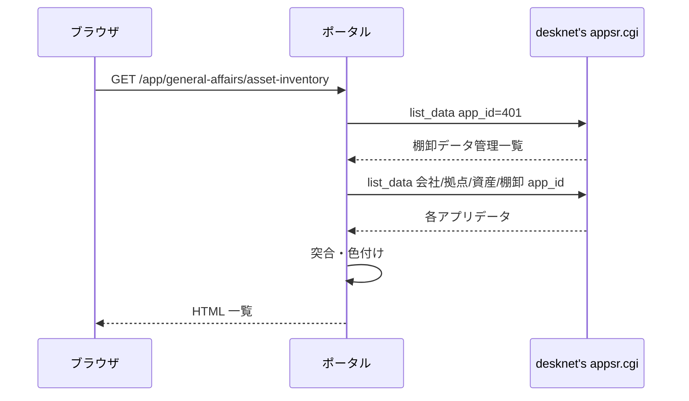

# 資産棚卸結果 機能仕様書

本書は、desknet's NEO 上の **棚卸データ管理・資産データ・棚卸データ** を AppSuite API で取得し、**資産台帳と現地棚卸実績を突合した結果** を総務担当者が Web 上で確認・CSV 出力するための要件を定義する。

提供された CSV ファイル（資産データ・棚卸データ・棚卸データ管理）は **API レスポンスのスキーマ確認用サンプル** であり、本機能では **CSV 取込は行わない**。データは **画面表示のたびに desknet's API から再取得** する。

## 1. 文書情報

| 項目 | 内容 |
|------|------|
| プログラム名 | **資産棚卸結果** |
| 親システム | 業務支援ポータル |
| 配置メニュー | 総務 > 資産棚卸結果 |
| 文書の目的 | desknet's 連携・突合ロジック・表示・CSV 出力を実装可能な粒度で固定する |
| 想定読者 | 業務担当（総務）、ベンダー開発者、テスト担当、プロジェクト関係者 |
| 関連実装 | Django アプリ `asset_inventory` 配下の domain / usecase / infrastructure / views / templates / static（**実装済み**） |
| 関連ドキュメント | [資産棚卸結果_テスト仕様書.md](./資産棚卸結果_テスト仕様書.md)、[アプリケーション仕様書.md](../../アプリケーション仕様書.md) §6（認証）、[desknet's AppSuite API 仕様](https://www.desknets.com/neo/help_apps/ja_JP/appendix/api/001.html) |

### 1.1 実装技術（ポータル共通前提）

| 区分 | 内容 |
|------|------|
| Web | Python + Django |
| 認証 | Django 認証 + desknet's NEO Login API（暫定） / Microsoft Entra ID（将来） |
| 業務データ | desknet's NEO **AppSuite API**（`appsr.cgi`、`action=list_data`）。**読取のみ** |
| ポータル DB | PostgreSQL（本機能では業務データを **永続化しない**。認可・お気に入り等はポータル共通） |
| CSV 出力 | サーバー側で **UTF-8 BOM 付き** CSV を生成（エクスポート専用。取込なし） |

### 1.2 レイヤー構成（クリーンアーキテクチャ・5年9組準拠）

| レイヤー | パス | 責務 |
|----------|------|------|
| インターフェース | `views.py`, `templates/` | HTTP 入出力。`composition` 経由でユースケース呼び出し |
| コンポジション | `composition.py` | ユースケース組み立て・desknet ゲートウェイ注入 |
| ユースケース | `usecase/usecase_*.py` | ユースケース（画面・API 単位） |
| ドメイン | `domain/` | 突合キー正規化・重複解決・変化点判定・行色区分・表示列マッピング |
| インフラ | `infrastructure/desknet/` | AppSuite API クライアント・レスポンス正規化 |

**ユースケース一覧（`usecase/`）**

| ファイル | クラス | 概要 |
|----------|--------|------|
| `usecase_list_page.py` | `ListPageUsecase` | 棚卸データ管理一覧・API 取得・突合結果一覧（SSR） |
| `usecase_export_csv.py` | `ExportCsvUsecase` | 突合結果 CSV 出力 |

補助モジュールは domain に集約する。`domain/match_key.py`（突合キー）、`domain/inventory_dedup.py`（棚卸重複解決）、`domain/asset_filter.py`（棚卸対象資産の固定フィルタ）、`domain/field_compare.py`（変化点・工場変化判定）、`domain/row_display.py`（表示列・行色）、`domain/list_filter.py`（突合結果・拠点・資産番号フィルタ）、`domain/reconcile.py`（突合本体）、`domain/reconcile_cache.py`（突合結果のセッション serialize/deserialize）、`domain/reconcile_data.py`（突合データの取得またはセッションキャッシュ読込）、`domain/list_client_data.py`（ブラウザ用一覧 JSON 組み立て）、`domain/desknet_data.py`（管理行・4 app 取得オーケストレーション）、`domain/errors.py`（desknet's API 例外）、`domain/ports.py`（DTO・ポート型）が担当する。desknet's への HTTP は `infrastructure/desknet/client.py` が担当する（`record_field_value` で API `val` 抽出）。`usecase/` には `usecase_*.py` のみを置く。

**identity 連携（実装済み）**

AppSuite API 呼び出しには Login API の `access_key` が必要である（[共通 API 仕様](https://www.desknets.com/neo/help_apps/ja_JP/appendix/api/002.html)。ログイン成功時に `request.session["desknet_access_key"]` を保存する（`apps/identity/views.py`）。有効期限は desknet's 仕様どおりログイン後 3 日間。ログアウト時は Django セッション破棄によりキーも削除される。

**資産棚卸結果** の AppSuite API は、環境変数 `DESKNETS_ASSET_INVENTORY_LOGIN_ID` / `DESKNETS_ASSET_INVENTORY_PASSWORD` に **棚卸関連アプリ（棚卸データ管理・資産データ・棚卸データ等）の参照権限を持つ desknet's アカウント** を設定した場合、そのアカウントで API を呼び出す（ポータル総務権限を持つユーザーが、個別の desknet's アプリ権限なしで利用できるようにする）。未設定時はログインユーザーの `access_key` を使用する。

---

## 2. 背景・業務目的

### 2.1 背景

固定資産の棚卸は desknet's NEO 上で **資産台帳（資産データ）** と **現地読取結果（棚卸データ）** を別アプリで管理している。**棚卸データ管理** アプリで年度・会社・拠点・対象データセットをひとまとめに定義し、総務が突合結果を確認する運用を想定する。

### 2.2 本機能の目的

| 目的 | 内容 |
|------|------|
| 突合の可視化 | 台帳と棚卸実績を **資産番号＋資産枝番** で突合し、棚卸済み・未棚卸・台帳外を一覧する |
| 差異の強調 | 突合済み行について、台帳との **変化点**・**工場（拠点）変化** を色分けして示す |
| 帳票出力 | 画面と同条件の結果を **CSV ダウンロード** できるようにする |
| データの正 | desknet's を **唯一のデータソース** とし、都度 API 再取得で最新状態を表示する |

---

## 3. システム境界・前提

| 区分 | 内容 |
|------|------|
| desknet's NEO | **参照のみ**（`list_data`）。INSERT / UPDATE / DELETE は行わない |
| データ鮮度 | **棚卸選択（`managementId`）変更時のみ** desknet's API で資産・棚卸・拠点マスタを再取得。同一棚卸内のフィルタ・ソート・ページング・CSV は **Django セッションに保存した突合結果** を再利用する（TTL・手動再取得なし） |
| 認証 | Django 認証（ログイン必須）。未ログインは `/login` へ遷移、API は 401 |
| desknet's 認可 | **ポータルの総務権限**で画面利用可否を制御する。AppSuite API は **`DESKNETS_ASSET_INVENTORY_LOGIN_ID` / `PASSWORD` が設定されている場合はサービス連携アカウント**の `access_key` を使用する（設定がなければログインユーザーの `access_key` を使用し、desknet's 側の参照権限に従う） |
| 権限 | **総務** メニューグループを持つ一般ユーザーおよび管理者が利用可能（§9） |
| CSV サンプル | 開発・テストの fixture 作成の参考。**本番データ経路には使わない** |

### 3.1 desknet's アプリ対応（本番想定）

サンプル CSV および業務ヒアリングに基づく対応。部品名は desknet's の **field_name**（日本語部品名）を第一とする。API 設定で部品識別子を使う場合は `field_alias` に読み替える。

| app_id | アプリ名（desknet's） | 用途 |
|--------|----------------------|------|
| **401** | 棚卸データ管理 | 突合対象の選択。各行が他 app_id を参照 |
| （行参照） | 会社マスタ | 管理行の「会社マスタ」列の app_id（例: 394） |
| （行参照） | 拠点マスタ | 管理行の「拠点マスタ」列の app_id（例: 395） |
| （行参照） | 資産データ | 管理行の「資産データ」列の app_id（例: 415） |
| （行参照） | 棚卸データ | 管理行の「棚卸データ」列の app_id（例: 408） |

**棚卸データ管理（app_id=401）の主要部品（サンプル CSV より）**

| 部品名 | 用途 |
|--------|------|
| データID | 管理行の識別子（画面選択キー） |
| 棚卸項目 | 画面セレクトの表示ラベル（例: `2025年`） |
| 年度 | 補助表示 |
| 会社マスタ | 参照先 app_id（数値文字列） |
| 拠点マスタ | 参照先 app_id |
| 資産データ | 参照先 app_id |
| 棚卸データ | 参照先 app_id |

**資産データの主要部品（サンプル CSV より）**

`データID`, `資産番号`, `資産枝番`, `管理部門コード`, `管理者コード`, `管理者名称`, `メーカー`, `摘要`, `管理部門名称`, `旧資産番号コード`, `型番`, `使用区分`, `使用区分コード`, `生産品番⑧コード` 等。

**棚卸対象資産（固定フィルタ）**

資産データ取得後、突合の前に **`生産品番⑧コード` が `1` の行のみ** を台帳側の対象とする（TRIM 後文字列一致）。`1` 以外・空の行は未棚卸候補から除外する。棚卸データはフィルタしない（台帳外判定のため）。

**棚卸データの主要部品（サンプル CSV より）**

資産データと共通の部品に加え、`棚卸日時`, `棚卸実施者`, `プレート作成`, `資産写真`, `資産プレート写真` 等。

**会社マスタ・拠点マスタ**

管理行が参照する app_id で `list_data` 取得し、**拠点解決・工場変化判定・画面フィルタ** に利用する。拠点マスタは **管理部門コード**（資産／棚卸データの `管理部門コード`）と突合して拠点情報を解決する。具体的な部品名は desknet's 設定に合わせ実装時に `record_mapper` で固定する（初版ではサンプル運用データから **拠点を識別できるコード列＋拠点名列** を特定し、仕様書改訂履歴に記載する）。

### 3.2 AppSuite API 呼び出し

| 項目 | 内容 |
|------|------|
| エンドポイント | `DESKNETS_LOGIN_URL` のホストを流用し、パスを `/cgi-bin/dneo/appsr.cgi` に置換（`dneo.cgi` → `appsr.cgi`） |
| 認証ヘッダー | `X-Desknets-Auth: {access_key}`（セッションの `desknet_access_key`） |
| 一覧取得 | `POST` `action=list_data`, `app_id={app_id}` |
| ページング | `offset` / `limit`（1 リクエスト最大 **5000** 件）。全件取得するまで繰り返す |
| 部品指定 | `fields` に `[{"field_name":"部品名"},…]` 形式の JSON 文字列を指定（desknet's AppSuite API 仕様どおり） |
| エラー | `status != ok` または HTTP エラー時はユーザー向けメッセージを表示し、一覧は空 |

---

## 4. 画面（ルーティング）

| 画面 ID | 画面 | ルート | 概要 |
|---------|------|--------|------|
| SCR-01 | 突合結果一覧 | `/app/general-affairs/asset-inventory` | 棚卸データ管理の選択・突合結果表示・CSV 出力 |

### 4.1 一覧画面（SCR-01）

#### 4.1.1 操作フロー

1. 画面表示時、`app_id=401` で棚卸データ管理を API 取得し、**棚卸項目** の昇順でセレクトボックスに表示する。
2. クエリ `managementId`（データID）で選択行を特定する。未指定時は **先頭行** を選択する。
3. 選択行から参照 app_id を読み、**会社マスタ・拠点マスタ・資産データ・棚卸データ** を API 取得する（並列可）。
4. 資産データに **§3.1 の棚卸対象固定フィルタ** を適用する。
5. ドメイン層で突合し、一覧・件数サマリを表示する。
6. **突合結果のキャッシュ**（`request.session["asset_inventory_reconcile_cache"]`）に、選択中 `managementId`・突合後全行・件数・拠点候補・資産番号候補を保存する。
7. **再表示**の API 呼び出しは次のとおり分岐する。
   - **棚卸データ管理（`app_id=401`）**: 画面表示のたびに API 取得（棚卸セレクト用）。
   - **資産・棚卸・拠点マスタ（手順 3〜6）**: **`managementId` がキャッシュと一致する場合は API 再取得しない**。
   - **`managementId` 変更**・キャッシュなし・キャッシュの `managementId` 不一致時は手順 3〜6 を実行しキャッシュを更新する。
   - **棚卸未選択**時はキャッシュを破棄する。
8. **フィルタ・ソート・ページング**（棚卸結果・プレート作成・拠点・資産番号・列ヘッダ・並び替えダイアログ・表示件数・前へ/次へ）は **ブラウザ内でローカル処理** する。初回表示時に突合後全行を `aiv-list-data`（JSON）として埋め込み、変更時は **ページ再読み込みなし** で表・件数サマリ・ページングを更新する。URL は `history.replaceState` で同期する（ブックマーク・共有用）。
9. **CSV 出力**はサーバ側セッションキャッシュを利用する（クエリは URL 同期値を使用）。

#### 4.1.2 画面上部

| 要素 | 内容 |
|------|------|
| タイトル | `資産棚卸結果`（お気に入りハートはタイトル横）。ハートの右に説明文 `資産台帳と棚卸データを突合し、棚卸結果を表示します。`（`portal-page-description`・検収書比較同型） |
| 棚卸選択 | 白いカード（`portal-search-disclosure` + `receipt-filter`）内のセレクト。ラベル `棚卸` はセレクトの**左**に横並び表示。セレクト表示は `棚卸項目（YYYY年度）` 形式。先頭 option は `選択してください`。**初回表示は未選択**。カード**下辺**に枠と一体のコンパクトなトグル帯（**折りたたむ**／**展開**、12px）を配置（`<summary>` は DOM 先頭・CSS `order` で下辺表示）。**ページを開くたびに展開**（開閉状態は保存しない） |
| 棚卸結果枠 | 常時表示する `card`（検収書比較の「比較結果」枠と同型 `receipt-results-card`）。見出し `棚卸結果`。未選択時は枠内に `棚卸を選択してください。`（`favorite-empty`）。**画面下部いっぱいに伸長**（検収書比較同型の flex / grid レイアウト） |
| 棚卸の色分け | 棚卸結果枠右上。ダイアログで行背景色の意味を表示（§4.1.5） |
| CSV 出力 | 棚卸結果枠右上。棚卸選択時のみ表示 |
| 取得中表示 | API 取得中は半透明オーバーレイとスピナー「データを取得中...」 |

#### 4.1.3 フィルタ

棚卸選択後、**棚卸結果枠内**にフィルタ用パネル（`aiv-filter-panel`）を表示する。**「フィルター」見出しは表示しない**。各フィルタは `aiv-filter-field` で **ラベル（`aiv-filter-field-label`）をコントロールの上** に縦並び配置し、入力幅・**高さ**（`--portal-control-height`）を統一する（コントロール `aiv-filter-control`）。フィルタは **棚卸結果**・**プレート作成**・**拠点**・**資産番号** の 4 項目とする。変更時は **ブラウザ内ローカル処理**（§4.1.1 手順 8）で即時反映し、**ページ再読み込みは行わない**。

フィルター枠の直下（表の直上）に **ツールバー** を置き、左寄せで **並び替え** ボタンの右隣に件数サマリ `棚卸済み N 件 / 未棚卸 N 件 / 台帳外 N 件`（**フィルタ適用後** の件数）を表示する。

| フィルタ | UI | クエリ | 既定 | 内容 |
|----------|-----|--------|------|------|
| 棚卸結果 | セレクト | `status` | `all` | `すべて`（`all`）/ `棚卸済み`（`matched`）/ `未棚卸`（`asset_only`）/ `台帳外`（`inventory_only`）。UI は `portal-filter-select` |
| プレート作成 | セレクト | `plate` | `all` | `すべて` / `プレート有`（`0`）/ `プレート作成`（`1`）。棚卸データの `プレート作成` コードで照合 |
| 拠点 | セレクト | `site` | `all`（すべて） | 資産データの `管理部門名称` から重複除去した候補（§4.1.3a）。UI は `portal-filter-select`。変更時に即時反映 |
| 資産番号 | テキスト入力 | `assetNumber` | 空（絞り込みなし） | 突合結果一覧の資産番号を **前方一致** で絞り込む。§5.1 の正規化（TRIM・先頭 `L`/`l` 除去）後の文字列で、行の正規化後資産番号が **入力の正規化後文字列で始まる** 行のみ表示。候補は突合結果の資産番号を §5.1 正規化後に昇順で重複除去し、HTML `datalist`（`aiv-asset-number-options`）でオートコンプリート表示。**候補の絞り込みも同じ正規化後の前方一致**（クライアント側で `datalist` を動的更新）。入力停止後 **600ms** でローカル絞り込み。**Enter** でも即時反映。フォーム送信・ページ再読み込みは行わない |

**適用ルール**

| 項目 | 内容 |
|------|------|
| 結合 | 棚卸結果・プレート作成・拠点・資産番号フィルタは **AND** |
| 対象列 | 拠点フィルタは一覧の **`拠点名` 列**（表示用。データソースは §4.1.4 のとおり `管理部門名称`）と **TRIM 後完全一致** で照合 |
| 未棚卸行 | 資産データの `管理部門名称` を `拠点名` として照合 |
| 拠点名が空 | 拠点が `all` 以外に指定されているときは **非表示**。`all` のときは表示 |
| 件数サマリ | フィルタ適用 **後** の件数を表示 |
| ページング | フィルタ適用後の行数に対してページング |
| CSV | 画面と同一フィルタを適用した行のみ出力 |
| 棚卸選択変更 | `managementId` 変更時は `site` クエリを **クリア** し、拠点候補を再構築 |

フィルタ変更時は **ブラウザ内ローカル処理**（§4.1.1 手順 8）で絞り込みを行う。

#### 4.1.3a 拠点フィルタ（詳細）

| 項目 | 内容 |
|------|------|
| 候補の出所 | **棚卸対象の資産データ**（`生産品番⑧コード=1` 適用後）の `管理部門名称` を重複除去して候補とする |
| 候補の並び | 拠点名の **昇順**（日本語ロケール）。重複は除去 |
| 表示ラベル | セレクト（`portal-filter-select`）。ラベル `拠点`。先頭 option は `すべて`（値 `all`） |
| 既定 | `all`＝**全工場**（絞り込みなし） |
| 変更時 | `onchange` でフォーム送信し、即座にフィルタ適用（棚卸結果・プレート作成と同型） |
| 候補 0 件 | セレクトは `すべて` のみ表示 |

拠点マスタの部品名（拠点コード・拠点名等）は desknet's 設定に合わせ `record_mapper` で固定する。フィルタ候補に使うのは **拠点名** 部品とし、行の `管理部門名称` と文字列一致で突合する（§5.5 の工場変化判定で用いる **管理部門コード → 拠点マスタ** 解決とは別経路。フィルタは表示列 `拠点名` を正とする）。

#### 4.1.4 一覧列

表示データの出所は **棚卸データ側の部品値** を基本とし、画面ラベルは次の対応で表示する（ユーザー指定の組み合わせ）。

| # | 画面列名 | データソース部品（棚卸データ） | 備考 |
|---|----------|-------------------------------|------|
| 0 | 棚卸結果 | （突合ロジック） | `棚卸済み` / `未棚卸` / `台帳外` |
| 1 | 変化状況 | （行色区分） | `一致` / `拠点変更` / `差異` / `未突合` |
| 2 | 資産番号 | 資産番号 | 画面は原値表示。突合キーは §5.1 |
| 3 | 資産枝番 | 資産枝番 | |
| 4 | 拠点名 | 管理部門名称 | |
| 5 | メーカー名 | メーカー | |
| 6 | 型番 | 管理者名称 | |
| 7 | シリアルNo. | 型番 | |
| 8 | 取得日付 | **資産データ**の `取得日付` | **表示のみ**（突合・変化点判定の対象外）。シリアルNo. の直後。棚卸済み・未棚卸は資産データから表示、台帳外は空。desknet's 側の **すべての資産データ app に `取得日付` 部品を配置する** 前提とし、API 取得は `ASSET_FIELDS` で常に要求する。API 応答の `yyyy-MM-dd` は `yyyy/MM/dd` に正規化して表示。並び替え時は **日付未入力行を常に末尾** にする |
| 9 | 旧資産番号 | 旧資産番号コード | |
| 10 | 使用区分 | 使用区分 | |
| 11 | 摘要 | 摘要 | |
| 12 | プレート作成 | プレート作成 | 表示変換: `0`→`プレート有`、`1`→`プレート作成`。未棚卸行は空 |
| 13 | 棚卸実施者 | 棚卸実施者 | |
| 14 | 棚卸日時 | 棚卸日時 | |

**行ごとのデータ出所**

| 突合結果 | データ出所 |
|----------|------------|
| 棚卸済み | 棚卸データ（重複解決後 §5.2） |
| 台帳外 | 棚卸データ（重複解決後） |
| 未棚卸 | **資産データ** を同じ列マッピングで表示（`管理部門名称`→拠点名 等）。`プレート作成`・`棚卸実施者`・`棚卸日時` は **空** |

#### 4.1.5 行の背景色（突合結果に応じた色付け）

| 条件 | 背景色 | CSS 目安 |
|------|--------|------------|
| 突合結果 **なし**（未棚卸・台帳外） | 白 | `#ffffff` または透明 |
| 棚卸済み ＋ **変化点なし** | 薄い緑 | `#dcfce7` |
| 棚卸済み ＋ **変化点あり** ＋ 工場変化なし | 薄い青 | `#dbeafe` |
| 棚卸済み ＋ **変化点あり** ＋ **工場変化あり** | 薄い黄 | `#fef9c3` |

色の優先順位: **工場変化あり（黄）** > **変化点あり（青）** > **変化点なし（緑）** > **突合なし（白）**。

**棚卸の色分け** ボタン（在庫発注アラートの「警告条件」同型）から、上記の判定条件と行背景色の対応表をダイアログ表示する。表は `棚卸結果` / `差異` / `行の色` の 3 列をポップアップ幅内に収める（在庫発注アラートの警告条件表と同型の `table-layout: fixed` と列幅比率）。行の表示順は **一致 → 拠点変更あり → 差異あり → 未突合** とする。一覧内への凡例テキストは表示しない。

#### 4.1.6 ページング・ソート

| 項目 | 内容 |
|------|------|
| ページサイズ | 既定 **50** 件。セレクトで 20 / 50 / 100 / 200 件（在庫発注アラートと同型 UI） |
| ページ移動 | 表下に `表示件数`・`前へ` / `次へ`（`button-link`）・`N–M 件目を表示（P / Q ページ）` |
| 既定ソート | 資産番号昇順 → 資産枝番昇順 |
| ソート | **複数列並び替え**（在庫発注アラート同型）。クエリ `sort` / `dir` はカンマ区切り（最大 5 条件）。表上の **並び替え** ボタン（ラベルは **並び替え** のみ。現在の条件名は表示しない）からダイアログを開き、条件追加・削除・ドラッグ並べ替え。列ヘッダクリックは当該列のみの昇順／降順切替。優先順位はヘッダに番号バッジ（`1` 等）と ▲▼ で表示 |

#### 4.1.7 行詳細ポップアップ

| 項目 | 内容 |
|------|------|
| 起動 | 一覧行クリック（Enter / Space キーでも可） |
| 写真 | 棚卸データの **資産写真**・**資産プレート写真** を 2 列で表示。未添付時は「写真がありません」（枠高 **220px** で左右同一）。表示中の写真を **クリック（Enter / Space でも可）** すると拡大ダイアログ（`aiv-photo-zoom-dialog`）で原寸に近いサイズ表示する。**拡大ダイアログの閉じる** も右上 **×**（`dialog-close-button`） |
| データ差異 | 見出し **データ差異**。 **9 項目**（資産番号・資産枝番・拠点名・メーカー名・型番・シリアルNo.・旧資産番号・使用区分・摘要）を資産データ／棚卸データで並列表示。値が異なる行は **薄青**（`#dbeafe`）で強調 |
| 比較表 UI | 表ヘッダー固定・**ダイアログ内の残り高さいっぱい**で縦スクロール（固定 `max-height` は使わない）。列幅は項目 24%・資産/棚卸各 38%。`min-width: 0` と `scrollbar-gutter: stable` で右端列の欠けを防止。長文はセル内折り返し。ダイアログ高さは最大約 92vh |
| 表示制御 | 行クリック時は **表示前にダイアログ内容を初期化**（比較表・写真をクリア、比較表スクロール位置を先頭へ）。**資産番号／枝番の見出し・棚卸結果・変化状況のサマリは表示しない**（一覧列で確認可能）。**閉じる** は右上の **×** ボタン（`dialog-close-button`）。写真はダイアログ表示後に `loading=eager` で取得し、読み込み完了（またはキャッシュ済み）後に表示する。閉じるときも初期化する |
| 画像取得 | desknet's 添付 URL は `GET /api/asset-inventory/attachment?src=…` 経由でプロキシ表示（`X-Desknets-Auth` を付与） |

---

## 5. 突合ロジック

### 5.0 棚卸対象資産（固定）

| 項目 | 内容 |
|------|------|
| 対象部品 | 資産データ `生産品番⑧コード` |
| 条件 | TRIM 後 **`1` と完全一致** |
| 適用タイミング | API 取得直後・突合前（ユーザー切替不可） |
| 影響 | **未棚卸**・**棚卸済み** の台帳側は対象資産のみ。**台帳外** は棚卸データ全件を維持 |

### 5.1 突合キー

| 項目 | ルール |
|------|--------|
| キー構成 | `normalize(資産番号)` + `|` + `normalize(資産枝番)` |
| 資産番号の正規化 | 前後空白 TRIM。先頭が `L` または `l` のとき **1 文字除去** してから比較（例: `L5262` と `5262` は同一キー） |
| 資産枝番の正規化 | 前後空白 TRIM。空は空文字のまま |

### 5.2 棚卸データの重複解決

同一突合キーに棚卸データが複数行ある場合、**棚卸日時が最も新しい行を 1 件採用** する。

- `棚卸日時` のパース形式: `YYYY/MM/DD HH:MM:SS`（desknet's サンプル準拠）。パース不能行は **最古扱い**（他行より優先度低）。
- 同日内時刻相同のときは `データID` 昇順で tie-break。

### 5.3 突合結果区分（3 区分）

| 区分 | 表示ラベル | 条件 |
|------|------------|------|
| MATCHED | **棚卸済み** | 資産データと棚卸データの両方にキーが存在 |
| ASSET_ONLY | **未棚卸** | 資産データにのみ存在 |
| INVENTORY_ONLY | **台帳外** | 棚卸データにのみ存在 |

「突合済み」は業務上 **棚卸済み** と表記する。

### 5.4 変化点判定（棚卸済み行のみ）

資産データ行（台帳）と、採用した棚卸データ行を、次の **対応部品** について **TRIM 後文字列完全一致** で比較する。いずれか 1 つでも異なれば **変化点あり**。

| 比較項目 | 資産データ部品 | 棚卸データ部品 |
|----------|----------------|----------------|
| 拠点名 | 管理部門名称 | 管理部門名称 |
| メーカー名 | メーカー | メーカー |
| 型番 | 管理者名称 | 管理者名称 |
| シリアルNo. | 型番 | 型番 |
| 旧資産番号 | 旧資産番号コード | 旧資産番号コード |
| 使用区分 | 使用区分 | 使用区分 |
| 摘要 | 摘要 | 摘要 |

両方空の場合は一致とみなす。

### 5.5 工場変化判定（変化点ありのときのみ評価）

| 項目 | ルール |
|------|--------|
| 前提 | 棚卸済みかつ変化点あり |
| 判定 | 資産データの `管理部門コード` と棚卸データの `管理部門コード` を、管理行が参照する **拠点マスタ** で解決した **拠点識別子**（拠点マスタ上の一意キー。初版実装で部品を確定）が **異なる** 場合に **工場変化あり** |
| フォールバック | 拠点マスタで **両方** のコードを解決できない場合、両方非空かつ **コード値が異なれば** 工場変化ありとする（API で拠点マスタが空の環境向け） |
| マスタ優先 | 拠点マスタで両方解決できた場合は、コード値が違っても **同一拠点識別子** なら工場変化なし |

**会社マスタ** は、画面の会社名表示および将来の会社単位フィルタ拡張に利用する。初版の工場変化判定は **拠点マスタ** を正とする。

### 5.6 行色区分の導出

```
if 突合結果 in (未棚卸, 台帳外):
    row_tone = NONE          # 白
elif not 変化点あり:
    row_tone = MATCH_CLEAN   # 薄緑
elif 工場変化あり:
    row_tone = MATCH_FACTORY # 薄黄
else:
    row_tone = MATCH_DIFF    # 薄青
```

---

## 6. desknet's データ取得シーケンス



取得順序の推奨:

1. 棚卸データ管理（401）
2. 選択行の 会社マスタ・拠点マスタ・資産データ・棚卸データ（各 app_id、それぞれ全ページ取得）

---

## 7. API 仕様（ポータル）

### 7.1 `GET /app/general-affairs/asset-inventory`

- **認証**: 必須
- **権限**: 総務グループまたは管理者
- **クエリ**: `managementId`, `status`（§4.1.3）, `site`（拠点名、§4.1.3a）, `plate`, `assetNumber`（§4.1.3）, `page`, `sort`, `dir`
- **処理**: §6 のとおり desknet's 再取得 → 突合 → SSR

### 7.2a `GET /api/asset-inventory/attachment`

- **認証**: 必須
- **権限**: 総務グループまたは管理者
- **クエリ**: `src` … desknet's `download_data_file` URL（同一ホストのみ許可）
- **応答**: 画像バイナリ（Content-Type は desknet's 応答に従う）

### 7.2 `GET /api/asset-inventory/export.csv`

- **認証**: 必須
- **権限**: 総務グループまたは管理者
- **クエリ**: 一覧画面と同一（`managementId`, `status`, `site`, `plate`, `assetNumber`, `sort`, `dir`）。`page` は無視し **全件** 出力
- **応答**: UTF-8 BOM 付き CSV
- **列順**: §4.1.4 の 13 列（画面列名どおり）

`変化状況` の値: `一致` / `拠点変更` / `差異` / `未突合`

### 7.3 エラー応答

| HTTP | 条件 |
|------|------|
| 401 | 未ログイン |
| 403 | 総務権限なし |
| 503 | `desknet_access_key` 欠落・期限切れ（メッセージ: desknet's 再ログインを促す） |
| 502 | desknet's API 障害 |

---

## 8. 権限・メニュー

| 項目 | 内容 |
|------|------|
| メニューキー | `asset-inventory` |
| メニュー表示名 | 資産棚卸結果 |
| グループ | `general-affairs`（総務）。`PortalMenuGroupAccess.group_key` は英語キーを正とし、旧データの日本語キー（`総務` 等）は正規化して扱う |
| URL | `/app/general-affairs/asset-inventory` |
| お気に入り | タイトル横ハート（ポータル共通） |

`apps/portal/domain/menu.py` およびメニュー権限マスタに追加する。

---

## 9. 非機能要件

| 項目 | 内容 |
|------|------|
| タイムアウト | desknet's 1 リクエスト `DESKNETS_TIMEOUT_SECONDS`（既定 10 秒） |
| ログ | `access_key`・パスワードをログに出さない |
| テスト | [資産棚卸結果_テスト仕様書.md](./資産棚卸結果_テスト仕様書.md)。ドメイン単体を CI で必須とし、desknet's はモック |
| クリーンアーキテクチャ | `tests/test_clean_architecture.py` に `asset_inventory` を追加 |

---

## 10. 改訂履歴

| 版 | 日付 | 内容 |
|----|------|------|
| 1.0 | 2026-06-23 | 初版。desknet's API 専用・突合 3 区分・表示列マッピング・行色・L 除去突合・棚卸重複は最新日時採用 |
| 1.1 | 2026-06-23 | 拠点フィルタを詳細化（拠点マスタ候補・複数選択・AND 条件・件数サマリ／CSV 連動） |
| 1.2 | 2026-06-23 | Web 実装完了。`asset_inventory` アプリ・identity `desknet_access_key` 連携・テスト追加を反映 |
| 1.3 | 2026-06-23 | AppSuite `list_data` を POST 化し、`fields` を `[{"field_name":…}]` 形式に修正 |
| 1.4 | 2026-06-23 | 棚卸データ管理の部品名を実データどおり `棚卸項目` に修正。データなし（W110）は空一覧扱い |
| 1.5 | 2026-06-23 | 棚卸・突合結果セレクトにポータル共通 `portal-filter-select` を適用（他アプリと同型 UI） |
| 1.6 | 2026-06-24 | 資産データを `生産品番⑧コード=1` の棚卸対象資産に固定フィルタ |
| 1.7 | 2026-06-24 | 表下ページング UI を在庫発注アラート同型（表示件数・前へ/次へ・件数表示）に統一 |
| 1.8 | 2026-06-24 | 拠点候補を資産データ由来に変更。プレート作成の表示変換・フィルタ追加。列ヘッダソート |
| 1.9 | 2026-06-24 | 画面レイアウトを在庫発注アラート同型に変更（フィルター→ツールバー→表）。対象注記を削除。複数列並び替えダイアログを追加 |
| 2.0 | 2026-06-24 | 拠点フィルタをチェックボックスからセレクトボックスに変更（変更時即時反映） |
| 2.1 | 2026-06-25 | 棚卸セレクトを見出し左へ移動。初回未選択。凡例を「行の色分け」ダイアログに変更 |
| 2.2 | 2026-06-25 | 検収書比較同型のレイアウト（棚卸フィルター + 棚卸結果枠）に変更 |
| 2.3 | 2026-06-25 | 見出しを「棚卸結果」に変更。棚卸結果枠を画面いっぱいに伸長 |
| 2.4 | 2026-06-25 | タイトル下に説明文追加。棚卸→棚卸年。行の色分け→棚卸の色分け。色分けダイアログの列幅調整 |
| 2.5 | 2026-06-25 | 説明文から「desknet's の」を削除 |
| 2.6 | 2026-06-25 | ラベルを「棚卸」に戻し、年度表示を「（YYYY年度）」形式に変更 |
| 2.7 | 2026-06-25 | 棚卸の色分けダイアログの表列が切れないようスタイルを警告条件表同型に修正 |
| 2.8 | 2026-06-25 | 件数サマリをツールバー左寄せ（並び替えボタンの右隣）に変更 |
| 2.9 | 2026-06-25 | 行色を変更（薄黄=拠点変更、薄青=変化あり） |
| 2.10 | 2026-06-25 | 棚卸の色分けダイアログの行順を変更（拠点変更を差異ありより上に） |
| 2.11 | 2026-06-25 | 一覧列「突合結果」を「棚卸結果」に改名し「変化状況」列を追加 |
| 2.12 | 2026-06-25 | 拠点マスタ未取得時は管理部門コード直接比較で拠点変更を判定 |
| 2.13 | 2026-06-25 | 行クリック詳細ポップアップ（写真2枚・台帳差異）と添付プロキシ API を追加 |
| 2.14 | 2026-06-25 | 添付なしフィールドの空 attach を URL 誤認識しないよう修正 |
| 2.15 | 2026-06-25 | 行詳細の比較表を9項目全表示・差異行の薄青強調・ヘッダー固定に拡張 |
| 2.16 | 2026-06-25 | 比較表の列幅調整・横スクロール非表示・長文セル折り返し |
| 2.17 | 2026-06-25 | 行詳細ポップアップの表示前初期化・写真の読み込み完了後表示 |
| 2.18 | 2026-06-25 | 比較表の右端列欠け防止（flex 幅調整・scrollbar-gutter） |
| 2.19 | 2026-06-25 | 行詳細写真の lazy 読み込み不具合修正（eager・キャッシュ complete 判定） |
| 2.20 | 2026-06-25 | 行詳細写真のクリック拡大表示ダイアログを追加 |
| 2.21 | 2026-06-25 | 棚卸選択カードに下中央トグル（`<details>`）による折りたたみを追加。開閉状態を localStorage に保存 |
| 2.22 | 2026-06-25 | トグルを全幅フッター帯に変更（枠になじむグラデーション）。ラベルを「折りたたむ」／「展開」に切替 |
| 2.23 | 2026-06-25 | 折りたたみ UI を共通 `portal-search-disclosure` に整理（localStorage キー形式を統一） |
| 2.24 | 2026-06-25 | 棚卸結果枠内フィルタの「フィルター」見出しを削除 |
| 2.25 | 2026-06-25 | 棚卸選択のラベル「棚卸」をセレクト左に横並び表示 |
| 2.26 | 2026-06-25 | 共通 `portal-search-disclosure` トグルをコンパクト化（12px） |
| 2.27 | 2026-06-25 | 検索条件と折りたたみトグル間の余白を拡大 |
| 2.28 | 2026-06-25 | 行詳細ポップアップから棚卸結果・変化状況のサマリ行を削除 |
| 2.29 | 2026-06-25 | 行詳細ポップアップの資産番号見出しを削除。「データ比較」→「データ差異」に変更 |
| 2.30 | 2026-06-25 | 行詳細ポップアップの閉じるを右上 × ボタンに変更 |
| 2.31 | 2026-06-25 | 行詳細の写真なし枠を左右同サイズ（220px）に統一 |
| 2.32 | 2026-06-25 | 行詳細のデータ差異表をダイアログ残り高さいっぱいにし縦切れを解消 |
| 2.33 | 2026-06-25 | 行詳細ダイアログの `display: flex` が未オープン時も表示される不具合を修正 |
| 2.34 | 2026-06-25 | 写真拡大ダイアログの閉じるを右上 × に変更 |
| 2.35 | 2026-06-25 | 棚卸選択折りたたみの初回表示を展開状態に統一 |
| 2.36 | 2026-06-25 | `portal-search-disclosure` の `display: flex` 除去・localStorage キー v2 化で初回展開を確実化 |
| 2.37 | 2026-06-25 | 折りたたみトグルをカード下辺に戻す（summary 先頭 + CSS order） |
| 2.38 | 2026-06-25 | 棚卸選択折りたたみをページ表示のたびに展開（localStorage 復元を廃止） |
| 2.39 | 2026-06-25 | `PortalMenuGroupAccess` 旧日本語 `group_key` 正規化を追記（総務権限の不整合解消） |
| 2.40 | 2026-06-25 | AppSuite API 用サービス連携アカウント（`DESKNETS_ASSET_INVENTORY_LOGIN_ID`）を追加 |
| 2.41 | 2026-06-25 | 一覧に資産データの取得日付列を追加（表示のみ）。並び替えボタンラベルを「並び替え」のみに変更 |
| 2.42 | 2026-06-25 | 取得日付部品を棚卸データ API の `fields` から除外（W8000360 解消） |
| 2.43 | 2026-06-25 | フィルタ UI のラベル・コントロール幅を統一（`aiv-filter-field`）。資産番号テキストフィルタ（`assetNumber`・datalist オートコンプリート）を追加 |
| 2.44 | 2026-06-26 | 取得日付未入力の古い資産データに対応（空表示・日付正規化・並び替え末尾固定・部品未定義時の API フォールバック） |
| 2.45 | 2026-06-26 | 取得日付を desknet's 資産データ全 app 必須部品とし、API フォールバック・空欄 `—` 表示を廃止 |
| 2.46 | 2026-06-26 | 資産番号フィルタの入力中デバウンス送信を廃止（Enter / blur / datalist 完全一致で送信） |
| 2.47 | 2026-06-26 | 資産番号フィルタを L 除去後の前方一致に変更 |
| 2.48 | 2026-06-26 | 資産番号フィルタに 600ms デバウンス自動送信を復活（`change` 送信は廃止のまま） |
| 2.49 | 2026-06-26 | 突合結果の Django セッションキャッシュを追加。同一 `managementId` のフィルタ・ソート・ページング・CSV は API 再取得なし |
| 2.50 | 2026-06-26 | 資産番号フィルタ送信後に入力欄フォーカスを復元。datalist 操作時の blur 誤送信を遅延判定で防止 |
| 2.51 | 2026-06-26 | 資産番号オートコンプリート候補を L 除去後の前方一致に統一（候補抽出・datalist 動的絞り込み） |
| 2.52 | 2026-06-26 | 資産番号フィルタ送信後のフォーカス復元を `aivFocusAsset` クエリ＋`autofocus` で強化 |
| 2.53 | 2026-06-27 | フィルタ・ソート・ページングをブラウザ内ローカル処理に変更（`aiv-list-data` JSON・ページ再読み込みなし） |
| 2.54 | 2026-06-27 | ソート・ページング・列見出し・並び替えダイアログを `portal-list-core.js` / `portal-list-sort-dialog.js` へ移行（[ポータル一覧表_共通仕様.md](../共通/ポータル一覧表_共通仕様.md)） |
| 2.55 | 2026-06-27 | 一覧フィルタのコントロール幅を共通 CSS 変数で縮小（`--portal-list-filter-control-width: 9.5rem`） |
| 2.56 | 2026-06-27 | 一覧フィルタのラベルをセレクト上の縦並びレイアウトに変更 |
| 2.57 | 2026-06-27 | 棚卸結果カード（見出し・色分け・CSV出力）上の余白を縮小（カード上 padding `8px`、セクション間 gap `6px`） |
| 2.58 | 2026-06-27 | ページ説明文をタイトル下からお気に入りハート横（`portal-page-description`）へ移動 |
| 2.59 | 2026-06-29 | 資産番号フィルタの高さを拠点セレクトと同一（`--portal-control-height`）に統一 |
