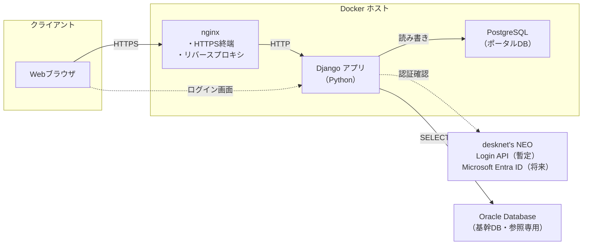
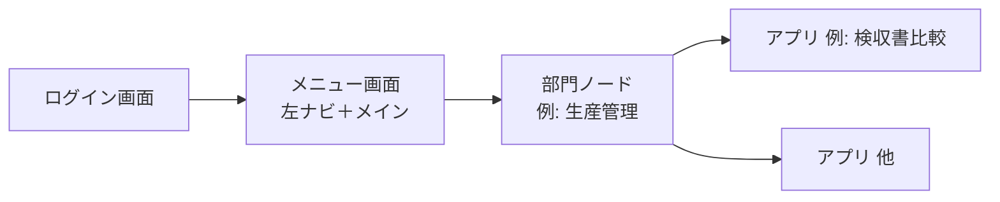

# アプリケーション仕様書

## 1. 文書情報


| 項目               | 内容                                        |
| ---------------- | ----------------------------------------- |
| プロジェクト名          | Core Data Integration Portal（基幹データ連携ポータル） |
| リポジトリ／作業フォルダ名（例） | **CoreDataIntegrationPortal**             |
| 文書の目的            | 本システムの目的・範囲・技術構成・運用上の前提を定義する              |
| 想定読者             | 開発者、インフラ担当、プロジェクト関係者                      |


---

## 2. 概要

### 2.1 目的

基幹システム周辺の業務を支援する **Web ポータル** を **全社向け** に提供する。**人事・総務・財務・営業・生産管理・品保** など、組織の各部門が利用し、部門に応じた業務支援と基幹データの参照を行う。

### 2.2 対象利用者・組織区分（確定）


| 区分       | 内容                                                               |
| -------- | ---------------------------------------------------------------- |
| **対象**   | **全社**（社員番号を持つ社内利用者を想定。当面は desknet's、将来は Microsoft アカウントで認証） |
| **部門区分** | 左メニューおよび業務コンテキストの単位として、例として **全社・人事・総務・財務・営業・生産管理・品保** を扱う（7 章）。 |


各部門の画面・機能・権限の詳細は、要件に応じて追記する。

### 2.3 主な目的（業務ゴール）

- **基幹 Oracle** からは **参照のみ** とする（本システムは基幹 DB を更新しない）。
- **ポータル／PostgreSQL 側** には、業務上 **登録・更新が発生する** データがある（**確定**）。具体のエンティティ・画面・テーブルは要件・設計フェーズで定義する。
- 部門ごとの優先機能（ダッシュボード、一覧、帳票出力など）は、必要に応じて追記する。

### 2.4 システムの位置づけ

- ユーザー向けの入口（ポータル）として単一の Web アプリケーションを提供する。
- 認証は当面 **desknet's NEO** のログイン API を利用する。将来は **Microsoft Entra ID** に切り替える前提とし、どちらの場合もポータル内ユーザーは **社員番号** で紐づける。
- アプリケーション本体・データベース・リバースプロキシは **Docker** 上で実行する。

---

## 3. スコープ

### 3.1 本仕様で扱う範囲

- フロントエンドおよびサーバーサイド（Python + Django）の技術選定と実行形態。
- リバースプロキシ（nginx）による公開形態。
- コンテナ実行環境（Docker）の前提。
- データ永続化（PostgreSQL）の前提。
- 認証方式（当面 desknet's NEO、将来 Microsoft Entra ID）の前提。
- 基幹システムとの連携方針（**Oracle DB からの読み取りのみ**）の前提。
- ポータル側データ（**PostgreSQL**）への **業務データの登録・更新** が発生する前提。
- **画面遷移**（ログイン → メニュー → 各アプリ）および **左メニュー構成・部門別の子リンク・メニューに表示するアプリ一覧**。

### 3.2 本仕様で詳細を固定しないもの（別文書・別フェーズ）

- 各アプリ画面の **詳細 UI・ワイヤーフレーム・バリデーション**（メニュー項目・遷移は 7 章で定義）。
- 基幹 Oracle への **接続ユーザー**、**参照を許可するテーブル／カラム**、および **テーブル・項目マッピング**（ACL 上のモデルへの対応）の詳細。
- 非機能要件の数値目標（同時接続数、RPO/RTO 等）は、要件定義フェーズで別途定義する。

### 3.3 ネットワーク前提（確定）

- アプリケーション（Docker 上の Django）と **Oracle（基幹 DB）** は **同一セグメント** 上にあり、レイヤ 3 で到達可能であることを前提とする。

---

## 4. 技術スタック


| 区分            | 採用技術                                                    | 備考                                                          |
| ------------- | ------------------------------------------------------- | ----------------------------------------------------------- |
| Web アプリケーション  | Python + Django                                         | UI・ルーティング・サーバーサイド処理                                         |
| 認証            | Django 認証 + desknet's NEO Login API（暫定） / Microsoft Entra ID（将来） | ログイン成功後は Django セッションにログイン状態を保持。Django ユーザーは社員番号で紐づける |
| データベース        | PostgreSQL                                              | マネージドまたはコンテナ内のいずれか（運用方針に依存）                                 |
| ORM           | Django ORM                                              | PostgreSQL 向け                                               |
| 基幹データソース      | Oracle Database                                         | **読み取り専用**。基幹システムが利用する DB と同一（想定）                           |
| 基幹連携アクセス      | `python-oracledb`                                       | 読み取り専用アカウントで Oracle に接続する。必要に応じて Thick / Thin モードを環境に合わせて選ぶ |
| HTTP サーバー（前段） | nginx                                                   | リバースプロキシ、TLS 終端（構成による）                                      |
| アプリケーション実行    | Python + Django（gunicorn / uWSGI 等）                     | nginx の背後で Django を実行                                       |
| コンテナ          | Docker（および Compose を想定）                                 | サービス単位でイメージ化                                                |


---

## 5. アーキテクチャ

### 5.1 論理構成

クライアント（ブラウザ）は **nginx** に HTTPS でアクセスし、nginx が **Django アプリケーション（Python）** にリクエストを転送する。アプリケーションは **PostgreSQL** に接続してポータル固有データを読み書きする。基幹の参照データは **Oracle** から **読み取りのみ** で取得する（詳細は 5.5）。




### 5.2 コンテナの役割（想定）


| コンテナ                  | 役割                                                       |
| --------------------- | -------------------------------------------------------- |
| **nginx**             | 外部からの HTTP(S) 受付、Django へのプロキシ、必要に応じて静的ファイルやアップロード上限の制御。 |
| **app**（名称は実装で可変）     | Django アプリケーション。ビュー・URL ルーティング・認証処理を含む。                  |
| **db**（または外部マネージド DB） | PostgreSQL。本番ではマネージド DB に切り替える選択肢あり。                     |


サービス名・ネットワーク（Docker ネットワーク）は `docker-compose` 等の実装時に定義する。

### 5.3 nginx と Django の関係

- Django は **Python アプリケーションサーバー（gunicorn / uWSGI 等）**として動作する。
- nginx は **リバースプロキシ**として、クライアントからの接続を Django アプリケーションサーバーがリッスンするポートに転送する。
- TLS（HTTPS）を nginx で終端する構成を推奨する（証明書は nginx 側または別レイヤで管理）。

### 5.4 アプリケーション設計方針（ドメイン駆動）

- 業務モデルと実装の対応を明確にするため、**ドメイン駆動設計（DDD）** を採用する。
- **境界づけられたコンテキスト**（全社・人事・総務・営業・生産管理・品保・財務・アイデンティティ／アクセス・基幹連携 等）と、**ドメイン／アプリケーション／インフラ／インターフェース** のレイヤー分離の詳細は、別紙 `**ドメイン駆動設計.md`** に定義する。

### 5.5 基幹システム連携（確定事項）


| 項目          | 内容                                                                 |
| ----------- | ------------------------------------------------------------------ |
| 基幹側データベース   | **Oracle Database**                                                |
| ポータルからの操作   | **読み取り（SELECT）のみ**。INSERT／UPDATE／DELETE による基幹 DB 更新は行わない。          |
| 参照のタイミング    | **都度**。リクエストに応じて Oracle に問い合わせ、必要なデータを取得する（主方式）。                   |
| 参照対象        | **テーブル直接**参照とする（参照専用ビューは用いない方針）。                                   |
| ネットワーク      | アプリと Oracle は **同一セグメント**（3.3）。                                    |
| ポータル側データベース | **PostgreSQL**（セッション、**メニュー・権限（認可）**、ポータル業務データの登録・更新、その他アプリ固有データ）。 |


- 基幹の行・列は **連携コンテキスト（ACL）** 内でポータル向けモデルに変換し、業務コンテキストが Oracle の物理構造に直接依存しすぎないようにする（`ドメイン駆動設計.md`）。テーブル直接参照でも、ドメイン層へのマッピングは維持する。
- 負荷対策として **PostgreSQL へのキャッシュやスナップショット** を併用するかは、負荷試験・運用方針に応じて **任意** とする。

---

## 6. 認証・認可

### 6.1 認証プロバイダ

- 当面は **desknet's NEO クラウド** の Login API を利用する。
- desknet's の接続先は `https://maruei01.dn-cloud.com/cgi-bin/dneo/dneo.cgi` とする。
- ログイン ID は **社員番号** とする。
- desknet's Login API で認証成功した場合のみ、Django 側で同じ社員番号のポータルユーザーを作成または更新し、Django セッションを発行する。
- 将来は **Microsoft Entra ID**（旧 Azure AD / OIDC / OAuth2）へ切り替える前提とする。この場合も、Entra ID から取得できる社員番号を同じポータルユーザーへ紐づける。

### 6.2 アプリケーション側

- **Django 認証**をベースにする。外部認証プロバイダ（desknet's / Entra ID）は、Django ユーザーへ対応付けるための入力元として扱う。
- Django ユーザーの `username` は **社員番号** とする。
- desknet's のパスワードはポータル DB に保存しない。desknet's Login API による認証成功後、Django 側では `set_unusable_password()` 相当でパスワードログインを無効化したユーザーを作る。
- desknet's Login API が返す `user_id`、`name`、`default_group_id`、`access_key` は必要に応じてセッションまたは拡張プロファイルに保持する。ただし、ポータルのユーザー同一性の正は **社員番号** とする。
- desknet's の `access_key` は API 呼び出し用の一時キーであり、長期認証情報として扱わない。ポータルへのログイン状態は Django セッションで管理する。
- 将来 Entra ID へ切り替える際は、Authlib による OIDC / OAuth フローを追加し、Entra 側の社員番号 claim を `username` に対応付ける。既存の検索履歴・権限は社員番号ベースで継続利用できる設計とする。
- 本番の公開オリジンは `**http://192.168.3.196`** とする（詳細は `Document/本番環境デプロイ手順.md` および `Document/Microsoft認証（Entra ID）構築手順.md`）。

### 6.3 認可

- **誰がどのメニュー・画面・API にアクセスできるか** は、**PostgreSQL 上のデータで制御する**（ユーザー／ロール／メニュー・機能権限のマスタと紐付け）。認証済みユーザーを社員番号でアプリ内ユーザーと対応付けたうえで、**DB の定義に従って表示・実行を許可する**。
- desknet's の組織情報や Entra ID のグループ／アプリロールは、**初期同期や補助的な入力**として利用してよいが、**最終的な許可の判定はアプリ側の DB を正とする**想定とする（運用ルールは実装時に定義）。

### 6.4 直接 URL アクセス時の認証

- ユーザーが **ブックマークや外部リンクなどで、ログイン画面以外の URL に直接アクセス** した場合でも、**セッション（ログイン済みか）を判定**する。
- **未ログイン** のときは、認証が必要なパスについて **ログイン画面**へ誘導する。当面は desknet's 認証、将来は Microsoft 認証へ誘導する。
- ログイン完了後は、**元々開こうとしていた URL** に戻れるようにする（実装ではコールバック URL／`callbackUrl` 等で保持する想定）。
- 公開パス（ログイン画面、静的な説明ページなど）の有無とパス一覧は実装時に定義する。

### 6.5 開発環境における認証の補足

開発環境でも開発者専用ログインは設けない。ログイン画面は通常ログインのみとし、当面は **desknet's NEO 認証**、将来は **Microsoft Entra ID 認証**へ切り替える。開発時も、認証済み状態が必要な確認は通常認証、テスト fixture、または Django テストクライアントの `force_login` 等で行う。

---

## 7. 画面構成・メニュー

### 7.1 画面遷移の全体像

画面の流れは次のとおりとする。

```text
ログイン画面 → メニュー画面（左ナビ＋メイン） → 各アプリ画面（複数）
```

- **ログイン**: 当面は **desknet's NEO 認証**を用いる。将来は **Microsoft 認証**（Entra ID）へ切り替える（6 章）。どちらも社員番号で Django ユーザーへ紐づける。
- **メニュー画面**: 画面名は **基幹システム連携ポータル** とし、左側にナビゲーションを置く。メイン領域にはユーザー別の **お気に入りリンク** をカード形式で表示し、各アプリへ遷移できるハブとする。
- **各アプリ画面**: 子リンクから遷移する、機能単位の画面。URL はアプリごとに分かれる想定。




### 7.2 左側メニュー（部門区分の例）

ログイン後に **左側** に表示する **第1階層（大項目）** の並びは次のとおりとする（**表示可否は 6.3・7.4 に従い DB で制御**）。


| 順   | 表示名（左メニュー大項目） |
| --- | -------------- |
| 1   | 全社             |
| 2   | 人事             |
| 3   | 総務             |
| 4   | 財務             |
| 5   | 営業             |
| 6   | 生産管理           |
| 7   | 品保             |
| 8   | 管理             |


### 7.3 ナビゲーション構造（親子）

- 各部門区分を **親ノード** とし、その **直下に子リンク** を並べる（アプリケーション・サブ画面・将来の外部リンク等）。
- **5年9組** は、親「生産管理」の子メニューとして配置する。現時点で想定している子項目は次のとおり（**随時追加** 可）。


| 順   | 表示名（生産管理配下） |
| --- | ----------- |
| 1   | 5年9組        |
| 2   | 検収書比較       |
| 3   | 内示受注変換      |
| 4   | 確定受注変換      |

- 親「管理」の下に、運用・設定向けメニューを子として配置する。現時点で想定している子項目は次のとおり（**随時追加** 可）。


| 順   | 表示名（管理配下） |
| --- | ----------- |
| 1   | お知らせ       |
| 2   | 承認依頼       |
| 3   | ユーザー管理     |
| 4   | データベース     |

- **データベース** は、PostgreSQL 内のテーブルをセレクトボックスで選択し、選択テーブルの内容を読み取り専用で確認する画面とする。初期実装では先頭100件を表示し、パスワード・セッション・トークン等の機密性が高い項目はマスクする。
- **お知らせ** は、管理者が追加・編集・削除できる運用メッセージとする。タイトル、本文、公開状態を管理し、公開中のお知らせのみをメニュー画面のお知らせ欄に作成日時の新しい順で表示する。


- **「5年9組」** は **正式なメニュー表示名** である。他項目の追加や並び順の変更は、要件に応じて **随時** 行う。
- **全社・人事・総務・財務・営業・品保** の配下の子リンクは、要件に応じて **別途定義** する。
- 各項目の **URL パス・画面仕様** は個別アプリの設計時に定義する。

### 7.4 メニューと権限（データベース）

- **左メニューの第1階層・子リンクの表示**、および **各画面・API の実行可否** は、**PostgreSQL** に保持するマスタと紐付けで制御する（ユーザー識別子、ロール、メニュー項目／操作権限の対応。具体スキーマは実装設計で定義）。
- **並び順・有効／無効** も DB で管理できるようにする想定とする。
- 初回ログインで作成されたユーザーは `UserAccessRequest` に **承認待ち** として登録する。管理メニューの **承認依頼** で、管理者が権限グループを選択して **許可**、または **拒否** を行う。許可または拒否が完了した申請は、承認依頼一覧には表示しない。
- 許可・拒否後のユーザー情報や権限の確認・変更は、管理メニューの **ユーザー管理** で行う。ユーザー管理では、社員番号、姓名、権限ロール、利用可能メニューグループ、申請状態、有効状態、最終ログイン日時を表示する。ユーザー行をクリックすると編集ポップアップを表示し、姓、名、メールアドレス、権限、グループを更新できる。
- 拒否した場合も `auth_user` と `UserAccessRequest` は削除せず、申請状態を **拒否** として保持する。これにより、監査・再申請・後日の再承認に対応できる。拒否時は付与済みグループを外す。
- 権限は **管理者** と **一般ユーザー** を基本とし、Django 標準の `auth_group` で管理する。`管理者` グループのユーザーは全メニューを表示・利用できる。
- メニューグループ（全社・人事・総務・財務・営業・生産管理・品保・管理）は権限ロールとは別物として、`PortalMenuGroupAccess` でユーザーごとに管理する。
- 一般ユーザーは **管理** メニューを表示しない。その他の大項目は、ユーザーに設定されたメニューグループ（例: `生産管理`）と一致するもののみ表示・利用できる。メニューグループ未設定の場合は、業務メニューを表示しない。
- 承認依頼画面では、権限を **一般ユーザー / 管理者** のいずれかで選択する。使えるグループはメニューグループ（全社・人事・総務・財務・営業・生産管理・品保）から選択し、初期値は **全社をチェック、その他は未チェック** とする。管理メニューは管理者専用のため、使えるグループの選択肢には表示しない。管理者を選択した場合、使えるグループの選択は不要なため無効化する。
- 承認待ち・拒否状態のユーザーは、部署グループが未設定の状態と同様に業務メニューを利用できず、利用申請状況画面のみ表示する。

### 7.5 お気に入りメニュー

- 各メニュー項目には **ハートボタン（♡／♥）** を表示し、ログインユーザーごとにお気に入り登録・解除を行える。
- メニュー画面の上部に、登録済みのお気に入りを **カード形式のリンク** として表示する。
- お気に入りカードはドラッグアンドドロップで並び順を変更でき、変更後の順序は PostgreSQL に保存する。
- 登録済みメニューのハート（♥）を押して解除する場合は、`「[メニュー名]」をお気に入りから削除します。よろしいですか？` の確認メッセージを表示する。
- お気に入り情報は `UserFavoriteMenu` で管理し、ユーザー、メニューキー、表示順（`sort_order`）を保持する。

---

## 8. データベース

### 8.1 PostgreSQL（ポータル側）

- アプリケーションの **主たる永続化** に使用する。
- 接続情報は環境変数またはシークレット管理で注入し、リポジトリに含めない。
- マイグレーションは Django migrations でバージョン管理する想定。
- **認可**に用いる **ユーザー（社員番号）と外部認証識別子（desknet's user_id / Entra ID 識別子）の対応、ロール、メニュー定義、権限マッピング** 等も本データベースで管理する（6.3、7.4）。
- ユーザー別のお気に入りメニューと表示順も PostgreSQL に保存する（7.5）。

### 8.2 Oracle（基幹／読み取り専用）

- 基幹システムが利用する **Oracle** から、ポータルは **参照のみ** でデータを取得する。
- 接続は読み取り専用ユーザー、または SELECT のみ許可された権限とする（詳細はインフラ・DBA と調整）。
- 機能ごとに **専用ユーザー・秘密情報の扱い・接続経路** 等の必須セキュリティ要件を定める場合は、**当該機能の機能仕様書**の記述を実装の前提とする（例: `Document/application/5年9組/5年9組_機能仕様書.md` §7.1）。
- **テーブルに直接**アクセスして参照する（ビューは用いない方針）。
- アプリケーションサーバと Oracle は **同一セグメント** で到達する（3.3）。

#### 8.2.1 接続パラメータ（確定）

基幹 Oracle への接続に用いるネットワーク・インスタンス情報は次のとおり。**パスワードは本文書に記載しない**。実装では環境変数またはシークレット管理にのみ保持する。


| 項目         | 値                                            |
| ---------- | -------------------------------------------- |
| プロトコル      | TCP                                          |
| ホスト        | `192.168.3.204`                              |
| ポート        | `1521`                                       |
| 接続識別子（SID） | `EXPJ`                                       |
| ユーザー ID    | `EXPJ`（**SELECT 等参照のみ**の権限に限定すること。パスワードは別管理） |


参考（別システム等で用いる接続文字列のイメージ。本ポータル実装では `python-oracledb` 等に合わせて上表を環境変数化する）:

```text
(DESCRIPTION =
  (ADDRESS = (PROTOCOL = TCP)(HOST = 192.168.3.204)(PORT = 1521))
  (CONNECT_DATA = (SID = EXPJ)))
```

参照可能なテーブル／カラム・マッピングの詳細は、インフラ・DBA と調整し、`ドメイン駆動設計.md` の **基幹連携（ACL）** でポータル側モデルに変換する。

---

## 9. 非機能要件（初期の考慮事項）


| 区分     | 内容                                                                                                                                                       |
| ------ | -------------------------------------------------------------------------------------------------------------------------------------------------------- |
| セキュリティ | **HTTPS** を原則とする。社内 LAN のみの HTTP 運用（例: 6.2 の本番オリジン）と併用する場合は、`本番環境デプロイ手順.md` の nginx／公開形態に合わせて TLS を検討する。本番シークレットの安全な保管、依存パッケージの更新。**認可**は DB 定義に従う（6.3）。 |
| ログ     | アクセスログ（nginx）、アプリケーションログの出力先を運用方針に合わせて定義。                                                                                                                |
| バックアップ | PostgreSQL のバックアップ方針は本番環境決定時に必須。                                                                                                                         |


数値 SLA は別途要件として定義する。

---

## 10. ヒアリングで確定した前提（Q1〜Q4）


| #   | テーマ                   | 確定内容                                   |
| --- | --------------------- | -------------------------------------- |
| Q1  | ポータル／PostgreSQL の書き込み | **ある**。業務上、ポータル側への **登録・更新** が発生する。    |
| Q2  | 基幹参照の鮮度               | **都度**。リクエスト単位で Oracle に問い合わせる方式を主とする。 |
| Q3  | アプリと Oracle のネットワーク   | **同一セグメント**（レイヤ 3 で到達可能な前提）。           |
| Q4  | Oracle 上の参照形態         | **テーブル直接**参照（ビューは用いない方針）。              |


---

## 11. ディレクトリ・文書


| パス                                            | 内容                                                                                                                       |
| --------------------------------------------- | ------------------------------------------------------------------------------------------------------------------------ |
| `Document/`                                   | 本仕様および関連ドキュメントの配置場所                                                                                                      |
| `Document/ドメイン駆動設計.md`                        | DDD に基づく戦略・戦術設計                                                                                                          |
| `Document/プログラム作成実行書.md`                      | Django によるプログラム作成の実行順序・作業範囲・確認観点                                                                                         |
| `Document/ローカル開発環境構築手順.md`                    | ローカルデバッグ環境の構築手順                                                                                                          |
| `Document/本番環境デプロイ手順.md`                      | 本番サーバーへの移植・デプロイ手順                                                                                                        |
| `Document/Microsoft認証（Entra ID）構築手順.md`       | Entra ID のアプリ登録とアプリ側設定（リダイレクト URI・環境変数）                                                                                  |
| `Document/application/5年9組/5年9組_機能仕様書.md`     | 5年9組機能の画面・処理・Oracle セキュリティ必須要件（§7.1）                                                                                     |
| `Document/diagrams/architecture-mermaid.html` | §5.1 と同内容の論理構成図をブラウザで表示する HTML。**現在はドキュメント作成段階のため未作成。必要に応じて作成し** `Document/diagrams/` に配置する。参照はそれまで本文 §5.1 の Mermaid とする |


---

## 12. 改訂履歴


| 版    | 日付         | 変更内容                                                                                                                                                |
| ---- | ---------- | --------------------------------------------------------------------------------------------------------------------------------------------------- |
| 0.1  | 2026-04-10 | 初版（技術スタック・Docker・nginx・PostgreSQL・認証方針）                                                                                                             |
| 0.2  | 2026-04-10 | DDD 方針を追加（5.4、`ドメイン駆動設計.md` 参照）                                                                                                                     |
| 0.3  | 2026-04-10 | 利用部門（主: 生産管理、その他: 営業・品保・財務）、基幹連携（Oracle 読み取り専用）、図 5.1 更新、DB 節の整理、要確認事項を追加                                                                           |
| 0.4  | 2026-04-10 | Q1〜Q4 回答を反映（PostgreSQL 書き込みあり、Oracle は都度・同一セグメント・テーブル直接）、3.3 追加、第9章を確定表に変更                                                                          |
| 0.5  | 2026-04-10 | 画面構成（ログイン→メニュー→各アプリ）、6.4 直接 URL 時の認証、7 章メニュー一覧（5年9組・検収書比較・内示受注変換・確定受注変換）、章番号繰り下げ                                                                    |
| 0.6  | 2026-04-10 | `ローカル開発環境構築手順.md` を文書一覧に追加                                                                                                                          |
| 0.7  | 2026-04-10 | ローカル手順を更新（Docker で app・DB・nginx を構築するパターンを追記）※文書のみ                                                                                                  |
| 0.8  | 2026-04-10 | Python + Django ひな形・Docker 一式をリポジトリに追加（手順書に沿った初期構築）                                                                                                 |
| 0.9  | 2026-04-10 | `本番環境デプロイ手順.md` を追加（文書一覧に追記）                                                                                                                        |
| 1.0  | 2026-04-10 | 5.1 論理構成図を詳細版の Mermaid に更新                                                                                                                          |
| 1.1  | 2026-04-10 | 5.1 にブラウザ用図 `Document/diagrams/architecture-mermaid.html` を追加                                                                                       |
| 1.2  | 2026-04-17 | 6.2 に本番 URL（`http://192.168.3.196`）を追記                                                                                                              |
| 1.3  | 2026-04-17 | **全社向け**に変更。左メニュー（全社〜品保の例）、生産管理配下にアプリを子として配置。**認可を PostgreSQL で制御**（6.3・7章・8.1・9章）                                                                  |
| 1.4  | 2026-04-17 | 第9章の HTTPS と本番 HTTP オリジン（6.2）の整合を明記。第11章に `Microsoft認証（Entra ID）構築手順.md` を追加。`diagrams/architecture-mermaid.html` を任意配備と明記。7.3 に生産管理配下の表示名が例である旨を追記 |
| 1.5  | 2026-04-17 | 7.3 で「5年9組」を正式名称と明記。第11章の `architecture-mermaid.html` を「未作成・必要なら作成」と整理                                                                              |
| 1.6  | 2026-04-17 | 文書情報にリポジトリ／作業フォルダ名 **MarueiPortal** を追記                                                                                                             |
| 1.7  | 2026-04-17 | §8.2.1 に Oracle 接続パラメータ（ホスト・ポート・SID・ユーザー ID）を追記。パスワードは文書に含めない                                                                                       |
| 1.8  | 2026-04-20 | §6.5 を追加（開発環境の Credentials・PostgreSQL 前提・CallbackRouteError とローカル手順への参照）                                                                            |
| 1.9  | 2026-04-27 | 文書情報のリポジトリ／作業フォルダ名を **CoreDataIntegrationPortal** に更新（旧 MarueiPortal）                                                                               |
| 1.10 | 2026-04-27 | §8.2 に、機能仕様書で定める Oracle セキュリティ必須要件を実装前提とできる旨を追記（5年9組 §7.1 等）                                                                                        |
| 1.11 | 2026-05-20 | `プログラム作成実行書.md` を文書一覧に追加                                                                                                                            |
| 1.12 | 2026-06-03 | 認証方針を更新。当面は desknet's NEO Login API、将来は Microsoft Entra ID とし、Django ユーザーは社員番号で紐づける方針を明記                                                     |
| 1.13 | 2026-06-04 | 開発環境でも通常ログインのみとする方針へ更新                                                     |
| 1.14 | 2026-06-04 | メニュー名を「生産管理ポータル」に変更し、ユーザー別お気に入りメニュー、カード表示、ドラッグ並び替え、削除確認の仕様を追加                                                     |
| 1.15 | 2026-06-04 | メニュー名を「基幹システム連携ポータル」に変更し、7.2 の大項目を左メニューに表示、5年9組を生産管理の子メニューとして整理                                                     |
| 1.16 | 2026-06-04 | 左メニュー大項目に「管理」を追加し、子メニューとして「お知らせ」「権限設定」「データベース」を追加                                                     |
| 1.17 | 2026-06-04 | 管理メニューの「データベース」画面に、テーブル選択と読み取り専用の内容表示を追加                                                     |
| 1.18 | 2026-06-04 | 管理メニューに「承認依頼」を追加し、初回ログインユーザーの承認待ち登録、権限グループ設定、許可・拒否の流れを追加                                                     |
| 1.19 | 2026-06-04 | 権限を管理者・一般ユーザーに整理し、管理者は全表示、一般ユーザーは管理非表示かつ設定部署のみ表示・利用するルールを追加                                                     |
| 1.20 | 2026-06-04 | 承認依頼画面の権限設定を一般ユーザー/管理者の選択と部署グループ選択に分け、全社を初期チェックに変更                                                     |
| 1.21 | 2026-06-04 | 権限ロールとメニューグループを分離し、メニューグループは `PortalMenuGroupAccess` で管理する構成に変更                                                     |
| 1.22 | 2026-06-04 | 「権限設定」を「ユーザー管理」に変更し、承認完了後の申請を承認依頼一覧から除外、ユーザー情報一覧を追加                                                     |
| 1.23 | 2026-06-04 | ユーザー管理でユーザー行クリック時の編集ポップアップを追加し、姓・名・メールアドレス・権限・グループの更新に対応                                                     |
| 1.24 | 2026-06-04 | 管理者選択時はグループ選択を無効化し、管理グループを使えるグループの選択肢から除外                                                     |
| 1.25 | 2026-06-04 | 管理メニューの「お知らせ」で追加・編集・削除を行い、公開中のお知らせをメニュー画面に新しい順で表示する仕様を追加                                                     |


