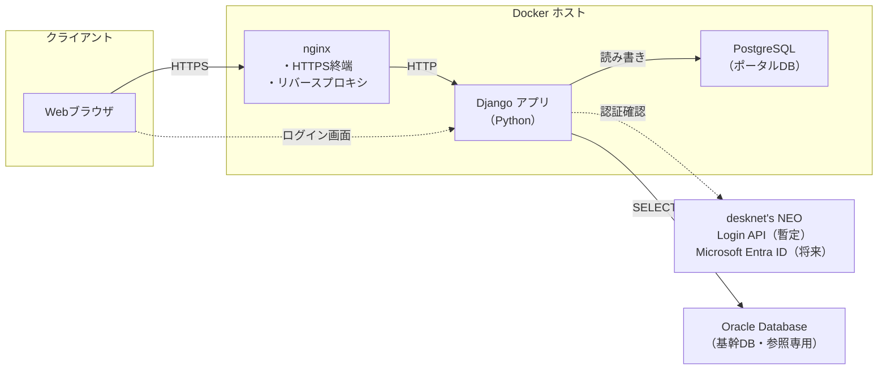
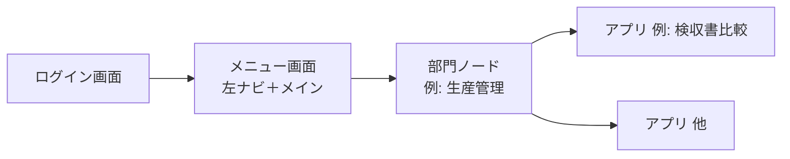

# アプリケーション仕様書

## 1. 文書情報


| 項目               | 内容                                        |
| ---------------- | ----------------------------------------- |
| プロジェクト名          | 業務支援ポータル |
| リポジトリ／作業フォルダ名（例） | **WorkSupportPortal**                     |
| 文書の目的            | 本システムの目的・範囲・技術構成・運用上の前提を定義する              |
| 想定読者             | 開発者、インフラ担当、プロジェクト関係者                      |


---

## 2. 概要

### 2.1 目的

基幹システム周辺の業務を支援する **Web ポータル** を **全社向け** に提供する。**人事・総務・財務・営業・生産管理・品保** など、組織の各部門が利用し、部門に応じた業務支援と基幹データの参照を行う。

### 2.2 対象利用者・組織区分（確定）


| 区分       | 内容                                                               |
| -------- | ---------------------------------------------------------------- |
| **対象**   | **全社**（社員番号を持つ社内利用者を想定。当面は desknet's、将来は Microsoft アカウントで認証） |
| **部門区分** | 左メニューおよび業務コンテキストの単位として、例として **全社・人事・総務・財務・営業・生産管理・品保** を扱う（7 章）。 |


各部門の画面・機能・権限の詳細は、要件に応じて追記する。

### 2.3 主な目的（業務ゴール）

- **基幹 Oracle** からは **参照のみ** とする（本システムは基幹 DB を更新しない）。
- **ポータル／PostgreSQL 側** には、業務上 **登録・更新が発生する** データがある（**確定**）。具体のエンティティ・画面・テーブルは要件・設計フェーズで定義する。
- 部門ごとの優先機能（ダッシュボード、一覧、帳票出力など）は、必要に応じて追記する。

### 2.4 システムの位置づけ

- ユーザー向けの入口（ポータル）として単一の Web アプリケーションを提供する。
- 認証は当面 **desknet's NEO** のログイン API を利用する。将来は **Microsoft Entra ID** に切り替える前提とし、どちらの場合もポータル内ユーザーは **社員番号** で紐づける。
- アプリケーション本体・データベース・リバースプロキシは **Docker** 上で実行する。

---

## 3. スコープ

### 3.1 本仕様で扱う範囲

- フロントエンドおよびサーバーサイド（Python + Django）の技術選定と実行形態。
- リバースプロキシ（nginx）による公開形態。
- コンテナ実行環境（Docker）の前提。
- データ永続化（PostgreSQL）の前提。
- 認証方式（当面 desknet's NEO、将来 Microsoft Entra ID）の前提。
- 基幹システムとの連携方針（**Oracle DB からの読み取りのみ**）の前提。
- ポータル側データ（**PostgreSQL**）への **業務データの登録・更新** が発生する前提。
- **画面遷移**（ログイン → メニュー → 各アプリ）および **左メニュー構成・部門別の子リンク・メニューに表示するアプリ一覧**。

### 3.2 本仕様で詳細を固定しないもの（別文書・別フェーズ）

- 各アプリ画面の **詳細 UI・ワイヤーフレーム・バリデーション**（メニュー項目・遷移は 7 章で定義）。
- 基幹 Oracle への **接続ユーザー**、**参照を許可するテーブル／カラム**、および **テーブル・項目マッピング**（ACL 上のモデルへの対応）の詳細。
- 非機能要件の数値目標（同時接続数、RPO/RTO 等）は、要件定義フェーズで別途定義する。

### 3.3 ネットワーク前提（確定）

- アプリケーション（Docker 上の Django）と **Oracle（基幹 DB）** は **同一セグメント** 上にあり、レイヤ 3 で到達可能であることを前提とする。

---

## 4. 技術スタック


| 区分            | 採用技術                                                    | 備考                                                          |
| ------------- | ------------------------------------------------------- | ----------------------------------------------------------- |
| Web アプリケーション  | Python + Django                                         | UI・ルーティング・サーバーサイド処理                                         |
| 認証            | Django 認証 + desknet's NEO Login API（暫定） / Microsoft Entra ID（将来） | ログイン成功後は Django セッションにログイン状態を保持。Django ユーザーは社員番号で紐づける |
| データベース        | PostgreSQL                                              | マネージドまたはコンテナ内のいずれか（運用方針に依存）                                 |
| ORM           | Django ORM                                              | PostgreSQL 向け                                               |
| 基幹データソース      | Oracle Database                                         | **読み取り専用**。基幹システムが利用する DB と同一（想定）                           |
| 基幹連携アクセス      | `python-oracledb`                                       | 読み取り専用アカウントで Oracle に接続する。必要に応じて Thick / Thin モードを環境に合わせて選ぶ |
| HTTP サーバー（前段） | nginx                                                   | リバースプロキシ、TLS 終端（構成による）                                      |
| アプリケーション実行    | Python + Django（gunicorn / uWSGI 等）                     | nginx の背後で Django を実行                                       |
| コンテナ          | Docker（および Compose を想定）                                 | サービス単位でイメージ化                                                |


---

## 5. アーキテクチャ

### 5.1 論理構成

クライアント（ブラウザ）は **nginx** に HTTPS でアクセスし、nginx が **Django アプリケーション（Python）** にリクエストを転送する。アプリケーションは **PostgreSQL** に接続してポータル固有データを読み書きする。基幹の参照データは **Oracle** から **読み取りのみ** で取得する（詳細は 5.5）。




### 5.2 コンテナの役割（想定）


| コンテナ                  | 役割                                                       |
| --------------------- | -------------------------------------------------------- |
| **nginx**             | 外部からの HTTP(S) 受付、Django へのプロキシ、必要に応じて静的ファイルやアップロード上限の制御。 |
| **app**（名称は実装で可変）     | Django アプリケーション。ビュー・URL ルーティング・認証処理を含む。                  |
| **db**（または外部マネージド DB） | PostgreSQL。本番ではマネージド DB に切り替える選択肢あり。                     |


サービス名・ネットワーク（Docker ネットワーク）は `docker-compose` 等の実装時に定義する。

### 5.3 nginx と Django の関係

- Django は **Python アプリケーションサーバー（gunicorn / uWSGI 等）**として動作する。
- nginx は **リバースプロキシ**として、クライアントからの接続を Django アプリケーションサーバーがリッスンするポートに転送する。
- TLS（HTTPS）を nginx で終端する構成を推奨する（証明書は nginx 側または別レイヤで管理）。

### 5.4 アプリケーション設計方針（ドメイン駆動）

- 業務モデルと実装の対応を明確にするため、**ドメイン駆動設計（DDD）** を採用する。
- **境界づけられたコンテキスト**（全社・人事・総務・営業・生産管理・品保・財務・アイデンティティ／アクセス・基幹連携 等）と、**domain / use_cases / infrastructure / interfaces** のレイヤー分離の詳細は、別紙 [`ドメイン駆動設計.md`](./ドメイン駆動設計.md) に定義する。
- リポジトリ構成は社内標準に合わせ、**ルートは Docker / DevContainer**、**Django ソースは `src/`**、仕様書は **`Document/`（ルート）** に置く。
- 各 Django app（`src/application/<app>/`）は次の依存を守る: **interfaces → use_cases → domain ← infrastructure**。DI は `interfaces/wiring.py` の手動組み立て（DI コンテナ・旧 `composition.py` は使わない）。

### 5.5 基幹システム連携（確定事項）


| 項目          | 内容                                                                 |
| ----------- | ------------------------------------------------------------------ |
| 基幹側データベース   | **Oracle Database**                                                |
| ポータルからの操作   | **読み取り（SELECT）のみ**。INSERT／UPDATE／DELETE による基幹 DB 更新は行わない。          |
| 参照のタイミング    | **都度**。リクエストに応じて Oracle に問い合わせ、必要なデータを取得する（主方式）。                   |
| 参照対象        | **テーブル直接**参照とする（参照専用ビューは用いない方針）。                                   |
| ネットワーク      | アプリと Oracle は **同一セグメント**（3.3）。                                    |
| ポータル側データベース | **PostgreSQL**（セッション、**メニュー・権限（認可）**、ポータル業務データの登録・更新、その他アプリ固有データ）。 |


- 基幹の行・列は **連携コンテキスト（ACL）** 内でポータル向けモデルに変換し、業務コンテキストが Oracle の物理構造に直接依存しすぎないようにする（`ドメイン駆動設計.md`）。テーブル直接参照でも、ドメイン層へのマッピングは維持する。
- 負荷対策として **PostgreSQL へのキャッシュやスナップショット** を併用するかは、負荷試験・運用方針に応じて **任意** とする。

---

## 6. 認証・認可

### 6.1 認証プロバイダ

- 当面は **desknet's NEO クラウド** の Login API を利用する。
- desknet's の接続先は `https://maruei01.dn-cloud.com/cgi-bin/dneo/dneo.cgi` とする。
- ログイン ID は **社員番号** とする。
- desknet's Login API で認証成功した場合のみ、Django 側で同じ社員番号のポータルユーザーを作成または更新し、Django セッションを発行する。
- 将来は **Microsoft Entra ID**（旧 Azure AD / OIDC / OAuth2）へ切り替える前提とする。この場合も、Entra ID から取得できる社員番号を同じポータルユーザーへ紐づける。

### 6.2 アプリケーション側

- **Django 認証**をベースにする。外部認証プロバイダ（desknet's / Entra ID）は、Django ユーザーへ対応付けるための入力元として扱う。
- Django ユーザーの `username` は **社員番号** とする。
- desknet's のパスワードはポータル DB に保存しない。desknet's Login API による認証成功後、Django 側では `set_unusable_password()` 相当でパスワードログインを無効化したユーザーを作る。
- desknet's Login API が返す `user_id`、`name`、`default_group_id`、`access_key` は必要に応じてセッションまたは拡張プロファイルに保持する。ただし、ポータルのユーザー同一性の正は **社員番号** とする。
- desknet's の `access_key` は API 呼び出し用の一時キーであり、長期認証情報として扱わない。ポータルへのログイン状態は Django セッションで管理する。
- 将来 Entra ID へ切り替える際は、Authlib による OIDC / OAuth フローを追加し、Entra 側の社員番号 claim を `username` に対応付ける。既存の検索履歴・権限は社員番号ベースで継続利用できる設計とする。
- 本番の公開オリジンは `**http://192.168.3.196`** とする（詳細は `Document/本番環境デプロイ手順.md` および `Document/Microsoft認証（Entra ID）構築手順.md`）。

### 6.3 認可

- **誰がどのメニュー・画面・API にアクセスできるか** は、**PostgreSQL 上のデータで制御する**（ユーザー／ロール／メニュー・機能権限のマスタと紐付け）。認証済みユーザーを社員番号でアプリ内ユーザーと対応付けたうえで、**DB の定義に従って表示・実行を許可する**。
- desknet's の組織情報や Entra ID のグループ／アプリロールは、**初期同期や補助的な入力**として利用してよいが、**最終的な許可の判定はアプリ側の DB を正とする**想定とする（運用ルールは実装時に定義）。

### 6.4 直接 URL アクセス時の認証

- ユーザーが **ブックマークや外部リンクなどで、ログイン画面以外の URL に直接アクセス** した場合でも、**セッション（ログイン済みか）を判定**する。
- **未ログイン** のときは、認証が必要なパスについて **ログイン画面**へ誘導する。当面は desknet's 認証、将来は Microsoft 認証へ誘導する。
- ログイン完了後は、**元々開こうとしていた URL** に戻れるようにする（実装ではコールバック URL／`callbackUrl` 等で保持する想定）。
- 公開パス（ログイン画面、静的な説明ページなど）の有無とパス一覧は実装時に定義する。

### 6.5 開発環境における認証の補足

開発環境でも開発者専用ログインは設けない。ログイン画面は通常ログインのみとし、当面は **desknet's NEO 認証**、将来は **Microsoft Entra ID 認証**へ切り替える。開発時も、認証済み状態が必要な確認は通常認証、テスト fixture、または Django テストクライアントの `force_login` 等で行う。

---

## 7. 画面構成・メニュー

### 7.1 画面遷移の全体像

画面の流れは次のとおりとする。

```text
ログイン画面 → メニュー画面（左ナビ＋メイン） → 各アプリ画面（複数）
```

- **ログイン**: 当面は **desknet's NEO 認証**を用いる。将来は **Microsoft 認証**（Entra ID）へ切り替える（6 章）。どちらも社員番号で Django ユーザーへ紐づける。
- **メニュー画面**: 画面名は **業務支援ポータル** とし、左側にナビゲーションを置く。メイン領域にはユーザー別の **お気に入りリンク** をカード形式で表示し、各アプリへ遷移できるハブとする。
- **各アプリ画面**: 子リンクから遷移する、機能単位の画面。URL はアプリごとに分かれる想定。




### 7.2 左側メニュー（部門区分の例）

ログイン後に **左側** に表示する **第1階層（大項目）** の並びは次のとおりとする（**表示可否は 6.3・7.4 に従い DB で制御**）。


| 順   | 表示名（左メニュー大項目） |
| --- | -------------- |
| 1   | 全社             |
| 2   | 人事             |
| 3   | 総務             |
| 4   | 財務             |
| 5   | 営業             |
| 6   | 生産管理           |
| 7   | 品保             |
| 8   | 管理             |


### 7.3 ナビゲーション構造（親子）

- 各部門区分を **親ノード** とし、その **直下に子リンク** を並べる（アプリケーション・サブ画面・将来の外部リンク等）。
- **5年9組** は、親「生産管理」の子メニューとして配置する。現時点で想定している子項目は次のとおり（**随時追加** 可）。


| 順   | 表示名（生産管理配下） |
| --- | ----------- |
| 1   | 5年9組        |
| 2   | 検収書比較（完成品 / 支給品） |
| 3   | 在庫発注アラート |
| 4   | 内示受注変換      |
| 5   | 確定受注変換      |

- **在庫発注アラート** は、SLIMS 在庫 CSV 取込時に Oracle 集計したスナップショットを一覧表示する。**フィルタ・ソート・ページングはブラウザ内でローカル処理**（ページ再読み込みなし）。SLIMS CSV 再取込・警告条件保存時のみ全画面再読み込み。詳細は [在庫発注アラート_機能仕様書.md](application/在庫発注アラート/在庫発注アラート_機能仕様書.md)。

- 親「総務」の下に、固定資産棚卸関連のメニューを子として配置する。現時点で想定している子項目は次のとおり（**随時追加** 可）。


| 順   | 表示名（総務配下） |
| --- | ----------- |
| 1   | 資産棚卸結果      |

- **資産棚卸結果** は、desknet's NEO の AppSuite API から棚卸データ管理・資産データ・棚卸データ等を取得し、台帳と現地棚卸の突合結果を一覧表示・CSV 出力する。突合結果は **Django セッションにキャッシュ** し、同一棚卸（`managementId`）内の **フィルタ・ソート・ページングはブラウザ内でローカル処理**（ページ再読み込みなし）。棚卸切替時のみ API 再取得。詳細は [資産棚卸結果_機能仕様書.md](application/資産棚卸結果/資産棚卸結果_機能仕様書.md)。

- 親「管理」の下に、運用・設定向けメニューを子として配置する。現時点で想定している子項目は次のとおり（**随時追加** 可）。


| 順   | 表示名（管理配下） |
| --- | ----------- |
| 1   | お知らせ       |
| 2   | 承認依頼       |
| 3   | ユーザー管理     |
| 4   | データベース     |

- **データベース** は、PostgreSQL 内のテーブルをセレクトボックスで選択し、選択テーブルの内容を読み取り専用で確認する画面とする。初期実装では先頭100件を表示し、パスワード・セッション・トークン等の機密性が高い項目はマスクする。
- **お知らせ** は、管理者が追加・編集・削除できる運用メッセージとする。タイトル、本文、公開状態を管理し、公開中のお知らせのみをメニュー画面のお知らせ欄に作成日時の新しい順で表示する。
- 管理メニュー各画面および業務画面のページ見出しは、タイトル・お気に入りハート・説明文（`portal-page-description`）を `portal-page-title-row` で横並びに配置する。
- **検収書比較** は、生産管理配下で **5年9組** と同じ階層に表示し、クリックで **完成品** / **支給品** のリンクを展開する。比較・設定は共通の1画面とし、リンクの `type` パラメータで処理を切り替える。PostgreSQL の取引先・取込・比較結果は完成品/支給品で **テーブルを分離** する。
- 左メニューの **大項目**（全社・人事・生産管理など）はクリックで展開/折りたたみできる。表示中の画面を含む大項目・中項目は自動的に展開される。展開状態はブラウザの `localStorage` に保存する。
- 左メニュー（サイドバー）は **常に画面高（`100dvh`）** を `#0f172a` の黒背景で表示する（メニューを折りたたんでも下端に灰色が見えない）。メニュー項目は **上詰め** で配置する。項目の **縦方向の余白**（大項目・中項目・リンクの `padding`、グループ間 `margin`、行間 `gap`）はコンパクトにし、同じ画面高でより多くの項目を表示できるようにする。項目が **画面高さを超える場合** は、ポータル名・ユーザー領域を除く **メニュー領域（`.sidebar-nav`）に縦スクロールバー** を表示する（サイドバー本体は `100dvh` 固定とし、ページ全体の高さに追従して伸ばさない）。**ようこそ** 表示と **ログアウト** ボタンはサイドバー **最下部**（`.sidebar-foot`）に固定し、スクロール対象外とする。メニューリンク遷移時は `.sidebar-nav` のスクロール位置を `sessionStorage`（`portal-sidebar-nav-scroll-top`）で保持し、次画面読込後に復元する（初回のみ現在地のメニュー項目を `scrollIntoView` で表示）。画面上部のトップバーは表示しない（メイン表示領域を `100dvh` いっぱいに使う）。スクロールバーはサイドバーの濃色背景（`#0f172a`）に合わせて細め・低コントラストで表示する（Firefox: `scrollbar-color`、Chrome/Edge: `::-webkit-scrollbar`）。**階層表示**: 大項目の展開矢印（`>`）はラベルに近づけて表示する。大項目配下の **同階層** 項目（5年9組・検収書比較・在庫発注アラート等）は **タイトル文字の始まりを揃える**（展開矢印あり項目は左に固定幅の矢印列、なし項目は同幅の余白）。中項目の子（完成品・支給品）は **一段深くインデント** する（縦線は表示しない）。**お気に入りハートは左メニューには表示しない**。
- ログイン後の全画面は `body.portal-app-page` で **ビューポート高（`100dvh`）に収める** 共通レイアウトとする。`.content` はサイドバー横の残り領域を **縦いっぱい** に使い、一覧・表を持つ画面は内部スクロールする。**メニュー画面（お気に入り）・お知らせ管理** は `portal-menu-page` とし、`.content` 単一の縦スクロールとする（内側の二重スクロールバーを出さない）。文字サイズは CSS 変数（見出し 22px、本文 14px、補足 13px 等）で全画面共通とする。


- **「5年9組」** は **正式なメニュー表示名** である。他項目の追加や並び順の変更は、要件に応じて **随時** 行う。
- **全社・人事・総務・財務・営業・品保** の配下の子リンクは、要件に応じて **別途定義** する。
- 各項目の **URL パス・画面仕様** は個別アプリの設計時に定義する。

### 7.4 メニューと権限（データベース）

- **左メニューの第1階層・子リンクの表示**、および **各画面・API の実行可否** は、**PostgreSQL** に保持するマスタと紐付けで制御する（ユーザー識別子、ロール、メニュー項目／操作権限の対応。具体スキーマは実装設計で定義）。
- **並び順・有効／無効** も DB で管理できるようにする想定とする。
- 初回ログインで作成されたユーザーは `UserAccessRequest` に **承認待ち** として登録する。管理メニューの **承認依頼** で、管理者が権限グループを選択して **許可**、または **拒否** を行う。許可または拒否が完了した申請は、承認依頼一覧には表示しない。
- 許可・拒否後のユーザー情報や権限の確認・変更は、管理メニューの **ユーザー管理** で行う。ユーザー管理では、社員番号、姓名、権限ロール、利用可能メニューグループ、申請状態、有効状態、最終ログイン日時を表示する。ユーザー行をクリックすると編集ポップアップを表示し、姓、名、メールアドレス、権限、グループを更新できる。ポップアップ内の **削除** ボタンでユーザーを削除できる（確認ダイアログあり）。**ログイン中の自分自身は削除できない**（削除ボタン非表示）。削除時は `auth_user` に紐づくお気に入り・メニューグループ・利用申請等も連鎖削除される。
- 拒否した場合も `auth_user` と `UserAccessRequest` は削除せず、申請状態を **拒否** として保持する。これにより、監査・再申請・後日の再承認に対応できる。拒否時は付与済みグループを外す。
- 権限は **管理者** と **一般ユーザー** を基本とし、Django 標準の `auth_group` で管理する。`管理者` グループのユーザーは全メニューを表示・利用できる。
- メニューグループ（全社・人事・総務・財務・営業・生産管理・品保・管理）は権限ロールとは別物として、`PortalMenuGroupAccess` でユーザーごとに管理する。`group_key` は **英語キー**（例: `general-affairs`）を正とし、旧データで日本語タイトル（例: `総務`）が残っている場合は読み取り時に正規化する。
- 一般ユーザーは **管理** メニューを表示しない。その他の大項目は、ユーザーに設定されたメニューグループ（例: `生産管理`）と一致するもののみ表示・利用できる。メニューグループ未設定の場合は、業務メニューを表示しない。
- 承認依頼画面では、権限を **一般ユーザー / 管理者** のいずれかで選択する。使えるグループはメニューグループ（全社・人事・総務・財務・営業・生産管理・品保）から選択し、初期値は **全社をチェック、その他は未チェック** とする。管理メニューは管理者専用のため、使えるグループの選択肢には表示しない。管理者を選択した場合、使えるグループの選択は不要なため無効化する。
- 承認待ち・拒否状態のユーザーは、部署グループが未設定の状態と同様に業務メニューを利用できず、利用申請状況画面のみ表示する。

### 7.5 お気に入りメニュー

- 各メニュー項目には **ハートボタン（♡／♥）** を表示し、ログインユーザーごとにお気に入り登録・解除を行える。**表示位置は各アプリ画面のタイトル横**（5年9組・検収書比較（完成品／支給品）・在庫発注アラート・資産棚卸結果等）。左メニューには表示しない。
- メニュー画面の上部に、登録済みのお気に入りを **カード形式のリンク** として表示する。
- お気に入りカードはドラッグアンドドロップで並び順を変更でき、変更後の順序は PostgreSQL に保存する。
- 登録済みメニューのハート（♥）を押して解除する場合は、`「[メニュー名]」をお気に入りから削除します。よろしいですか？` の確認メッセージを表示する。
- お気に入り情報は `UserFavoriteMenu` で管理し、ユーザー、メニューキー、表示順（`sort_order`）を保持する。

### 7.6 メニュー画面の在庫発注アラート帯

- **生産管理** メニューグループを持つユーザーが `/app`（メニュー画面）を開いたとき、**お知らせセクションの直上** に在庫発注アラートの **目立つサマリ帯** を表示する（詳細は [在庫発注アラート_機能仕様書.md](application/在庫発注アラート/在庫発注アラート_機能仕様書.md) §5.2）。
- 重点件数・警告件数・未確認件数、SLIMS 在庫時点（`YYYY年M月D日時点の在庫`）を表示し、クリックで在庫発注アラート一覧へ遷移する。
- 生産管理グループを持たないユーザーには **表示しない**。

## 8. データベース

### 8.1 PostgreSQL（ポータル側）

- アプリケーションの **主たる永続化** に使用する。
- 接続情報は環境変数またはシークレット管理で注入し、リポジトリに含めない。
- マイグレーションは Django migrations でバージョン管理する想定。
- **認可**に用いる **ユーザー（社員番号）と外部認証識別子（desknet's user_id / Entra ID 識別子）の対応、ロール、メニュー定義、権限マッピング** 等も本データベースで管理する（6.3、7.4）。
- ユーザー別のお気に入りメニューと表示順も PostgreSQL に保存する（7.5）。

### 8.2 Oracle（基幹／読み取り専用）

- 基幹システムが利用する **Oracle** から、ポータルは **参照のみ** でデータを取得する。
- 接続は読み取り専用ユーザー、または SELECT のみ許可された権限とする（詳細はインフラ・DBA と調整）。
- 機能ごとに **専用ユーザー・秘密情報の扱い・接続経路** 等の必須セキュリティ要件を定める場合は、**当該機能の機能仕様書**の記述を実装の前提とする（例: `Document/application/5年9組/5年9組_機能仕様書.md` §7.1）。
- **テーブルに直接**アクセスして参照する（ビューは用いない方針）。
- アプリケーションサーバと Oracle は **同一セグメント** で到達する（3.3）。

#### 8.2.1 接続パラメータ（確定）

基幹 Oracle への接続に用いるネットワーク・インスタンス情報は次のとおり。**パスワードは本文書に記載しない**。実装では環境変数またはシークレット管理にのみ保持する。


| 項目         | 値                                            |
| ---------- | -------------------------------------------- |
| プロトコル      | TCP                                          |
| ホスト        | `192.168.3.204`                              |
| ポート        | `1521`                                       |
| 接続識別子（SID） | `EXPJ`                                       |
| ユーザー ID    | `EXPJ`（**SELECT 等参照のみ**の権限に限定すること。パスワードは別管理） |


参考（別システム等で用いる接続文字列のイメージ。本ポータル実装では `python-oracledb` 等に合わせて上表を環境変数化する）:

```text
(DESCRIPTION =
  (ADDRESS = (PROTOCOL = TCP)(HOST = 192.168.3.204)(PORT = 1521))
  (CONNECT_DATA = (SID = EXPJ)))
```

参照可能なテーブル／カラム・マッピングの詳細は、インフラ・DBA と調整し、`ドメイン駆動設計.md` の **基幹連携（ACL）** でポータル側モデルに変換する。

---

## 9. 非機能要件（初期の考慮事項）


| 区分     | 内容                                                                                                                                                       |
| ------ | -------------------------------------------------------------------------------------------------------------------------------------------------------- |
| セキュリティ | **HTTPS** を原則とする。社内 LAN のみの HTTP 運用（例: 6.2 の本番オリジン）と併用する場合は、`本番環境デプロイ手順.md` の nginx／公開形態に合わせて TLS を検討する。本番シークレットの安全な保管、依存パッケージの更新。**認可**は DB 定義に従う（6.3）。 |
| ログ     | アクセスログ（nginx）、アプリケーションログの出力先を運用方針に合わせて定義。                                                                                                                |
| バックアップ | PostgreSQL のバックアップ方針は本番環境決定時に必須。                                                                                                                         |


数値 SLA は別途要件として定義する。

---

## 10. ヒアリングで確定した前提（Q1〜Q4）


| #   | テーマ                   | 確定内容                                   |
| --- | --------------------- | -------------------------------------- |
| Q1  | ポータル／PostgreSQL の書き込み | **ある**。業務上、ポータル側への **登録・更新** が発生する。    |
| Q2  | 基幹参照の鮮度               | **都度**。リクエスト単位で Oracle に問い合わせる方式を主とする。 |
| Q3  | アプリと Oracle のネットワーク   | **同一セグメント**（レイヤ 3 で到達可能な前提）。           |
| Q4  | Oracle 上の参照形態         | **テーブル直接**参照（ビューは用いない方針）。              |


---

## 11. ディレクトリ・文書


| パス                                            | 内容                                                                                                                       |
| --------------------------------------------- | ------------------------------------------------------------------------------------------------------------------------ |
| `src/`                                        | Django ソース（`manage.py`、`config/`、`application/`、`templates/`、`static/` 等）                                              |
| `src/application/<app>/`                      | 業務 app。`domain/` / `use_cases/` / `infrastructure/` / `interfaces/`（詳細は `ドメイン駆動設計.md` §5.0）                              |
| `docker/` / `.devcontainer/` / `docker-compose*.yaml` | 実行環境（開発は DevContainer、本番は production Compose）                                                                   |
| `Document/`                                   | 本仕様および関連ドキュメントの配置場所（**ルートに維持**）                                                                                      |
| `Document/ドメイン駆動設計.md`                        | DDD に基づく戦略・戦術設計・現行レイヤー規約                                                                                                 |
| `Document/社内標準移行メモ.md`                        | Docker 分離・レイヤー改称・composition 廃止など社内標準への移行記録                                                                              |
| `Document/プログラム作成実行書.md`                      | Django によるプログラム作成の実行順序・作業範囲・確認観点                                                                                         |
| `Document/ローカル開発環境構築手順.md`                    | ローカルデバッグ環境の構築手順（DevContainer 前提）                                                                                          |
| `Document/本番環境デプロイ手順.md`                      | 本番サーバーへの移植・デプロイ手順                                                                                                        |
| `Document/Microsoft認証（Entra ID）構築手順.md`       | Entra ID のアプリ登録とアプリ側設定（リダイレクト URI・環境変数）                                                                                  |
| `Document/application/5年9組/5年9組_機能仕様書.md`     | 5年9組機能の画面・処理・Oracle セキュリティ必須要件（§7.1）                                                                                     |
| `Document/application/在庫発注アラート/在庫発注アラート_機能仕様書.md` | 最終入荷が古い／入荷なし品目の在庫出荷アラート・SLIMS 在庫 CSV 取込・仕入先確認管理（5年9組 Oracle 準拠） |
| `Document/application/在庫発注アラート/在庫発注アラート_テスト仕様書.md` | 在庫発注アラートの単体・結合・回帰テストケース |
| `Document/diagrams/architecture-mermaid.html` | §5.1 と同内容の論理構成図をブラウザで表示する HTML。**現在はドキュメント作成段階のため未作成。必要に応じて作成し** `Document/diagrams/` に配置する。参照はそれまで本文 §5.1 の Mermaid とする |


---

## 12. 改訂履歴


| 版    | 日付         | 変更内容                                                                                                                                                |
| ---- | ---------- | --------------------------------------------------------------------------------------------------------------------------------------------------- |
| 0.1  | 2026-04-10 | 初版（技術スタック・Docker・nginx・PostgreSQL・認証方針）                                                                                                             |
| 0.2  | 2026-04-10 | DDD 方針を追加（5.4、`ドメイン駆動設計.md` 参照）                                                                                                                     |
| 0.3  | 2026-04-10 | 利用部門（主: 生産管理、その他: 営業・品保・財務）、基幹連携（Oracle 読み取り専用）、図 5.1 更新、DB 節の整理、要確認事項を追加                                                                           |
| 0.4  | 2026-04-10 | Q1〜Q4 回答を反映（PostgreSQL 書き込みあり、Oracle は都度・同一セグメント・テーブル直接）、3.3 追加、第9章を確定表に変更                                                                          |
| 0.5  | 2026-04-10 | 画面構成（ログイン→メニュー→各アプリ）、6.4 直接 URL 時の認証、7 章メニュー一覧（5年9組・検収書比較・内示受注変換・確定受注変換）、章番号繰り下げ                                                                    |
| 0.6  | 2026-04-10 | `ローカル開発環境構築手順.md` を文書一覧に追加                                                                                                                          |
| 0.7  | 2026-04-10 | ローカル手順を更新（Docker で app・DB・nginx を構築するパターンを追記）※文書のみ                                                                                                  |
| 0.8  | 2026-04-10 | Python + Django ひな形・Docker 一式をリポジトリに追加（手順書に沿った初期構築）                                                                                                 |
| 0.9  | 2026-04-10 | `本番環境デプロイ手順.md` を追加（文書一覧に追記）                                                                                                                        |
| 1.0  | 2026-04-10 | 5.1 論理構成図を詳細版の Mermaid に更新                                                                                                                          |
| 1.1  | 2026-04-10 | 5.1 にブラウザ用図 `Document/diagrams/architecture-mermaid.html` を追加                                                                                       |
| 1.2  | 2026-04-17 | 6.2 に本番 URL（`http://192.168.3.196`）を追記                                                                                                              |
| 1.3  | 2026-04-17 | **全社向け**に変更。左メニュー（全社〜品保の例）、生産管理配下にアプリを子として配置。**認可を PostgreSQL で制御**（6.3・7章・8.1・9章）                                                                  |
| 1.4  | 2026-04-17 | 第9章の HTTPS と本番 HTTP オリジン（6.2）の整合を明記。第11章に `Microsoft認証（Entra ID）構築手順.md` を追加。`diagrams/architecture-mermaid.html` を任意配備と明記。7.3 に生産管理配下の表示名が例である旨を追記 |
| 1.5  | 2026-04-17 | 7.3 で「5年9組」を正式名称と明記。第11章の `architecture-mermaid.html` を「未作成・必要なら作成」と整理                                                                              |
| 1.6  | 2026-04-17 | 文書情報にリポジトリ／作業フォルダ名 **MarueiPortal** を追記                                                                                                             |
| 1.7  | 2026-04-17 | §8.2.1 に Oracle 接続パラメータ（ホスト・ポート・SID・ユーザー ID）を追記。パスワードは文書に含めない                                                                                       |
| 1.8  | 2026-04-20 | §6.5 を追加（開発環境の Credentials・PostgreSQL 前提・CallbackRouteError とローカル手順への参照）                                                                            |
| 1.9  | 2026-04-27 | 文書情報のリポジトリ／作業フォルダ名を **CoreDataIntegrationPortal** に更新（旧 MarueiPortal）                                                                               |
| 1.10 | 2026-04-27 | §8.2 に、機能仕様書で定める Oracle セキュリティ必須要件を実装前提とできる旨を追記（5年9組 §7.1 等）                                                                                        |
| 1.11 | 2026-05-20 | `プログラム作成実行書.md` を文書一覧に追加                                                                                                                            |
| 1.12 | 2026-06-03 | 認証方針を更新。当面は desknet's NEO Login API、将来は Microsoft Entra ID とし、Django ユーザーは社員番号で紐づける方針を明記                                                     |
| 1.13 | 2026-06-04 | 開発環境でも通常ログインのみとする方針へ更新                                                     |
| 1.14 | 2026-06-04 | メニュー名を「生産管理ポータル」に変更し、ユーザー別お気に入りメニュー、カード表示、ドラッグ並び替え、削除確認の仕様を追加                                                     |
| 1.15 | 2026-06-04 | メニュー名を「基幹システム連携ポータル」に変更し、7.2 の大項目を左メニューに表示、5年9組を生産管理の子メニューとして整理                                                     |
| 1.16 | 2026-06-04 | 左メニュー大項目に「管理」を追加し、子メニューとして「お知らせ」「権限設定」「データベース」を追加                                                     |
| 1.17 | 2026-06-04 | 管理メニューの「データベース」画面に、テーブル選択と読み取り専用の内容表示を追加                                                     |
| 1.18 | 2026-06-04 | 管理メニューに「承認依頼」を追加し、初回ログインユーザーの承認待ち登録、権限グループ設定、許可・拒否の流れを追加                                                     |
| 1.19 | 2026-06-04 | 権限を管理者・一般ユーザーに整理し、管理者は全表示、一般ユーザーは管理非表示かつ設定部署のみ表示・利用するルールを追加                                                     |
| 1.20 | 2026-06-04 | 承認依頼画面の権限設定を一般ユーザー/管理者の選択と部署グループ選択に分け、全社を初期チェックに変更                                                     |
| 1.21 | 2026-06-04 | 権限ロールとメニューグループを分離し、メニューグループは `PortalMenuGroupAccess` で管理する構成に変更                                                     |
| 1.22 | 2026-06-04 | 「権限設定」を「ユーザー管理」に変更し、承認完了後の申請を承認依頼一覧から除外、ユーザー情報一覧を追加                                                     |
| 1.23 | 2026-06-04 | ユーザー管理でユーザー行クリック時の編集ポップアップを追加し、姓・名・メールアドレス・権限・グループの更新に対応                                                     |
| 1.24 | 2026-06-04 | 管理者選択時はグループ選択を無効化し、管理グループを使えるグループの選択肢から除外                                                     |
| 1.25 | 2026-06-04 | 管理メニューの「お知らせ」で追加・編集・削除を行い、公開中のお知らせをメニュー画面に新しい順で表示する仕様を追加                                                     |
| 1.26 | 2026-06-08 | 生産管理メニューの「検収書比較」をDjango画面として追加し、受領書ファイル取込、MARI比較、結果保存、CSV出力、受入/納品場所設定を追加                                                     |
| 1.27 | 2026-06-15 | 検収書比較を親メニューとし配下に完成品/支給品を配置。比較画面の検索条件から比較区分選択を削除。URL を `/app/production/receipt-comparison/{finished-product\|supplied-parts}` に変更 |
| 1.28 | 2026-06-15 | 左メニューの大項目（全社・人事・生産管理など）の表示サイズを拡大し、部門名が視認しやすいように調整 |
| 1.29 | 2026-06-15 | 左メニューの大項目と検収書比較を展開/折りたたみ可能に変更。検収書比較を5年9組と同階層に配置 |
| 1.30 | 2026-06-15 | 左メニューの展開を HTML details/summary ベースに変更し、JavaScript 未読込時でも開閉可能に修正。サイドバー用 CSS の優先度も調整 |
| 1.31 | 2026-06-15 | 検収書比較のメニュー行を5年9組と同じグリッド配置（左アイコン列＋ラベル列）に揃え、完成品/支給品のみ一段下に表示 |
| 1.32 | 2026-06-15 | 検収書比較の比較・設定画面を1つに統合し、客先/支給品は `type` クエリで切替。メニュー表示を完成品から客先に変更 |
| 1.33 | 2026-06-15 | 検収書比較の設定を管理者のみ利用可能に変更。画面内の区分切替を廃止し、タイトルに完成品/支給品を表示 |
| 1.34 | 2026-06-15 | 検収書比較メニューの表示名を「客先」から「完成品」に戻す |
| 1.35 | 2026-06-15 | 検収書比較の PostgreSQL テーブルを完成品/支給品で分離し、コード種別を廃止 |
| 1.36 | 2026-06-15 | 検収書比較（完成品）設定画面の customer_code 表示名を「客先」に変更 |
| 1.37 | 2026-06-15 | 検収書比較の設定を Oracle マスタ基準に変更。支給品も客先（M_CUST）選択と Oracle 紐づけ解決。比較画面は登録済み取引先のみ表示 |
| 1.40 | 2026-06-15 | 検収書比較設定画面の関連データ取得を区分別に修正。完成品は `subcontractors` を prefetch しない |
| 1.41 | 2026-06-15 | 検収書比較設定画面に取引先・受入/納品場所・支給品追加取引先の削除を追加 |
| 1.42 | 2026-06-15 | 検収書比較設定画面を得意先一覧＋ポップアップ編集に変更。表示ラベルを得意先に統一 |
| 1.43 | 2026-06-15 | 検収書比較設定ポップアップ内の受入/納品場所を表形式に変更 |
| 1.44 | 2026-06-15 | 検収書比較設定の取引先追加フォームの表示幅をコンパクトに変更 |
| 1.45 | 2026-06-15 | 検収書比較設定を左右2カラムレイアウトに変更。得意先一覧を画面高さいっぱいに表示 |
| 1.46 | 2026-06-15 | 検収書比較設定の表示ラベルを「直送先得意先コード」に変更 |
| 1.47 | 2026-06-15 | 検収書比較設定の得意先一覧を残り画面幅いっぱいに表示 |
| 1.48 | 2026-06-15 | 検収書比較設定の得意先一覧テーブル列幅を均等化 |
| 1.49 | 2026-06-15 | 検収書比較で比較と登録を分離し、比較結果一覧の列ソートを追加 |
| 1.50 | 2026-06-15 | 検収書比較の数量列ソートで空値と数値の混在時にエラーにならないよう修正 |
| 1.51 | 2026-06-15 | 検収書比較の比較結果一覧を表示・比較直後は結果列の昇順でソートするよう変更 |
| 1.52 | 2026-06-15 | 検収書比較（支給品）を完成品と同構成で整備。得意先4桁・TXT取込・設定一覧の Oracle 購買取引先表示を反映 |
| 1.53 | 2026-06-15 | 検収書比較（支給品）設定画面の左カラム見出しを「得意先追加」に変更 |
| 1.54 | 2026-06-15 | 5年9組検索条件・検収書比較比較画面の表示ラベルを「得意先」に統一 |
| 1.55 | 2026-06-15 | 検収書比較設定の Oracle 得意先候補取得不具合（正規表現エスケープ）を修正 |
| 1.56 | 2026-06-15 | 5年9組・検収書比較の Oracle 得意先候補取得を共通モジュールに統合 |
| 1.57 | 2026-06-15 | 検収書比較設定で得意先コードの編集を不可にし、Oracle 購買取引先の表示を削除 |
| 1.58 | 2026-06-15 | 検収書比較（支給品）の追加取引先コード設定を廃止。4桁得意先コードと Oracle 購買取引先で照合 |
| 1.59 | 2026-06-15 | 検収書比較設定ポップアップ内の得意先変更案内文を削除 |
| 1.60 | 2026-06-15 | 検収書比較設定ポップアップ内の得意先表示を縦並びレイアウトに変更 |
| 1.61 | 2026-06-15 | 検収書比較設定ポップアップの設定項目を見えない表レイアウトに変更 |
| 1.62 | 2026-06-15 | 検収書比較設定ポップアップを変更可能項目のみ表示に整理し、余白を縮小 |
| 1.63 | 2026-06-15 | 完成品設定画面の横はみ出しを修正 |
| 1.64 | 2026-06-15 | 検収書比較設定ポップアップ幅を拡大し、完成品の直送先得意先コードを縦並びレイアウトに変更 |
| 1.65 | 2026-06-15 | 検収書比較設定ポップアップ見出し下に区切り線を追加し、直送先得意先コード入力幅を縮小 |
| 1.66 | 2026-06-15 | 検収書比較設定画面を左「得意先追加」・右「得意先一覧」の2カラム固定レイアウトに変更 |
| 1.67 | 2026-06-15 | 検収書比較設定ポップアップの受入/納品場所「有効」表示の間隔を縮小 |
| 1.68 | 2026-06-15 | 検収書比較（支給品）設定画面の除外・設定項目表示を品番に変更 |
| 1.69 | 2026-06-15 | 検収書比較（支給品）TXT取込の品番正規化を旧実装/MARIに合わせて修正 |
| 1.70 | 2026-06-16 | 検収書比較（支給品）TXT取込で数量小数・7桁品番に対応 |
| 1.71 | 2026-06-16 | 検収書比較（支給品）を3桁得意先＋子取引先設定に変更（旧 SUBCONTRACTOR_INFO 相当） |
| 1.72 | 2026-06-16 | 検収書比較の受入/納品場所・品番設定から「有効」フラグを廃止 |
| 1.73 | 2026-06-16 | 検収書比較（支給品）の子取引先を Oracle 4桁マスタから選択するよう変更 |
| 1.74 | 2026-06-16 | 検収書比較（支給品）設定ポップアップの子取引先セレクトと追加ボタンの縦位置を修正 |
| 1.75 | 2026-06-16 | 検収書比較（支給品）の子取引先に購買取引先名を保存・表示するよう変更 |
| 1.76 | 2026-06-16 | 検収書比較設定ポップアップの品番/受入場所表を削除のみに変更し、表列を幅いっぱいに表示 |
| 1.77 | 2026-06-16 | 検収書比較（支給品）で受領TXTとMARIの品番正規化・2列目照合を修正し、比較結果にファイル値が反映されるよう改善 |
| 1.78 | 2026-06-16 | 検収書比較の比較結果表ヘッダーを固定し、表本体のみスクロールするよう変更 |
| 1.79 | 2026-06-16 | 検収書比較の比較・登録成功時の画面上部メッセージを廃止（エラー時のみ表示） |
| 1.80 | 2026-06-16 | 検収書比較の登録ボタンを比較結果一覧右上に移動 |
| 1.81 | 2026-06-16 | 検収書比較の表示後に比較結果右上へファイル選択を追加し、選択時に自動比較するよう変更 |
| 1.82 | 2026-06-16 | 検収書比較の未登録結果表示中も CSV ボタンを表示し、表示中データを出力可能に変更 |
| 1.83 | 2026-06-16 | 検収書比較の比較結果見出し下テキスト廃止と操作ボタン順（ファイル選択・CSV・登録）の統一 |
| 1.84 | 2026-06-16 | 検収書比較（支給品）TXT取込を旧 GetSuppliedPartsData 仕様に合わせて変更 |
| 1.85 | 2026-06-16 | 検収書比較で MARI 数量 NULL を 0 として表示するよう変更 |
| 1.86 | 2026-06-17 | 製品名・画面名を「業務支援ポータル」に統一（旧称: 基幹データ連携ポータル／基幹システム連携ポータル） |
| 1.87 | 2026-06-17 | リポジトリ／作業フォルダ名を **WorkSupportPortal** に変更（旧称: CoreDataIntegrationPortal）。Docker・DB 識別子を **worksupportportal** に統一 |
| 1.88 | 2026-06-17 | 生産管理配下に「在庫発注アラート」を追加。機能仕様書・テスト仕様書を `Document/application/在庫発注アラート/` に配置 |
| 1.89 | 2026-06-17 | 在庫発注アラート仕様を業務回答で更新（SLIMS 実 CSV、メニュー画面アラート帯、hideConfirmed）。7.6 を追加 |
| 1.90 | 2026-06-17 | 在庫発注アラートの一覧 CSV 出力を実装（`/app/production/inventory-order-alert/export.csv`）。生産管理メニュー・middleware 登録 |
| 1.91 | 2026-06-17 | 在庫発注アラート初版 Web 実装（一覧・SLIMS PostgreSQL 取込・件数サマリ・メニューアラート帯）。`application/inventory_order_alert` |
| 1.92 | 2026-06-17 | サイドバーメニュー表示テストに「在庫発注アラート」を追加。Docker は `WorkSupportPortal` フォルダをマウントすること |
| 1.93 | 2026-06-17 | Docker 初回起動時 `bootstrap_local_dev`（開発ユーザー・全メニュー権限）とローカル開発ログイン（`AUTH_DEV_MODE`）を追加 |
| 1.94 | 2026-06-17 | Oracle 接続タイムアウト（`ORACLE_CONNECT_TIMEOUT_SECONDS`）とメニュー帯集計タイムアウト（`INVENTORY_ORDER_ALERT_BANNER_TIMEOUT_SECONDS`）を追加。ログイン後のメニュー表示ブロックを解消。開発ログイン UI を明確化 |
| 1.95 | 2026-06-17 | 開発用ユーザー以外に管理者が登録されたら、ローカル開発ログイン欄と `/auth/dev-login` を自動無効化 |
| 1.96 | 2026-06-17 | 在庫発注アラート SLIMS 仕様変更（`WRSOQT` 採用、`WLOCCD` 形式フィルタ、`WSHOCD`/`WMFGLT` 列定義） |
| 1.97 | 2026-06-17 | 在庫発注アラートを SLIMS 取込時集計スナップショット表示に変更（一覧・メニュー帯は Oracle 都度参照しない） |
| 1.98 | 2026-06-17 | 在庫発注アラート一覧に固定ヘッダ・ソート・ページング（20/50/100/200 件）を追加 |
| 1.99 | 2026-06-17 | 在庫発注アラート一覧の列名・列順変更、数量カンマ表示、ロケーション列削除 |
| 1.100 | 2026-06-17 | 在庫発注アラート一覧のレイアウト調整（ページング・件数サマリの配置） |
| 1.101 | 2026-06-17 | 在庫発注アラートのデータ全員共有の注記を一覧画面に表示 |
| 1.102 | 2026-06-17 | 在庫発注アラート一覧の操作行レイアウト調整（表示範囲を次へ右へ） |
| 1.103 | 2026-06-17 | 在庫発注アラート一覧の行ホバー・クリック選択を追加 |
| 1.104 | 2026-06-18 | 在庫発注アラート一覧に担当者コード・得意先コードフィルターを追加 |
| 1.105 | 2026-06-18 | 在庫発注アラート一覧・CSV に担当者コード列を追加 |
| 1.106 | 2026-06-18 | 担当者コード列位置変更・CSV 取込ファイル選択 UI 改善 |
| 1.107 | 2026-06-18 | 日付列ソートの空値扱い（昇順で先頭）を明文化 |
| 1.108 | 2026-06-18 | 在庫発注アラート: SLIMS 取込 UI を一覧見出しへ移動、CSV 出力ラベル簡略化 |
| 1.109 | 2026-06-18 | 在庫発注アラート: 一覧の「最終取込」日時表示を削除 |
| 1.110 | 2026-06-18 | 在庫発注アラート: 一覧の「BOM 基準日」表示を削除 |
| 1.111 | 2026-06-18 | 在庫発注アラート: 一覧見出しを在庫時点メッセージに変更 |
| 1.112 | 2026-06-18 | 在庫発注アラート: 一覧の在庫行・集計件数・ファイル名表示を削除 |
| 1.113 | 2026-06-18 | 在庫発注アラート: 集計件数を重点件数の左に表示 |
| 1.114 | 2026-06-18 | 在庫発注アラート: 集計件数表示に「件」を追加 |
| 1.115 | 2026-06-18 | 在庫発注アラート: 複数列ソートとページング位置変更 |
| 1.116 | 2026-06-18 | 在庫発注アラート: 入出荷実績に関する注記を一覧見出し下に追加 |
| 1.117 | 2026-06-18 | 在庫発注アラート: 一覧テーブル高さを画面サイズ連動に変更 |
| 1.118 | 2026-06-18 | 左メニューが画面高を超える場合にサイドバー内で縦スクロール可能に変更 |
| 1.119 | 2026-06-18 | 在庫発注アラート画面でページ全体の縦スクロールを抑止 |
| 1.120 | 2026-06-18 | 左メニューのスクロールバーをサイドバー背景色に合わせてカスタム表示 |
| 1.121 | 2026-06-18 | 在庫発注アラート一覧見出し文言の修正 |
| 1.122 | 2026-06-18 | 在庫発注アラート: 確認済み行を薄緑表示し重点・警告件数から除外 |
| 1.123 | 2026-06-18 | 在庫発注アラート: 確認状態の編集ポップアップと確認 API を追加 |
| 1.124 | 2026-06-18 | 在庫発注アラート: 確認状態を一覧プルダウンで直接変更 |
| 1.125 | 2026-06-18 | 在庫発注アラート: 入出荷バランス型アラート（重点／警告（出荷）／警告（入荷））と色分け |
| 1.126 | 2026-06-18 | 在庫発注アラート: バランス良好を「最終入荷から9か月以内に最終出荷」に変更 |
| 1.127 | 2026-06-18 | 在庫発注アラート: バランス良好の既定を1年（12か月）に変更 |
| 1.128 | 2026-06-18 | 在庫発注アラート: 6パターン警告ルール統一と「警告条件」ポップアップを追加 |
| 1.129 | 2026-06-18 | 在庫発注アラート: 確認中行を薄青表示（`#dbeafe`） |
| 1.130 | 2026-06-18 | 在庫発注アラート: 警告条件の出荷あり／出荷なし月数を個別設定（1〜36か月） |
| 1.131 | 2026-06-18 | 在庫発注アラート: 確認状態の色を確認状態列のみに変更 |
| 1.132 | 2026-06-18 | 在庫発注アラート: 月数判定を暦月に変更、確認状態色を行背景に復帰 |
| 1.133 | 2026-06-18 | 在庫発注アラート: 並び替え条件を番号ドラッグ＆ドロップで並べ替え可能に |
| 1.134 | 2026-06-18 | 在庫発注アラート: 警告条件の「暦月数」表記を「月数」に統一 |
| 1.135 | 2026-06-18 | 在庫発注アラート: 確認状態変更後もテーブルスクロール位置を維持 |
| 1.136 | 2026-06-18 | 在庫発注アラート: 確認状態変更時の再読込を廃止し行位置を維持 |
| 1.137 | 2026-06-18 | 在庫発注アラート: 件数サマリの「集計件数」を「全件数」に変更 |
| 1.138 | 2026-06-18 | 在庫発注アラート: 未確認件数に警告なし行を含める |
| 1.139 | 2026-06-18 | 在庫発注アラート: 件数サマリを左右分割し確認中・確認済み件数を追加 |
| 1.140 | 2026-06-18 | 在庫発注アラート: 件数サマリ右側の表示順を確認済み→確認中→未確認に変更 |
| 1.141 | 2026-06-18 | 在庫発注アラート: アラートなし件数追加、「なし」を「アラートなし」に改称 |
| 1.142 | 2026-06-18 | 在庫発注アラート: 件数サマリから全件数表示を削除 |
| 1.143 | 2026-06-18 | 在庫発注アラート: 件数サマリ左右の合計が一致するよう集計修正 |
| 1.144 | 2026-06-18 | 在庫発注アラート: アラートレベル改称（警告（出荷あり）／警告（出荷なし）／アラート無し） |
| 1.145 | 2026-06-18 | 5年9組: 検索画面を画面高に合わせ、縦見切れを解消 |
| 1.146 | 2026-06-18 | 5年9組: 検索条件・検索履歴カードの高さを揃える |
| 1.147 | 2026-06-18 | 5年9組: 検索画面カードの最大高を抑え、下端に余白を追加 |
| 1.148 | 2026-06-18 | 左メニューを折りたたんでも下端まで黒背景が続くようサイドバー高さを修正 |
| 1.149 | 2026-06-18 | 左メニュー項目を上詰め配置に変更（折りたたみ時の行間拡大を解消） |
| 1.150 | 2026-06-18 | 左メニューのスクロール復活（サイドバーを `100dvh` 固定に戻す） |
| 1.151 | 2026-06-19 | 在庫発注アラート: 一覧行クリックで SLIMS ロケーション内訳ダイアログを表示 |
| 1.152 | 2026-06-19 | 在庫発注アラート: ロケーション内訳ダイアログの幅をコンパクト化 |
| 1.153 | 2026-06-19 | 在庫発注アラート: ロケーション内訳ダイアログの横幅を最大 280px に調整 |
| 1.154 | 2026-06-19 | 在庫発注アラート: ロケーション内訳ダイアログを警告条件ポップアップと同サイズに統一 |
| 1.155 | 2026-06-19 | 在庫発注アラート: ロケーション内訳に入荷日列追加・重複ロケーション行を表示 |
| 1.156 | 2026-06-19 | 在庫発注アラート: SLIMS 在庫 CSV 取込中にスピナー表示 |
| 1.157 | 2026-06-19 | 在庫発注アラート: CSV 取込が実行されない不具合を修正 |
| 1.158 | 2026-06-19 | 在庫発注アラート: CSV 再取込でアラート悪化時に確認状態を未確認へ自動復帰 |
| 1.159 | 2026-06-19 | 在庫発注アラート: SLIMS CSV 新形式（WKATQT）対応 |
| 1.160 | 2026-06-19 | 在庫発注アラート: ロケーション内訳を入荷日昇順で表示 |
| 1.161 | 2026-06-19 | 5年9組: 得意先候補のサーバー描画とドロップダウン見切れ修正 |
| 1.162 | 2026-06-19 | Docker Compose 既定の Oracle モック OFF（5年9組で実得意先名を表示） |
| 1.163 | 2026-06-19 | 在庫発注アラート: 確認状態リセットボタンを追加 |
| 1.164 | 2026-06-19 | 在庫発注アラート: 詳細ダイアログの見出しを「在庫内訳」に変更 |
| 1.165 | 2026-06-19 | 左メニューのインデント調整（子項目の段落を明確化、展開矢印を項目に近づけ） |
| 1.166 | 2026-06-19 | 左メニュー: 大項目配下（検収書比較等）のインデントを右に修正 |
| 1.167 | 2026-06-19 | お気に入りハートを左メニューから各アプリ画面へ移動（完成品・支給品・在庫発注アラート含む） |
| 1.168 | 2026-06-19 | 検収書比較（完成品・支給品）の比較結果を画面高に合わせてスクロール領域を調整 |
| 1.169 | 2026-06-19 | 左メニュー同階層項目のタイトル開始位置を揃える（展開矢印列＋ラベル列） |
| 1.170 | 2026-06-19 | 左メニュー子項目（完成品・支給品）の縦線を非表示 |
| 1.171 | 2026-06-19 | ユーザー管理: 編集ポップアップからユーザーを削除できる機能を追加 |
| 1.172 | 2026-06-22 | `本番環境デプロイ手順.md` を現行実装に整合（desknet 本番認証、環境変数、Windows VM、静的ファイル、チェックリスト） |
| 1.173 | 2026-06-22 | 本番 Docker 構成（`Dockerfile.prod`・`docker-compose.prod.yml`・WhiteNoise）を追加 |
| 1.174 | 2026-06-22 | 本番初回管理者コマンド `bootstrap_production_admin` とデプロイ手順 §10.1 を追加 |
| 1.175 | 2026-06-23 | ログイン後全画面に `portal-app-page` 共通レイアウト（ビューポート高収まり・統一タイポグラフィ）を適用 |
| 1.176 | 2026-06-23 | 総務配下メニュー「資産棚卸結果」を追加。desknet's API 突合・一覧・CSV の機能仕様書・テスト仕様書を新設 |
| 1.177 | 2026-06-25 | 左メニュー項目の縦方向余白をコンパクト化（padding・gap・margin を縮小） |
| 1.178 | 2026-06-25 | ようこそ・ログアウトをサイドバー最下部に固定。トップバー廃止でメイン表示領域を縦いっぱいに拡大 |
| 1.179 | 2026-06-25 | 在庫発注アラート: 並び替えボタンを「並び替え」のみに、確認状態戻しを「リセット」に短縮 |
| 1.180 | 2026-06-25 | 在庫発注アラート: 件数サマリの文字サイズを 12px に縮小 |
| 1.181 | 2026-06-25 | 資産棚卸結果: 棚卸選択のラベルをセレクト左に横並び表示 |
| 1.182 | 2026-06-25 | 検収書比較: 検索条件ラベルを入力左に横並び。`portal-search-disclosure` トグルをコンパクト化 |
| 1.183 | 2026-06-25 | `portal-search-disclosure`: 検索条件と折りたたみトグル間の余白を拡大 |
| 1.184 | 2026-06-25 | 資産棚卸結果: 行詳細ポップアップから棚卸結果・変化状況サマリを削除 |
| 1.185 | 2026-06-25 | 資産棚卸結果: 行詳細の資産番号見出し削除、「データ比較」→「データ差異」 |
| 1.186 | 2026-06-25 | 資産棚卸結果: 行詳細ポップアップの閉じるを右上 × に変更 |
| 1.187 | 2026-06-25 | 資産棚卸結果: 行詳細の写真なし枠を左右同サイズに統一 |
| 1.188 | 2026-06-25 | 資産棚卸結果: 行詳細のデータ差異表をダイアログ内で縦切れしないよう調整 |
| 1.189 | 2026-06-25 | 資産棚卸結果: 行詳細ダイアログがページ読込時に表示される不具合を修正 |
| 1.190 | 2026-06-25 | 資産棚卸結果: 写真拡大ダイアログの閉じるを右上 × に変更 |
| 1.191 | 2026-06-25 | `portal-search-disclosure` の初回表示を展開状態に統一 |
| 1.192 | 2026-06-25 | `portal-search-disclosure` 初回展開不具合を修正（CSS・localStorage キー v2） |
| 1.193 | 2026-06-25 | `portal-search-disclosure` 折りたたみトグルをカード下辺に戻す |
| 1.194 | 2026-06-25 | メニュー（お気に入り）・お知らせ管理の二重スクロールを解消（`portal-menu-page`） |
| 1.195 | 2026-06-25 | `portal-search-disclosure` をページ表示のたびに展開（localStorage 復元を廃止） |
| 1.196 | 2026-06-25 | `PortalMenuGroupAccess` の旧日本語 `group_key` を正規化し、資産棚卸結果の権限不整合を解消 |
| 1.197 | 2026-06-25 | 資産棚卸結果 AppSuite API 用サービス連携アカウント（`DESKNETS_ASSET_INVENTORY_LOGIN_ID`）を追加 |
| 1.198 | 2026-06-25 | 資産棚卸結果一覧に取得日付列を追加、並び替えボタン表示を簡素化 |
| 1.199 | 2026-06-25 | 資産棚卸結果: フィルタ UI 整列と資産番号テキストフィルタ（オートコンプリート）を追加 |
| 1.200 | 2026-06-26 | 資産棚卸結果: 取得日付未入力の古い資産データ表示・並び替え・API フォールバックに対応 |
| 1.201 | 2026-06-26 | 資産棚卸結果: 取得日付 API フォールバック時のマージ復旧と日付表示の堅牢化 |
| 1.202 | 2026-06-26 | 資産棚卸結果: 取得日付を desknet's 資産データ全 app 必須とし、フォールバック・`—` 表示を廃止 |
| 1.203 | 2026-06-26 | 資産棚卸結果: 資産番号フィルタの入力中自動送信を廃止（2文字目が消える不具合の解消） |
| 1.204 | 2026-06-26 | 資産棚卸結果: 資産番号フィルタを L 除去後の前方一致に変更 |
| 1.205 | 2026-06-26 | 資産棚卸結果: 資産番号フィルタの 600ms デバウンス自動送信を復活 |
| 1.206 | 2026-06-26 | 資産棚卸結果: 突合結果の Django セッションキャッシュを追加（同一棚卸内は API 再取得なし） |
| 1.207 | 2026-06-26 | 資産棚卸結果: 資産番号フィルタ送信後の入力欄フォーカス復元と datalist 時 blur 誤送信防止 |
| 1.208 | 2026-06-26 | 資産棚卸結果: 資産番号オートコンプリートを L 除去後の前方一致に統一 |
| 1.209 | 2026-06-26 | 資産棚卸結果: 資産番号フィルタ送信後のフォーカス復元を `aivFocusAsset` で強化 |
| 1.210 | 2026-06-27 | 資産棚卸結果: フィルタ・ソート・ページングをブラウザ内ローカル処理に変更 |
| 1.211 | 2026-06-27 | 在庫発注アラート: フィルタ・ソート・ページングをブラウザ内ローカル処理に変更 |
| 1.212 | 2026-06-27 | ポータル一覧表共通モジュール（`portal-list-core.js` / `portal-list-sort-dialog.js` / `application/portal/domain/list_table.py`）を追加し、資産棚卸・在庫発注アラートへ適用 |
| 1.213 | 2026-06-27 | 資産棚卸・在庫発注アラートの一覧フィルタ幅を共通 CSS 変数で縮小 |
| 1.214 | 2026-06-27 | 資産棚卸・在庫発注アラートの一覧フィルタをラベル上・コントロール下の縦並びに統一 |
| 1.215 | 2026-06-27 | 資産棚卸結果: 棚卸結果カード見出し行上の余白を縮小 |
| 1.216 | 2026-06-27 | 資産棚卸・検収書比較・5年9組: ページ説明文をお気に入りハート横に配置（5年9組に説明文追加） |
| 1.217 | 2026-06-27 | 在庫発注アラート・管理メニュー各画面: ページ説明文をお気に入りハート横に配置（お知らせ・承認依頼・ユーザー管理・データベースにハート追加） |
| 1.218 | 2026-06-27 | 左メニュー遷移時に `.sidebar-nav` のスクロール位置を `sessionStorage` で保持・復元 |
| 1.219 | 2026-07-20 | 社内標準（Docker 分離・`src/`・Clean Architecture レイヤー）に合わせ §5.4・§11 を更新。`社内標準移行メモ.md` を文書一覧に追加 |
| 1.220 | 2026-07-20 | portal / asset_inventory の interfaces 痩せ化（views から infrastructure 直 import 除去。詳細は `社内標準移行メモ.md` §7.5） |
| 1.221 | 2026-07-20 | 再レビュー残件是正（添付HTTP移設、ORACLE_USE_MOCK厳格化、sales Oracle ACL、CA検査強化。詳細は `社内標準移行メモ.md` §7.6） |


