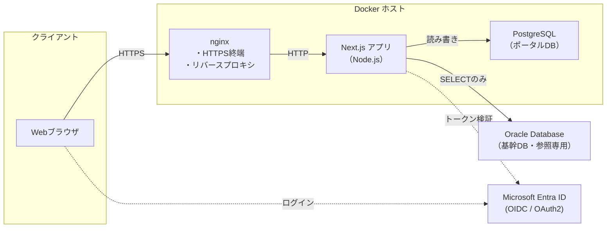
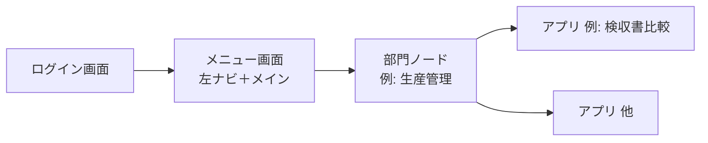

# アプリケーション仕様書

## 1. 文書情報

| 項目 | 内容 |
|------|------|
| プロジェクト名 | Core Data Integration Portal（基幹データ連携ポータル） |
| リポジトリ／作業フォルダ名（例） | **CoreDataIntegrationPortal** |
| 文書の目的 | 本システムの目的・範囲・技術構成・運用上の前提を定義する |
| 想定読者 | 開発者、インフラ担当、プロジェクト関係者 |

---

## 2. 概要

### 2.1 目的

基幹システム周辺の業務を支援する **Web ポータル** を **全社向け** に提供する。**人事・総務・財務・営業・生産管理・品保** など、組織の各部門が利用し、部門に応じた業務支援と基幹データの参照を行う。

### 2.2 対象利用者・組織区分（確定）

| 区分 | 内容 |
|------|------|
| **対象** | **全社**（社内の Microsoft アカウント利用者を想定） |
| **部門区分** | 左メニューおよび業務コンテキストの単位として、例として **全社・人事・総務・財務・営業・生産管理・品保** を扱う（7 章）。 |

各部門の画面・機能・権限の詳細は、要件に応じて追記する。

### 2.3 主な目的（業務ゴール）

- **基幹 Oracle** からは **参照のみ** とする（本システムは基幹 DB を更新しない）。
- **ポータル／PostgreSQL 側** には、業務上 **登録・更新が発生する** データがある（**確定**）。具体のエンティティ・画面・テーブルは要件・設計フェーズで定義する。
- 部門ごとの優先機能（ダッシュボード、一覧、帳票出力など）は、必要に応じて追記する。

### 2.4 システムの位置づけ

- ユーザー向けの入口（ポータル）として単一の Web アプリケーションを提供する。
- 認証は組織の Microsoft アカウント（Entra ID）を利用する。
- アプリケーション本体・データベース・リバースプロキシは **Docker** 上で実行する。

---

## 3. スコープ

### 3.1 本仕様で扱う範囲

- フロントエンドおよびサーバーサイド（Next.js）の技術選定と実行形態。
- リバースプロキシ（nginx）による公開形態。
- コンテナ実行環境（Docker）の前提。
- データ永続化（PostgreSQL）の前提。
- 認証方式（Microsoft Entra ID）の前提。
- 基幹システムとの連携方針（**Oracle DB からの読み取りのみ**）の前提。
- ポータル側データ（**PostgreSQL**）への **業務データの登録・更新** が発生する前提。
- **画面遷移**（ログイン → メニュー → 各アプリ）および **左メニュー構成・部門別の子リンク・メニューに表示するアプリ一覧**。

### 3.2 本仕様で詳細を固定しないもの（別文書・別フェーズ）

- 各アプリ画面の **詳細 UI・ワイヤーフレーム・バリデーション**（メニュー項目・遷移は 7 章で定義）。
- 基幹 Oracle への **接続ユーザー**、**参照を許可するテーブル／カラム**、および **テーブル・項目マッピング**（ACL 上のモデルへの対応）の詳細。
- 非機能要件の数値目標（同時接続数、RPO/RTO 等）は、要件定義フェーズで別途定義する。

### 3.3 ネットワーク前提（確定）

- アプリケーション（Docker 上の Next.js）と **Oracle（基幹 DB）** は **同一セグメント** 上にあり、レイヤ 3 で到達可能であることを前提とする。

---

## 4. 技術スタック

| 区分 | 採用技術 | 備考 |
|------|----------|------|
| フロントエンド | Next.js（App Router）、TypeScript | UI・ルーティング・サーバーサイド処理 |
| 認証 | Auth.js（NextAuth.js）、Microsoft Entra ID | 組織アカウントでのログイン |
| データベース | PostgreSQL | マネージドまたはコンテナ内のいずれか（運用方針に依存） |
| ORM | Prisma（想定） | PostgreSQL 向け。実装フェーズで確定可 |
| 基幹データソース | Oracle Database | **読み取り専用**。基幹システムが利用する DB と同一（想定） |
| 基幹連携アクセス | 実装時に確定 | 例: `oracledb`（Node）、Thin クライアント経由の API 等。読み取り専用アカウントの利用を前提とする |
| HTTP サーバー（前段） | nginx | リバースプロキシ、TLS 終端（構成による） |
| アプリケーション実行 | Node.js（`next start` 等） | nginx の背後で Next.js を実行 |
| コンテナ | Docker（および Compose を想定） | サービス単位でイメージ化 |

---

## 5. アーキテクチャ

### 5.1 論理構成

クライアント（ブラウザ）は **nginx** に HTTPS でアクセスし、nginx が **Next.js（Node.js）** にリクエストを転送する。アプリケーションは **PostgreSQL** に接続してポータル固有データを読み書きする。基幹の参照データは **Oracle** から **読み取りのみ** で取得する（詳細は 5.5）。




### 5.2 コンテナの役割（想定）

| コンテナ | 役割 |
|----------|------|
| **nginx** | 外部からの HTTP(S) 受付、Next.js へのプロキシ、必要に応じて静的ファイルやアップロード上限の制御。 |
| **app**（名称は実装で可変） | Next.js アプリケーション。Route Handlers・Server Actions・Auth.js の処理を含む。 |
| **db**（または外部マネージド DB） | PostgreSQL。本番ではマネージド DB に切り替える選択肢あり。 |

サービス名・ネットワーク（Docker ネットワーク）は `docker-compose` 等の実装時に定義する。

### 5.3 nginx と Next.js の関係

- Next.js は **Node.js プロセス**として動作する。
- nginx は **リバースプロキシ**として、クライアントからの接続を Node がリッスンするポートに転送する。
- TLS（HTTPS）を nginx で終端する構成を推奨する（証明書は nginx 側または別レイヤで管理）。

### 5.4 アプリケーション設計方針（ドメイン駆動）

- 業務モデルと実装の対応を明確にするため、**ドメイン駆動設計（DDD）** を採用する。
- **境界づけられたコンテキスト**（全社・人事・総務・営業・生産管理・品保・財務・アイデンティティ／アクセス・基幹連携 等）と、**ドメイン／アプリケーション／インフラ／インターフェース** のレイヤー分離の詳細は、別紙 **`ドメイン駆動設計.md`** に定義する。

### 5.5 基幹システム連携（確定事項）

| 項目 | 内容 |
|------|------|
| 基幹側データベース | **Oracle Database** |
| ポータルからの操作 | **読み取り（SELECT）のみ**。INSERT／UPDATE／DELETE による基幹 DB 更新は行わない。 |
| 参照のタイミング | **都度**。リクエストに応じて Oracle に問い合わせ、必要なデータを取得する（主方式）。 |
| 参照対象 | **テーブル直接**参照とする（参照専用ビューは用いない方針）。 |
| ネットワーク | アプリと Oracle は **同一セグメント**（3.3）。 |
| ポータル側データベース | **PostgreSQL**（セッション、**メニュー・権限（認可）**、ポータル業務データの登録・更新、その他アプリ固有データ）。 |

- 基幹の行・列は **連携コンテキスト（ACL）** 内でポータル向けモデルに変換し、業務コンテキストが Oracle の物理構造に直接依存しすぎないようにする（`ドメイン駆動設計.md`）。テーブル直接参照でも、ドメイン層へのマッピングは維持する。
- 負荷対策として **PostgreSQL へのキャッシュやスナップショット** を併用するかは、負荷試験・運用方針に応じて **任意** とする。

---

## 6. 認証・認可

### 6.1 認証プロバイダ

- **Microsoft Entra ID**（旧 Azure AD）を利用する。
- アプリケーション登録（クライアント ID、シークレット、リダイレクト URI）は Entra ID 管理センターで行う。

### 6.2 アプリケーション側

- **Auth.js** を用いて OIDC / OAuth フローを実装する。
- セッション管理・コールバック URL は Next.js のオリジンと整合させる（本番 URL と開発 URL の区別に注意）。
- 本番の公開オリジンは **`http://192.168.3.196`** とする（詳細は `Document/本番環境デプロイ手順.md` および `Document/Microsoft認証（Entra ID）構築手順.md`）。

### 6.3 認可

- **誰がどのメニュー・画面・API にアクセスできるか** は、**PostgreSQL 上のデータで制御する**（ユーザー／ロール／メニュー・機能権限のマスタと紐付け）。認証済みユーザー（Entra）をアプリ内ユーザーと対応付けたうえで、**DB の定義に従って表示・実行を許可する**。
- Entra ID のグループ／アプリロールは、**初期同期や補助的な入力**として利用してよいが、**最終的な許可の判定はアプリ側の DB を正とする**想定とする（運用ルールは実装時に定義）。

### 6.4 直接 URL アクセス時の認証

- ユーザーが **ブックマークや外部リンクなどで、ログイン画面以外の URL に直接アクセス** した場合でも、**セッション（ログイン済みか）を判定**する。
- **未ログイン** のときは、認証が必要なパスについて **ログイン（Microsoft 認証）へ誘導**する。
- ログイン完了後は、**元々開こうとしていた URL** に戻れるようにする（実装ではコールバック URL／`callbackUrl` 等で保持する想定）。
- 公開パス（ログイン画面、静的な説明ページなど）の有無とパス一覧は実装時に定義する。

### 6.5 開発環境における認証の補足（ローカル限定）

本番では **Microsoft Entra ID のみ**を前提とする（6.1）。一方、**ローカル開発**では `NODE_ENV=development` かつ環境変数 `AUTH_DEV_MODE=true` のとき、**開発用 Credentials**（メール／パスワード）によるサインインを有効にできる実装とする（資格情報・無効化条件は **`ローカル開発環境構築手順.md`** および実装の `src/auth.ts` を参照）。

次を仕様上の前提として明記する。

- 開発用ログインは **Auth.js（Credentials）** で処理され、**ポータル DB（PostgreSQL）** にユーザー行を作成・更新する処理が走る。したがって **PostgreSQL が起動しており**、接続文字列（`DATABASE_URL`）が正しく、**Prisma スキーマが DB に反映されていること**が必須である。
- DB に接続できない状態でサインインを試みると、ブラウザには **CallbackRouteError**（Auth.js）等の汎用エラーが出ることがあり、原因が「DB 未到達」だと分かりにくい。詳細は **`ローカル開発環境構築手順.md` §10**（トラブルシューティング）に記載する。

---

## 7. 画面構成・メニュー

### 7.1 画面遷移の全体像

画面の流れは次のとおりとする。

```text
ログイン画面 → メニュー画面（左ナビ＋メイン） → 各アプリ画面（複数）
```

- **ログイン**: **Microsoft 認証**（Entra ID）を用いる（6 章）。
- **メニュー画面**: **左側に部門区分のナビゲーション** を置き、選択した区分の **子リンク**（アプリ・一覧・ダッシュボード等）を展開するハブ。初期表示時も **左メニューが先に見える** レイアウトとする。
- **各アプリ画面**: 子リンクから遷移する、機能単位の画面。URL はアプリごとに分かれる想定。



### 7.2 左側メニュー（部門区分の例）

ログイン後に **左側** に表示する **第1階層（部門区分）** の並び例は次のとおりとする（**表示可否は 6.3・7.4 に従い DB で制御**）。

| 順 | 表示名（左メニュー第1階層） |
|----|---------------------------|
| 1 | 全社 |
| 2 | 人事 |
| 3 | 総務 |
| 4 | 財務 |
| 5 | 営業 |
| 6 | 生産管理 |
| 7 | 品保 |

### 7.3 ナビゲーション構造（親子）

- 各部門区分を **親ノード** とし、その **直下に子リンク** を並べる（アプリケーション・サブ画面・将来の外部リンク等）。
- **生産管理** を例に、親「生産管理」の下に **生産管理向けアプリ** を子として配置する。現時点で想定している子項目は次のとおり（**随時追加** 可）。

| 順 | 表示名（生産管理配下） |
|----|---------------------------|
| 1 | 5年9組 |
| 2 | 検収書比較 |
| 3 | 内示受注変換 |
| 4 | 確定受注変換 |

- **「5年9組」** は **正式なメニュー表示名** である。他項目の追加や並び順の変更は、要件に応じて **随時** 行う。

- **全社・人事・総務・財務・営業・品保** の配下の子リンクは、要件に応じて **別途定義** する。
- 各項目の **URL パス・画面仕様** は個別アプリの設計時に定義する。

### 7.4 メニューと権限（データベース）

- **左メニューの第1階層・子リンクの表示**、および **各画面・API の実行可否** は、**PostgreSQL** に保持するマスタと紐付けで制御する（ユーザー識別子、ロール、メニュー項目／操作権限の対応。具体スキーマは実装設計で定義）。
- **並び順・有効／無効** も DB で管理できるようにする想定とする。

---

## 8. データベース

### 8.1 PostgreSQL（ポータル側）

- アプリケーションの **主たる永続化** に使用する。
- 接続情報は環境変数またはシークレット管理で注入し、リポジトリに含めない。
- マイグレーションは Prisma Migrate 等でバージョン管理する想定。
- **認可**に用いる **ユーザーと Entra 識別子の対応、ロール、メニュー定義、権限マッピング** 等も本データベースで管理する（6.3、7.4）。

### 8.2 Oracle（基幹／読み取り専用）

- 基幹システムが利用する **Oracle** から、ポータルは **参照のみ** でデータを取得する。
- 接続は読み取り専用ユーザー、または SELECT のみ許可された権限とする（詳細はインフラ・DBA と調整）。
- 機能ごとに **専用ユーザー・秘密情報の扱い・接続経路** 等の必須セキュリティ要件を定める場合は、**当該機能の機能仕様書**の記述を実装の前提とする（例: `Document/application/5年9組/5年9組_機能仕様書.md` §7.1）。
- **テーブルに直接**アクセスして参照する（ビューは用いない方針）。
- アプリケーションサーバと Oracle は **同一セグメント** で到達する（3.3）。

#### 8.2.1 接続パラメータ（確定）

基幹 Oracle への接続に用いるネットワーク・インスタンス情報は次のとおり。**パスワードは本文書に記載しない**。実装では環境変数またはシークレット管理にのみ保持する。

| 項目 | 値 |
|------|-----|
| プロトコル | TCP |
| ホスト | `192.168.3.204` |
| ポート | `1521` |
| 接続識別子（SID） | `EXPJ` |
| ユーザー ID | `EXPJ`（**SELECT 等参照のみ**の権限に限定すること。パスワードは別管理） |

参考（別システム等で用いる接続文字列のイメージ。本ポータル実装では Node の `oracledb` 等に合わせて上表を環境変数化する）:

```text
(DESCRIPTION =
  (ADDRESS = (PROTOCOL = TCP)(HOST = 192.168.3.204)(PORT = 1521))
  (CONNECT_DATA = (SID = EXPJ)))
```

参照可能なテーブル／カラム・マッピングの詳細は、インフラ・DBA と調整し、`ドメイン駆動設計.md` の **基幹連携（ACL）** でポータル側モデルに変換する。

---

## 9. 非機能要件（初期の考慮事項）

| 区分 | 内容 |
|------|------|
| セキュリティ | **HTTPS** を原則とする。社内 LAN のみの HTTP 運用（例: 6.2 の本番オリジン）と併用する場合は、`本番環境デプロイ手順.md` の nginx／公開形態に合わせて TLS を検討する。本番シークレットの安全な保管、依存パッケージの更新。**認可**は DB 定義に従う（6.3）。 |
| ログ | アクセスログ（nginx）、アプリケーションログの出力先を運用方針に合わせて定義。 |
| バックアップ | PostgreSQL のバックアップ方針は本番環境決定時に必須。 |

数値 SLA は別途要件として定義する。

---

## 10. ヒアリングで確定した前提（Q1〜Q4）

| # | テーマ | 確定内容 |
|---|--------|----------|
| Q1 | ポータル／PostgreSQL の書き込み | **ある**。業務上、ポータル側への **登録・更新** が発生する。 |
| Q2 | 基幹参照の鮮度 | **都度**。リクエスト単位で Oracle に問い合わせる方式を主とする。 |
| Q3 | アプリと Oracle のネットワーク | **同一セグメント**（レイヤ 3 で到達可能な前提）。 |
| Q4 | Oracle 上の参照形態 | **テーブル直接**参照（ビューは用いない方針）。 |

---

## 11. ディレクトリ・文書

| パス | 内容 |
|------|------|
| `Document/` | 本仕様および関連ドキュメントの配置場所 |
| `Document/ドメイン駆動設計.md` | DDD に基づく戦略・戦術設計 |
| `Document/ローカル開発環境構築手順.md` | ローカルデバッグ環境の構築手順 |
| `Document/本番環境デプロイ手順.md` | 本番サーバーへの移植・デプロイ手順 |
| `Document/Microsoft認証（Entra ID）構築手順.md` | Entra ID のアプリ登録とアプリ側設定（リダイレクト URI・環境変数） |
| `Document/application/5年9組/5年9組_機能仕様書.md` | 5年9組機能の画面・処理・Oracle セキュリティ必須要件（§7.1） |
| `Document/diagrams/architecture-mermaid.html` | §5.1 と同内容の論理構成図をブラウザで表示する HTML。**現在はドキュメント作成段階のため未作成。必要に応じて作成し** `Document/diagrams/` に配置する。参照はそれまで本文 §5.1 の Mermaid とする |

---

## 12. 改訂履歴

| 版 | 日付 | 変更内容 |
|----|------|----------|
| 0.1 | 2026-04-10 | 初版（技術スタック・Docker・nginx・PostgreSQL・認証方針） |
| 0.2 | 2026-04-10 | DDD 方針を追加（5.4、`ドメイン駆動設計.md` 参照） |
| 0.3 | 2026-04-10 | 利用部門（主: 生産管理、その他: 営業・品保・財務）、基幹連携（Oracle 読み取り専用）、図 5.1 更新、DB 節の整理、要確認事項を追加 |
| 0.4 | 2026-04-10 | Q1〜Q4 回答を反映（PostgreSQL 書き込みあり、Oracle は都度・同一セグメント・テーブル直接）、3.3 追加、第9章を確定表に変更 |
| 0.5 | 2026-04-10 | 画面構成（ログイン→メニュー→各アプリ）、6.4 直接 URL 時の認証、7 章メニュー一覧（5年9組・検収書比較・内示受注変換・確定受注変換）、章番号繰り下げ |
| 0.6 | 2026-04-10 | `ローカル開発環境構築手順.md` を文書一覧に追加 |
| 0.7 | 2026-04-10 | ローカル手順を更新（Docker で app・DB・nginx を構築するパターンを追記）※文書のみ |
| 0.8 | 2026-04-10 | Next.js ひな形・Docker 一式をリポジトリに追加（手順書に沿った初期構築） |
| 0.9 | 2026-04-10 | `本番環境デプロイ手順.md` を追加（文書一覧に追記） |
| 1.0 | 2026-04-10 | 5.1 論理構成図を詳細版の Mermaid に更新 |
| 1.1 | 2026-04-10 | 5.1 にブラウザ用図 `Document/diagrams/architecture-mermaid.html` を追加 |
| 1.2 | 2026-04-17 | 6.2 に本番 URL（`http://192.168.3.196`）を追記 |
| 1.3 | 2026-04-17 | **全社向け**に変更。左メニュー（全社〜品保の例）、生産管理配下にアプリを子として配置。**認可を PostgreSQL で制御**（6.3・7章・8.1・9章） |
| 1.4 | 2026-04-17 | 第9章の HTTPS と本番 HTTP オリジン（6.2）の整合を明記。第11章に `Microsoft認証（Entra ID）構築手順.md` を追加。`diagrams/architecture-mermaid.html` を任意配備と明記。7.3 に生産管理配下の表示名が例である旨を追記 |
| 1.5 | 2026-04-17 | 7.3 で「5年9組」を正式名称と明記。第11章の `architecture-mermaid.html` を「未作成・必要なら作成」と整理 |
| 1.6 | 2026-04-17 | 文書情報にリポジトリ／作業フォルダ名 **MarueiPortal** を追記 |
| 1.7 | 2026-04-17 | §8.2.1 に Oracle 接続パラメータ（ホスト・ポート・SID・ユーザー ID）を追記。パスワードは文書に含めない |
| 1.8 | 2026-04-20 | §6.5 を追加（開発環境の Credentials・PostgreSQL 前提・CallbackRouteError とローカル手順への参照） |
| 1.9 | 2026-04-27 | 文書情報のリポジトリ／作業フォルダ名を **CoreDataIntegrationPortal** に更新（旧 MarueiPortal） |
| 1.10 | 2026-04-27 | §8.2 に、機能仕様書で定める Oracle セキュリティ必須要件を実装前提とできる旨を追記（5年9組 §7.1 等） |
