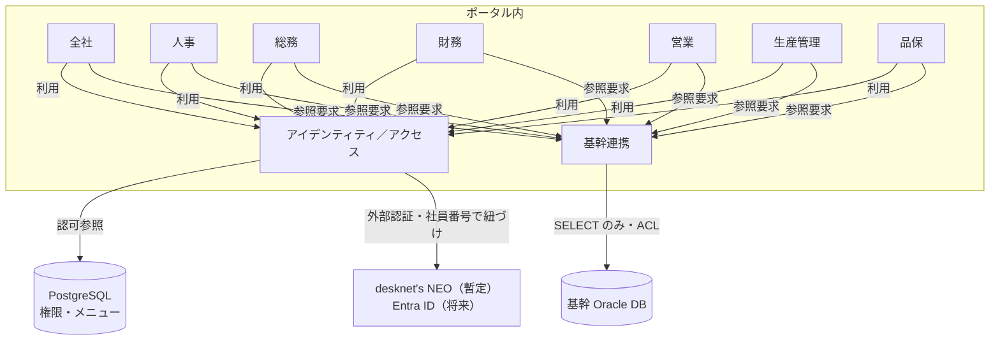

# ドメイン駆動設計（DDD）

## 1. 文書情報

| 項目 | 内容 |
|------|------|
| 目的 | 本システムをドメイン駆動で設計・実装する際の **戦略設計** と **戦術設計** の方針を定義する |
| 関連文書 | `アプリケーション仕様書.md` |
| 想定読者 | 開発者、アーキテクト、ドメインエキスパートとの協働に参加する者 |

---

## 2. なぜ DDD を採用するか

- 業務領域は **全社向けポータル** とし、**人事・総務・財務・営業・生産管理・品保** および **全社横断** の言葉とコードの対応（**ユビキタス言語**）を明確にし、基幹システム側の用語と混同しないようにする。
- **境界づけられたコンテキスト**ごとにモデルを分け、将来の基幹連携や仕様変更に耐える境界を引く。
- ポータルは単一の Python + Django デプロイとして動かしつつ、コードベース上は **ドメイン単位のモジュール** に分割する（モノリス内DDD）。

---

## 3. 戦略設計

### 3.1 ドメインの分解（概要）

| 種別 | 説明 |
|------|------|
| **コアドメイン** | 本システムが独自に提供する価値が最も高い領域。業務が進むにつれ再定義する（例: 部門横断の業務フロー支援、基幹との整合を取るルール）。 |
| **サポートドメイン** | 必要だが差別化の中心ではない領域（例: 画面ナビゲーション、通知の仕組み）。 |
| **汎用ドメイン** | 認証基盤（当面 desknet's NEO、将来 Entra ID）など、外部サービスに委ねる部分。 |

コアドメインの具体名は、要件が固まった段階でドメインエキスパートと合意する。

### 3.2 境界づけられたコンテキスト（初期案）

単一アプリケーション（1 リポジトリ）内で、次の **コンテキスト** に分割する想定とする。名称は実装・業務用語に合わせて調整してよい。

| コンテキスト | 責務のイメージ |
|--------------|----------------|
| **全社（Company-wide）** | 部門横断のお知らせ・共通ポリシー・全社向け入口など（要件に応じて範囲を確定）。 |
| **人事（HR）** | 人事部門の業務に紐づく概念とルール。 |
| **総務（General Affairs）** | 総務部門の業務に紐づく概念とルール。 |
| **財務（Finance）** | 原価・請求・与信参照など、財務部門に紐づく概念とルール。 |
| **営業（Sales）** | 見積・受注・顧客・出荷予定など、営業部門の業務に紐づく概念とルール。 |
| **生産管理（Production）** | 製番・工程・手配・実績など、生産に紐づく概念とルール。 |
| **品保（Quality）** | 品質・検査・不適合など、品保部門に紐づく概念とルール。 |
| **アイデンティティ／アクセス（Identity & Access）** | **認証**は外部サービス（当面 desknet's NEO、将来 Entra ID）。**認可**（メニュー・画面・API の可否）は **PostgreSQL** に保持するポリシーとユーザー紐付けで解釈する。ポータル内の安定したユーザー識別子は **社員番号** とする（仕様書 6.3）。 |
| **基幹連携（Integration）** | 基幹 **Oracle** からの **読み取り**、マッピング、キャッシュ／同期方針。**他コンテキストが直接 Oracle を意識しない** ための窓口。基幹 DB への書き込みは行わない。 |

業務の重なりが小さい場合は、コンテキストの統合・分割を実装時に見直してよい。

### 3.3 コンテキストマップ（関係のイメージ）



- **基幹連携** は **ACL（腐敗防止層）** として、Oracle 上の **テーブル**から取得した行をポータル側のモデルに変換する（`アプリケーション仕様書.md` のとおり、参照専用ビューは用いない方針）。ポータルから基幹への更新は行わない。
- **アイデンティティ／アクセス** は、**認可の正** を **PostgreSQL** に置き、メニュー・操作単位の許可を照会する（仕様書 7.4）。外部認証プロバイダが desknet's から Entra ID に変わっても、社員番号で同じ Django ユーザーへ紐づける。
- 部門コンテキスト間（例: **営業**・**生産管理**）で **顧客・品目** など概念が重なる場合は **共有カーネル** または **パートナーシップ** で用語と境界をドキュメント化し、重複や不整合を防ぐ。

### 3.4 ユビキタス言語

- 各コンテキストごとに **用語集（グロッサリー）** を `Document/` またはリポジトリ内の `docs/glossary` 等で維持する。
- 基幹システムの用語とポータル固有の用語が異なる場合は、**連携コンテキスト** で対応表を持つ。
- コード上のクラス名・DB カラム名は、可能な限りユビキタス言語と一致させる（略語はチームで統一）。

---

## 4. 戦術設計（レイヤー）

Django 単体構成のまま、論理レイヤーを次のように分ける（社内標準: `django_docker_env` 型 Clean Architecture）。

| レイヤー | 責務 | 依存の向き |
|----------|------|------------|
| **ドメイン（domain）** | エンティティ、値オブジェクト、集約、ドメインサービス、リポジトリ **インターフェース（ABC / Protocol）**、ドメインイベント | フレームワーク・DB・HTTP に依存しない |
| **ユースケース（use_cases）** | ユースケース（動詞+名詞のクラス）、トランザクション境界、入出力用のコマンド／クエリ、ドメインの orchestration | ドメインに依存。インフラの具象・Django に依存しない |
| **インフラストラクチャ（infrastructure）** | Django ORM 実装、外部 API クライアント、メッセージ送信、ファイル保存 | ドメインのインターフェースを実装 |
| **インターフェース（interfaces）** | Django views、URL ルーティング、テンプレート、フォーム、**手動 DI（wiring.py）** | ユースケースを呼び出す |

依存のルール: **interfaces → use_cases → domain** の向きのみ。インフラはドメインのポートを実装する（**依存性の逆転**: domain ← infrastructure）。DI コンテナは使わず、`interfaces/wiring.py` で手動組み立てる。

### 4.1 ドメインモデルの要素（使い分け）

| 要素 | 使う場面の目安 |
|------|----------------|
| **エンティティ** | 同一性（ID）で追跡し、ライフサイクル中に変化するもの。 |
| **値オブジェクト** | 属性の組み合わせで表し、不変・交換可能なもの（金額、期間、コード値など）。 |
| **集約** | 整合性を保つ単位。1 トランザクションで更新するまとまりの境界。 |
| **ドメインサービス** | 特定のエンティティに属さないがドメインに属する処理。 |
| **ドメインイベント** | ドメインで起きた事実。連携・監査・非同期処理の起点にできる。 |
| **リポジトリ** | 集約の永続化・再構築。インターフェースはドメイン側、実装はインフラ。 |

### 4.2 基幹連携と腐敗防止層

- 基幹は **Oracle** からの **読み取りのみ** とする。物理テーブルへの **直接 SELECT** を前提とするが、取得結果をそのまま営業・生産などのドメインモデルに持ち込まない。
- **基幹連携コンテキスト** に **DTO／マッパー**（および読み取り専用のゲートウェイ／リポジトリ実装）を置き、ポータル側の集約・値オブジェクト・読み取りモデルに変換する。
- 参照の主方式は **都度**（リクエストに応じた Oracle へのクエリ）。負荷・運用上、**PostgreSQL へのキャッシュやスナップショット** を補助的に併用するかは任意。
- 基幹のスキーマ変更が他コンテキストへの波及を局所化しやすくなる。

---

## 5. コード配置の方針（例）

**境界づけられたコンテキスト**ごとに Django app（`src/application/<app>/`）を切り、各 app 内で **domain / use_cases / infrastructure / interfaces** の責務を分ける。技術的な実装（Django ORM・Oracle クライアント等）は **`infrastructure/`** に置き、ドメインの **ポート（インターフェース）を実装**する（依存性の逆転）。

### 5.0 現行実装（クリーンアーキテクチャ・社内標準）

#### リポジトリ構成

| 配置 | 内容 |
|------|------|
| リポジトリルート | Docker / DevContainer 環境（`docker/`、`docker-compose*.yaml`、`.devcontainer/`、`.env`） |
| `src/` | Django ソース（`manage.py`、`config/`、`application/`、`templates/`、`static/` 等） |
| `Document/` | 仕様・手順書（**リポジトリルートに残す**。`src/` 配下へは移さない） |

#### アプリ内レイヤー（全 Django app 共通）

```text
src/application/<app>/
  domain/
    entities/
    value_objects/
    repositories/   # ABC / Protocol（ports）
  use_cases/        # Django 非依存。動詞+名詞のクラス（例: SearchPage, ExportExcel）
  infrastructure/   # domain の IF 実装。django/models 等
  interfaces/       # views.py, urls.py, wiring.py（手動 DI）
  models.py         # infrastructure/django/models をリエクスポート（Django が期待する位置）
  tests/
```

**依存の向き**

```text
interfaces → use_cases → domain ← infrastructure
```

**DI**

- DI コンテナは **使用しない**。
- `interfaces/wiring.py` でユースケースとインフラを **手動組み立て**する。
- 旧 `composition.py`（app 直下）は **廃止**。`views.py` / `urls.py` も app 直下ではなく **`interfaces/`** に置く。

**依存ルール（全 app 共通）**

- `interfaces/views.py` → `interfaces/wiring` / `use_cases` / `domain` のみ（**`infrastructure` 直 import 禁止**）
- `use_cases/` → `domain` のみ（自 app の `infrastructure` 直 import 禁止。Django 非依存）
- `infrastructure/` → `domain.repositories`（ports）を実装。ORM / Oracle / 外部 API / セッションを担当
- `domain/` → Django / Oracle / HTTP / 他レイヤーに **非依存**

レイヤー検証: `src/config/tests/test_clean_architecture.py`  
エージェント向け要約（Claude Code）: リポジトリルートの **`CLAUDE.md`**（旧 `.cursor/rules/clean-architecture.mdc` は廃止）

#### アプリ一覧（現行）

| Django app | domain | use_cases（例） | infrastructure | interfaces/wiring | 備考 |
|------------|--------|-----------------|----------------|-------------------|------|
| `gonenkukumi` | entities / value_objects / repositories | SearchPage, ExportExcel 等 | django/, oracle/, persistence/ | ✅ | 5年9組。`models.py` は django models をリエクスポート |
| `receipt_comparison` | 同上 | ComparisonPage, Compare, Register 等 | django/, oracle/, persistence/, session/, handlers/ | ✅ | 検収書比較 |
| `inventory_order_alert` | 同上 | ListPage, ImportStock 等 | django/, oracle/, persistence/ | ✅ | 在庫発注アラート |
| `shipment_trend` | 同上 | 一覧・集計系 | django/, oracle/, persistence/ | ✅ | 出荷トレンド一覧 |
| `asset_inventory` | 同上 | ListPage, ExportCsv, ResolveAccessKey | desknet/ | ✅ | 資産棚卸結果（Desknet AppSuite）。views は access_key も wiring 経由 |
| `portal` | 同上 | Favorites, MenuAccess, Dashboard, AccessRequests, UserManagement, NoticeManagement, DatabasePage, Bootstrap 等 | django/, persistence/ | ✅ | メニュー・お気に入り・管理画面。views は ORM/SQL を直実行しない |
| `identity` | 同上 | LoginPage, DesknetLogin 等 | desknet/, persistence/ | ✅ | 認証。`next` URL 検証は views |
| `sales` | （段階整備） | — | oracle/ 等 | 部分 | 営業系の共通インフラ置き場（必要に応じ拡充） |

### 5.1 フォルダ構成（Django + DDD の想定ツリー）

名称は実装で調整してよい。現行の実体は **`src/` 配下**。

```text
（リポジトリルート）
  docker/                                 # Django / PostgreSQL / nginx イメージ定義
  docker-compose.devcontainer.yaml
  docker-compose.production.yaml
  .devcontainer/
  Document/                               # 仕様書（ルートに維持）
  .env / .env.example

  src/                                    # Django ソース
    manage.py
    config/                               # settings / urls / wsgi / asgi
    application/
      portal/                             # 共通画面・メニュー等
      identity/                           # アイデンティティ／アクセス
      gonenkukumi/                        # 生産管理・5年9組
      receipt_comparison/                 # 検収書比較
      inventory_order_alert/              # 在庫発注アラート
      shipment_trend/                     # 出荷トレンド一覧
      asset_inventory/                    # 資産棚卸結果
      sales/                              # 営業（段階整備）
      # 各 app は §5.0 のレイヤー構成に従う
    templates/
    static/
```

戦略設計上のコンテキスト（全社・人事・総務・財務・営業・生産管理・品保・IAM・基幹連携）は、上記 Django app に対応付ける。新規業務は **既存 app の拡張** か **新 app の追加** で切り、いずれも §5.0 のレイヤー規約に従う。

- **Oracle 接続コード**（`python-oracledb`、接続プール、SQL）は各 app の **`infrastructure/oracle/`**（または共有が必要な場合は適切な ACL 配置）に置く。業務ユースケースは **domain のポート**経由で基幹データを利用し、Oracle の物理テーブル名に直接依存しない。
- **PostgreSQL** は **Django ORM**（`infrastructure/django/models`）と、必要に応じて各ドメインのリポジトリ実装で扱う。

### 5.2 簡略版（コンテキストと app の対応）

```
src/application/
  portal/                 # ポータル共通
  identity/               # アイデンティティ／アクセス（権限解釈・認証）
  gonenkukumi/            # 生産管理（5年9組）
  receipt_comparison/     # 検収書比較
  inventory_order_alert/  # 在庫発注アラート
  shipment_trend/         # 出荷トレンド一覧
  asset_inventory/        # 資産棚卸結果
  sales/                  # 営業（段階整備）
src/config/               # Django project settings / urls
Document/                 # 仕様（ルート）
docker/ / .devcontainer/  # 実行環境
```

- **共有してよいもの**: 横断的な型ユーティリティ、認証セッションの取得（interfaces から use_cases へ渡す）。
- **共有を避けるもの**: あるコンテキストの集約を、別コンテキストから直接変更すること。参照が必要な場合は **ID 参照** または **読み取り専用の投影** を検討する。

---

## 6. トランザクションと整合性

- **集約をまたぐ整合性** は、まず **最終的整合性**（イベント、バッチ、再試行）を検討する。
- **同一集約内** は **強い整合性**（単一トランザクション）を保証する。
- Django views（`interfaces/`）からユースケースを 1 リクエストで呼び、ユースケース単位でトランザクション境界を明示する。

---

## 7. 本書と実装の関係

- 本書は **設計原則** を示す。クラス図や DB スキーマの詳細は、各機能の設計時に追加する。
- アプリケーション仕様書の技術スタック（Python + Django、PostgreSQL、Oracle 読み取り、Django ORM、Docker、nginx）は本書と矛盾させない。

---

## 8. 改訂履歴

| 版 | 日付 | 変更内容 |
|----|------|----------|
| 0.1 | 2026-04-10 | 初版（境界コンテキスト案、レイヤー、ユビキタス言語、ACL） |
| 0.2 | 2026-04-10 | 利用部門（品保・財務）、基幹連携を Oracle 読み取り専用に合わせて更新（コンテキストマップ、4.2） |
| 0.3 | 2026-04-10 | 基幹参照を都度・テーブル直接に合わせて 4.2 を更新（キャッシュは任意） |
| 0.4 | 2026-04-17 | **全社向け**に変更。コンテキストに全社・人事・総務を追加。**認可は PostgreSQL**（IAM とコンテキストマップを更新） |
| 0.5 | 2026-04-17 | 3.3 コンテキストマップの ACL 説明を仕様書と整合（Oracle はテーブル直接参照・ビュー非使用方針を明記） |
| 0.6 | 2026-04-17 | §5 を拡充（レイヤー付きフォルダツリー、`infrastructure/oracle` と `integration` の役割分担）。§5.2 に従来の簡略ツリーを残す |
| 0.7 | 2026-07-20 | §4・§5.0 を社内標準（`django_docker_env`）に合わせ更新。`src/application/<app>/`、`use_cases` / `interfaces/wiring.py`、`composition` 廃止、`Document/` ルート維持、アプリ一覧に asset_inventory・shipment_trend を追加 |
| 0.8 | 2026-07-20 | エージェント向け要約を `.cursor/rules` から **`CLAUDE.md`** へ移行 |
| 0.9 | 2026-07-20 | 検収書比較: 比較区分・突合フラグを domain 値オブジェクト化し domain→`models` 依存を解消。CA 検査に `application.<app>.models` 禁止を追加 |
