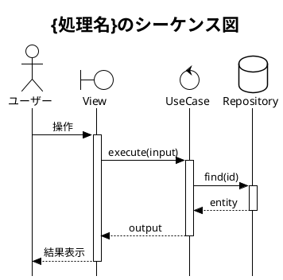

# PlantUML シーケンス図作成スキル

機能設計書の処理フローをPlantUMLのシーケンス図として可視化する。

## 実行フロー

```
Step 1: 情報源の読み取り
  ↓
Step 2: アクターとコンポーネントの特定
  ↓
Step 3: シーケンス図の生成
  ↓
Step 4: ユーザーに確認
  ↓
Step 5: ファイルとして保存
```

## Step 1: 情報源の読み取り

$ARGUMENTS

- ファイルパスが指定されている場合は Read ツールで読み取る
- 処理名が指定されている場合は、対応する設計書を `application/{app_name}/docs/specs/` 配下から探す
- 指定がない場合はユーザーに「どの処理のシーケンス図を作成しますか？」と質問する

以下の関連文書も読み取る:
1. 対応する機能設計書（design.md）
2. `docs/ubiquitous_language_core.md`（存在する場合）
3. `application/{app_name}/docs/ubiquitous_language.md`（存在する場合）

## Step 2: アクターとコンポーネントの特定

設計書から以下を抽出する:

### アクターの種類

| 種類 | PlantUMLの表現 | 例 |
|------|--------------|-----|
| 人間のユーザー | `actor` | ユーザー、管理者 |
| 外部システム | `entity` | SLIMS、MARI、AppSuite |
| UIコンポーネント | `boundary` | ViewController、View |
| アプリケーション層 | `control` | UseCase、ApplicationService |
| ドメイン層 | `control` | DomainService |
| インフラストラクチャ層 | `database` または `entity` | Repository、ApiClient |

### Clean Architectureのレイヤーを参加者として配置

```plantuml
actor ユーザー as user
boundary "View" as view
control "ViewModel" as vm
control "UseCase" as uc
control "Domain" as domain
database "Repository" as repo
entity "外部システム" as ext
```

## Step 3: シーケンス図の生成

### PlantUMLのフォーマット



### 記述ルール

**メッセージの書き方**:
- ユビキタス言語集の用語を使用する
- メソッド名は設計書の定義に合わせる
- 引数と戻り値を簡潔に記述する

**正常系と異常系の分離**:
- 正常系を先に記述する
- 異常系は `alt / else / end` で分岐を表現する

```plantuml
alt 正常系
    uc -> repo : save(entity)
    repo --> uc : success
else バリデーションエラー
    uc --> view : ValidationError
end
```

**ループの表現**:

```plantuml
loop 各アイテムに対して
    uc -> repo : find(itemId)
    repo --> uc : item
end
```

**外部システム連携**:

```plantuml
uc -> apiClient : fetch(params)
activate apiClient
apiClient -> ext : HTTP GET /api/resource
ext --> apiClient : JSON response
apiClient -> mapper : toEntity(json)
mapper --> apiClient : entity
apiClient --> uc : entity
deactivate apiClient
```

**ノートの追加**:

```plantuml
note over uc : ビジネスルールの適用\n在庫数 < 0 の場合はエラー
note right of repo : DBトランザクション内で実行
```

### 図の粒度

| 粒度 | 用途 | 参加者の範囲 |
|------|------|------------|
| 概要レベル | 処理全体の流れを把握する | ユーザー、主要コンポーネント、外部システム |
| 詳細レベル | レイヤー間の呼び出しを確認する | 全レイヤーのクラス |
| 外部連携レベル | API連携の詳細を確認する | APIクライアント、Mapper、外部システム |

ユーザーに「概要レベルと詳細レベルのどちらで作成しますか？」と確認する。
指定がなければ概要レベルで作成する。

## Step 4: ユーザーへの確認

生成したPlantUMLコードをユーザーに提示し、以下を確認する:

- [ ] 参加者（アクター・コンポーネント）に過不足がないか
- [ ] メッセージの順序が正しいか
- [ ] 異常系の分岐が含まれているか
- [ ] ユビキタス言語集の用語が使われているか

## Step 5: ファイルの保存

承認後、以下のパスに保存する:

```
application/{app_name}/docs/specs/{feature-name}/{diagram-name}.puml
```

ファイル名の例:
- `login-sequence.puml`
- `upload-csv-sequence.puml`
- `survey-result-fetch-sequence.puml`

## 複数の図を作成する場合

1つの機能に対して複数のシーケンス図が必要な場合:

| 図 | 内容 |
|---|------|
| `{feature}-overview.puml` | 処理全体の概要フロー |
| `{feature}-normal.puml` | 正常系の詳細フロー |
| `{feature}-error.puml` | 異常系の詳細フロー |
| `{feature}-api.puml` | 外部API連携の詳細フロー |

## 補足

- PlantUMLのレンダリングはユーザーの環境に依存する（VS Code拡張、オンラインサーバー等）
- 図が大きくなりすぎる場合は、処理を分割して複数の図にする
- 設計書に記述されていない処理フローを勝手に追加しない
- 設計書の処理フローと図が一致していることが最も重要
