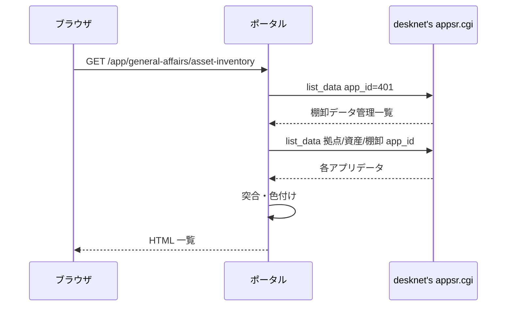

# 資産棚卸結果 機能仕様書

文書ID: REQ-ASSET-INVENTORY-2026-001
作成日: 2026-06-23
更新日: 2026-08-27
対応文書: [ubiquitous_language_core.md](../../../docs/ubiquitous_language_core.md)（UL-CORE-2026-001）、[ubiquitous_language.md](./ubiquitous_language.md)（UL-ASSET-INVENTORY-2026-001）、[資産棚卸結果_テスト仕様書.md](./資産棚卸結果_テスト仕様書.md)

本書は、desknet's NEO 上の **棚卸データ管理・資産データ・棚卸データ** を AppSuite API で取得し、**資産台帳と現地棚卸実績を突合した結果** を総務担当者が Web 上で確認・CSV 出力するための要件を定義する。

提供された CSV ファイル（資産データ・棚卸データ・棚卸データ管理）は **API レスポンスのスキーマ確認用サンプル** であり、本機能では **CSV 取込は行わない**。desknet's を唯一のデータソースとし、**一覧画面を表示するたび（棚卸を選び直すたび）に desknet's API から取得** する（絞り込み・並べ替え・ページ移動はブラウザ内のローカル処理、CSV 出力は取得済みの突合結果スナップショットの再利用であり、いずれも desknet's API を呼び出さない。§3・§4.1.1）。

用語は上記ユビキタス言語集に従う。機能要件の一覧は §2.3、スコープ外は §2.4 に定める。

## 1. 文書情報

| 項目 | 内容 |
|------|------|
| プログラム名 | **資産棚卸結果** |
| 親システム | 業務支援ポータル |
| 配置メニュー | 総務 > 資産棚卸結果 |
| 文書の目的 | desknet's 連携・突合ロジック・表示・CSV 出力を実装可能な粒度で固定する |
| 想定読者 | 業務担当（総務）、ベンダー開発者、テスト担当、プロジェクト関係者 |
| 関連実装 | Django アプリ `asset_inventory` 配下の domain / use_cases / infrastructure / interfaces / templates / static（**実装済み**） |
| 関連ドキュメント | [ubiquitous_language_core.md](../../../docs/ubiquitous_language_core.md)、[ubiquitous_language.md](./ubiquitous_language.md)（本アプリの用語集）、[資産棚卸結果_テスト仕様書.md](./資産棚卸結果_テスト仕様書.md)、[アプリケーション仕様書.md](../../../../Document/アプリケーション仕様書.md) §6（認証）、[desknet's AppSuite API 仕様](https://www.desknets.com/neo/help_application/ja_JP/appendix/api/001.html) |

> **横断課題（指摘 L3-10）は 2026/08/25 に解消した**: 戦略的設計 [`src/docs/strategic_design.md`](../../../docs/strategic_design.md) を新設し、サブドメイン分類・境界コンテキスト・コンテキストマップを定義した。本アプリは境界コンテキスト **E: 資産棚卸結果**（総務・**支援**サブドメイン）に位置づく。基幹 Oracle への共有 ACL `application/sales/infrastructure/oracle/` は同書 §3.1 の**共有カーネル H**（**SELECT のみ**）として所有コンテキストを定めた。観点2 の再検証結果は本書末尾のレビュー履歴に記録している。

### 1.1 実装技術（ポータル共通前提）

| 区分 | 内容 |
|------|------|
| Web | Python + Django |
| 認証 | Django 認証 + desknet's NEO Login API（暫定） / Microsoft Entra ID（将来） |
| 業務データ | desknet's NEO **AppSuite API**（`appsr.cgi`、`action=list_data`）。**読取のみ** |
| ポータル DB | PostgreSQL（本機能では **業務用テーブルを作らない**。認可・お気に入り等はポータル共通。突合結果は Django セッションに保持し、その保存先は §3「突合結果の保持先」を参照） |
| CSV 出力 | サーバー側で **UTF-8 BOM 付き** CSV を生成（エクスポート専用。取込なし） |

### 1.2 レイヤー構成（クリーンアーキテクチャ・5年9組準拠）

| レイヤー | パス | 責務 |
|----------|------|------|
| インターフェース | `interfaces/views.py`, `templates/` | HTTP 入出力。**`interfaces/wiring.py` 経由でのみ** ユースケースを呼び出す（use_cases / infrastructure / models を直 import しない） |
| 配線 | `interfaces/wiring.py` | ユースケース組み立て・desknet ゲートウェイ／アクセスキー解決の注入。組み立てはこのファイル **のみ** で行う |
| ユースケース | `use_cases/*.py` | 一覧・CSV・アクセスキー解決など画面単位のオーケストレーション |
| ドメイン | `domain/value_objects/`, `domain/repositories/` | 突合キー正規化・重複解決・変化点判定・行色区分・表示列マッピング |
| インフラ | `infrastructure/desknet/` | AppSuite API クライアント・レスポンス正規化 |

**ユースケース一覧（`use_cases/`）**

| ファイル | クラス | 概要 |
|----------|--------|------|
| `list_page.py` | `ListPage` | 棚卸データ管理一覧・API 取得・突合結果一覧（SSR） |
| `export_csv.py` | `ExportCsv` | 突合結果 CSV 出力 |
| `resolve_access_key.py` | `ResolveAccessKey` | サービス連携／セッションから実効 `access_key` を解決（views は wiring 経由） |

補助モジュールは domain に集約する。`domain/value_objects/`（突合キー・重複解決・行色・フィルタ等）と `domain/repositories/ports.py`（DTO・ポート型）が担当する。desknet's への HTTP は `infrastructure/desknet/` が担当する。`interfaces/views.py` は infrastructure を直 import しない。

**identity 連携（実装済み）**

AppSuite API 呼び出しには Login API の `access_key` が必要である（[共通 API 仕様](https://www.desknets.com/neo/help_application/ja_JP/appendix/api/002.html)。ログイン成功時に `request.session["desknet_access_key"]` を保存する（`application/identity/views.py`）。有効期限は desknet's 仕様どおりログイン後 3 日間。ログアウト時は Django セッション破棄によりキーも削除される。

**資産棚卸結果** の AppSuite API は、**ログイン時に取得したログインユーザー自身の `access_key`** で呼び出す。したがって利用者には、ポータルの総務メニューグループに加えて **desknet's 側で棚卸関連アプリ（棚卸データ管理・資産データ・棚卸データ等）の参照権限** が必要である。参照権限がない場合の表示は §7.4 に定める。

> **改訂（2026/08/31）**: 従来は専用の desknet's アカウント（サービス連携アカウント）を環境変数に設定して API を呼び出す方式も備えていたが、
> desknet's 側の権限を利用者ごとに付与する運用に一本化したため **撤去した**。環境変数 `DESKNETS_ASSET_INVENTORY_LOGIN_ID` / `DESKNETS_ASSET_INVENTORY_PASSWORD` は廃止する。

---

## 2. 背景・業務目的

### 2.1 背景

固定資産の棚卸は desknet's NEO 上で **資産台帳（資産データ）** と **現地読取結果（棚卸データ）** を別アプリで管理している。**棚卸データ管理** アプリで年度・会社・拠点・対象データセットをひとまとめに定義し、総務が突合結果を確認する運用を想定する。

### 2.2 本機能の目的

| 目的 | 内容 |
|------|------|
| 突合の可視化 | 台帳と棚卸実績を **資産番号＋資産枝番** で突合し、棚卸済み・未棚卸・台帳外を一覧する |
| 差異の強調 | 棚卸済み行について、台帳との **変化点**・**工場（拠点）変化** を色分けして示す |
| 帳票出力 | 画面と同条件の結果を **CSV ダウンロード** できるようにする |
| データの正 | desknet's を **唯一のデータソース** とし、棚卸の選択時に API から取得した最新状態を表示する（ポータル側に業務用テーブルを作らず、業務データを複製・蓄積しない） |

#### 2.2.1 受入基準（指摘 L3-9）

本機能が目的を達成したと判断する基準。5年9組 §10.1 の受入チェックリストに倣う。

| # | 受入基準 | 確認方法 |
|---|---------|---------|
| C-01 | 棚卸データ管理から棚卸を選択すると、資産データ・棚卸データを突合した一覧が表示される | 実データで棚卸を 1 件選択し、棚卸済み・未棚卸・台帳外の 3 区分が件数サマリと一致すること |
| C-02 | 棚卸済み行の変化点・工場変化が色分けで判別できる | 台帳と実績が異なる行が §4.1.5 の色分けどおりに表示されること |
| C-03 | 絞り込み・並べ替え・ページ移動がページ再読み込みなしで動作する | 棚卸結果・プレート作成・拠点・資産番号の各フィルタを操作し、再読み込みが発生しないこと |
| C-04 | 画面と同条件の CSV が出力できる | 絞り込み後の件数と CSV の行数が一致すること |
| C-05 | 突合結果が desknet's の最新状態を反映している | desknet's 側で 1 件更新し、棚卸を選択し直すと反映されること |
| C-06 | ポータル DB に本機能の業務用テーブルが作られていない | マイグレーションに `asset_inventory` の業務テーブルが存在しないこと（REQ-NF-006） |

> **未確定**: 「棚卸作業がどれだけ効率化したか」を測る定量指標（突合作業に要する時間の削減率等）は、現行運用の実測値が無いため設定していない。運用開始後に実績を取得してから定める。

### 2.3 機能要件一覧

| ID | 機能要件 | 詳細 |
|----|---------|------|
| REQ-F-001 | 棚卸データ管理（`app_id=401`）を取得し、棚卸項目の昇順でセレクトに表示する。初回表示は未選択とする | §4.1.1・§4.1.2 |
| REQ-F-002 | 選択した棚卸行が参照する**拠点マスタ・資産データ・棚卸データ**を AppSuite API で取得する（**会社マスタは取得しない**。§5.5） | §3.2・§6 |
| REQ-F-003 | 資産データを棚卸対象資産（`生産品番⑧コード` = `1`）に限定する | §5.0 |
| REQ-F-004 | 資産番号＋資産枝番の正規化キーで突合し、棚卸済み／未棚卸／台帳外の 3 区分に分類する | §5.1・§5.3 |
| REQ-F-005 | 同一キーの棚卸データが複数ある場合、棚卸日時が最も新しい 1 件を採用する | §5.2 |
| REQ-F-006 | 棚卸済み行について変化点を判定し、さらに工場変化を判定して行背景色を決定する | §5.4〜§5.6・§4.1.5 |
| REQ-F-007 | 棚卸結果・プレート作成・拠点・資産番号（前方一致）で絞り込める（ブラウザ内ローカル処理） | §4.1.3・§4.1.3a |
| REQ-F-008 | 単一列ソートおよび最大 5 条件の複数列ソート、表示件数変更・ページ移動ができる | §4.1.6 |
| REQ-F-009 | 行クリックで詳細ダイアログを表示し、写真 2 枚と 9 項目のデータ差異を確認できる | §4.1.7 |
| REQ-F-010 | 写真をクリックすると拡大ダイアログで表示する。添付はポータル経由でプロキシ取得する | §4.1.7・§7.2 |
| REQ-F-011 | 画面と同一の絞り込み条件で全件を UTF-8 BOM 付き CSV に出力する | §7.3 |
| REQ-F-012 | 棚卸の色分けダイアログで行背景色の意味を確認できる | §4.1.5 |
| REQ-F-013 | ログイン時に取得した利用者自身の `access_key` で AppSuite API を呼び出す。desknet's の参照権限がない場合は、依頼先の分かるメッセージを一覧に表示する | §1.2・§3・§7.4 |
| REQ-F-014 | タイトル横からお気に入りメニューに登録できる | §8 |
| REQ-F-015 | 選択中の棚卸のうち**変化点のある棚卸済み行**を、ASP『資産／異動情報修正入力』の貼り付けレイアウト（**75 列**）に沿ったヘッダーなし CSV として出力できる | §4.1.8・§7.5・[requirements.md](./spec/02_asp-import-data/requirements.md) |

### 2.4 スコープ外（やらないこと）

| # | 対象外 | 理由 |
|---|--------|------|
| 1 | CSV による取込 | 提供 CSV は API スキーマ確認用サンプルであり、本番データ経路には使わない |
| 2 | desknet's への登録・更新・削除 | 参照専用（`list_data` のみ） |
| 3 | 業務用テーブルの新設（業務データの複製・蓄積） | desknet's を唯一のデータソースとする。Django セッション等の技術的一時領域は本項の対象外（§3「突合結果の保持先」・REQ-NF-006） |
| 4 | 突合結果の TTL 管理・手動再取得ボタン | 一覧画面の表示ごとに再取得するため不要（§3） |
| 5 | 取得日付の突合・変化点判定への利用 | 表示のみとする（§4.1.4） |
| 6 | 棚卸データへの棚卸対象資産フィルタの適用 | 台帳外を判定するため絞り込まない（§5.0） |

---

## 3. システム境界・前提

| 区分 | 内容 |
|------|------|
| desknet's NEO | **参照のみ**（`list_data`）。INSERT / UPDATE / DELETE は行わない |
| データ鮮度 | **一覧画面を表示するたび**（棚卸セレクトで棚卸を選び直した場合を含む）に desknet's API で資産・棚卸・拠点マスタを取得し、突合結果スナップショットを上書きする。**フィルタ・ソート・ページングはブラウザ内のローカル処理**、**CSV 出力は突合結果スナップショットの再利用**であり、いずれも desknet's API を呼び出さない（TTL・手動再取得ボタンなし） |
| 認証 | Django 認証（ログイン必須）。画面・添付プロキシ・CSV 出力はいずれも `@login_required` を用いるため、未ログイン時は **`/login` へ 302 リダイレクト**する（JSON の 401 は返さない） |
| desknet's 認可 | **ポータルの総務メニューグループ**で画面利用可否を制御する。AppSuite API は **ログインユーザーの `access_key`** を使用するため、データの参照可否は **desknet's 側の参照権限**に従う。権限がない場合は画面を表示したうえで、依頼先の分かるメッセージを一覧のエラー表示枠に出す（ログアウトはしない） |
| アクセスキーの失効 | `access_key` はログイン時にのみ取得するため、desknet's 側で失効すると HTTP 401 / 403 になる。この場合は**ログアウトしてログイン画面へ誘導**し、再ログインで取り直す |
| 認可 | **総務** メニューグループを持つ一般ユーザーおよび管理者が利用可能（§8） |
| CSV サンプル | 開発・テストの fixture 作成の参考。**本番データ経路には使わない** |
| **突合結果の保持先** | 突合結果スナップショット（一覧 15 項目＋データ差異 9 項目）は **Django セッション** に保持する。セッションバックエンドは Django 既定の DB バックエンドであり、実体は PostgreSQL の **`django_session` テーブル**に格納される。これは Django 標準のセッション基盤であって本機能の業務用テーブルではなく、REQ-NF-006 の制約（業務用テーブルを作らない）の適用範囲外とする。保持されたデータは **セッション終了・失効時に破棄** され、一覧画面を表示するたびに上書きされる（TTL・手動再取得なし） |

### 3.1 desknet's アプリ対応（本番想定）

サンプル CSV および業務ヒアリングに基づく対応。部品名は desknet's の **field_name**（日本語部品名）を第一とする。API 設定で部品識別子を使う場合は `field_alias` に読み替える。

| app_id | アプリ名（desknet's） | 用途 |
|--------|----------------------|------|
| **401** | 棚卸データ管理 | 突合対象の選択。各行が他 app_id を参照 |
| （行参照） | 会社マスタ | 管理行の「会社マスタ」列の app_id（例: 394） |
| （行参照） | 拠点マスタ | 管理行の「拠点マスタ」列の app_id（例: 395） |
| （行参照） | 資産データ | 管理行の「資産データ」列の app_id（例: 415） |
| （行参照） | 棚卸データ | 管理行の「棚卸データ」列の app_id（例: 408） |

**棚卸データ管理（app_id=401）の主要部品（サンプル CSV より）**

| 部品名 | 用途 |
|--------|------|
| データID | 管理行の識別子（画面選択キー） |
| 棚卸項目 | 画面セレクトの表示ラベル（例: `2025年`） |
| 年度 | 補助表示 |
| 会社マスタ | 参照先 app_id（数値文字列） |
| 拠点マスタ | 参照先 app_id |
| 資産データ | 参照先 app_id |
| 棚卸データ | 参照先 app_id |

**資産データの主要部品（サンプル CSV より）**

`データID`, `資産番号`, `資産枝番`, `管理部門コード`, `管理者コード`, `管理者名称`, `メーカー`, `メーカーコード`, `摘要`, `管理部門名称`, `旧資産番号コード`, `型番`, `使用区分`, `使用区分コード`, `生産品番⑧コード` 等。

うち `管理部門コード`・`管理者コード`・`使用区分コード`・`メーカーコード`・`旧資産番号コード` は、取り込み用データ（§4.1.8）で ASP のコード列へ出力するために取得する。

**棚卸対象資産（固定フィルタ）**

資産データ取得後、突合の前に **`生産品番⑧コード` が `1` の行のみ** を台帳側の対象とする（TRIM 後文字列一致）。`1` 以外・空の行は未棚卸候補から除外する。棚卸データはフィルタしない（台帳外判定のため）。

**棚卸データの主要部品（サンプル CSV より）**

資産データと共通の部品に加え、`棚卸日時`, `棚卸実施者`, `プレート作成`, `資産写真`, `資産プレート写真` 等。

**会社マスタ・拠点マスタ**

管理行が参照する app_id で `list_data` 取得し、**拠点解決・工場変化判定・画面フィルタ** に利用する。拠点マスタは **管理部門コード**（資産／棚卸データの `管理部門コード`）と突合して拠点情報を解決する。

拠点マスタから取得する部品は以下の 3 件に **確定済み**（実装 `application/asset_inventory/domain/repositories/ports.py` の `SITE_FIELDS`）。

| 部品名 | 役割 |
|---|---|
| `データID` | 拠点マスタ行の識別子 |
| `管理部門コード` | 資産データ／棚卸データの `管理部門コード` と突合するキー |
| `拠点名` | 画面の拠点フィルタ候補および表示に用いる拠点名（§4.1.3a・§5.5） |

### 3.2 AppSuite API 呼び出し

| 項目 | 内容 |
|------|------|
| エンドポイント | `DESKNETS_LOGIN_URL` のホストを流用し、パスを `/cgi-bin/dneo/appsr.cgi` に置換（`dneo.cgi` → `appsr.cgi`） |
| 認証ヘッダー | `X-Desknets-Auth: {access_key}`（セッションの `desknet_access_key`） |
| 一覧取得 | `POST` `action=list_data`, `app_id={app_id}` |
| ページング | `offset` / `limit`（1 リクエスト最大 **5000** 件）。全件取得するまで繰り返す |
| 部品指定 | `fields` に `[{"field_name":"部品名"},…]` 形式の JSON 文字列を指定（desknet's AppSuite API 仕様どおり） |
| エラー | `status != ok` または HTTP エラー時はユーザー向けメッセージを表示し、一覧は空 |

---

## 4. 画面（ルーティング）

| 画面 ID | 画面 | ルート | 概要 |
|---------|------|--------|------|
| SCR-01 | 突合結果一覧 | `/app/general-affairs/asset-inventory` | 棚卸データ管理の選択・突合結果表示・CSV 出力 |

### 4.1 一覧画面（SCR-01）

#### 4.1.1 操作フロー

1. 画面表示時、`app_id=401` で棚卸データ管理を API 取得し、**棚卸項目** の昇順でセレクトボックスに表示する。
2. クエリ `managementId`（データID）で選択行を特定する。未指定時は **未選択のまま** とし、突合結果は表示しない（棚卸データ管理一覧のみを返し、保持中の突合結果スナップショットは破棄する）。REQ-F-001・§4.1.2 と同じ振る舞いである。
3. 選択行から参照 app_id を読み、**拠点マスタ・資産データ・棚卸データ** を API 取得する（並列可）。**会社マスタは取得しない**（§5.5）。
4. 資産データに **§3.1 の棚卸対象固定フィルタ** を適用する。
5. ドメイン層で突合し、一覧・件数サマリを表示する。
6. **突合結果スナップショット**（`request.session["asset_inventory_reconcile_cache"]`）に、選択中 `managementId`・突合後全行・件数・拠点候補・資産番号候補を保持する。
7. **再表示**の API 呼び出しは次のとおりとする。
   - **棚卸データ管理（`app_id=401`）**: 画面表示のたびに API 取得（棚卸セレクト用）。
   - **資産・棚卸・拠点マスタ（手順 3〜6）**: **棚卸が選択されている限り、画面表示のたびに API 取得**する（`managementId` が保持中のスナップショットと一致する場合も再取得し、スナップショットを上書きする）。棚卸セレクトの変更はフォーム送信により画面表示を伴うため、**棚卸を選び直すたびに最新データを取得**することになる。
   - **棚卸未選択**時は手順 3〜6 を行わず、スナップショットを破棄する。
   - **フィルタ・ソート・ページング**（手順 8）はブラウザ内のローカル処理であり画面表示を伴わないため、API 取得は発生しない。**CSV 出力**（手順 9）はスナップショットを再利用し API 取得を行わない。
8. **フィルタ・ソート・ページング**（棚卸結果・プレート作成・拠点・資産番号・列ヘッダ・並び替えダイアログ・表示件数・前へ/次へ）は **ブラウザ内でローカル処理** する。初回表示時に突合後全行を `aiv-list-data`（JSON）として埋め込み、変更時は **ページ再読み込みなし** で表・件数サマリ・ページングを更新する。URL は `history.replaceState` で同期する（ブックマーク・共有用）。
9. **CSV 出力**はサーバ側セッションの突合結果スナップショットを利用する（クエリは URL に反映済みの値を使用）。
10. **取り込み用データの作成**（§4.1.8）も同じスナップショットを利用し、desknet's API 取得を行わない。画面のフィルタ・ソートには依存せず、選択中の棚卸の**全行**から修正対象行を抽出する。

#### 4.1.2 画面上部

| 要素 | 内容 |
|------|------|
| タイトル | `資産棚卸結果`（お気に入りハートはタイトル横）。ハートの右に説明文 `資産台帳と棚卸データを突合し、棚卸結果を表示します。`（`portal-page-description`・検収書比較同型） |
| 棚卸選択 | 白いカード（`portal-search-disclosure` + `receipt-filter`）内のセレクト。ラベル `棚卸` はセレクトの**左**に横並び表示。セレクト表示は `棚卸項目（YYYY年度）` 形式。先頭 option は `選択してください`。**初回表示は未選択**。カード**下辺**に枠と一体のコンパクトなトグル帯（**折りたたむ**／**展開**、12px）を配置（`<summary>` は DOM 先頭・CSS `order` で下辺表示）。**ページを開くたびに展開**（開閉状態は保存しない） |
| 棚卸結果枠 | 常時表示する `card`（検収書比較の「比較結果」枠と同型 `receipt-results-card`）。見出し `棚卸結果`。未選択時は枠内に `棚卸を選択してください。`（`favorite-empty`）。**画面下部いっぱいに伸長**（検収書比較同型の flex / grid レイアウト） |
| 棚卸の色分け | 棚卸結果枠右上。ダイアログで行背景色の意味を表示（§4.1.5） |
| CSV 出力 | 棚卸結果枠右上。棚卸選択時のみ表示 |
| 取り込み用データの作成 | 棚卸結果枠右上、CSV 出力の隣。**常に表示**し、棚卸未選択・一覧エラー時は非活性（§4.1.8） |
| 取得中表示 | API 取得中は半透明オーバーレイとスピナー「データを取得中...」 |

#### 4.1.3 フィルタ

棚卸選択後、**棚卸結果枠内**の **ツールバー行**（表の直上）にフィルタ用パネル（`aiv-filter-panel`）を表示する。**表の表示領域を優先するため、フィルタは独立した行にせず並び替えボタンと同じ行の右側に配置する**。**「フィルター」見出しは表示しない**。各フィルタは `aiv-filter-field` で **ラベル（`aiv-filter-field-label`）をコントロールの上** に縦並び配置し、入力幅・**高さ**（`--portal-control-height`）を統一する（コントロール `aiv-filter-control`）。フィルタは **棚卸結果**・**プレート作成**・**拠点**・**資産番号** の 4 項目とする。変更時は **ブラウザ内ローカル処理**（§4.1.1 手順 8）で即時反映し、**ページ再読み込みは行わない**。

件数サマリ `棚卸済み N 件 / 未棚卸 N 件 / 台帳外 N 件`（**フィルタ適用後** の件数）は、**表の直下のフッタ行**（ページングと同じ行、右寄せ）に表示する。フィルタ結果が 0 件でもページングだけを隠し、件数サマリは常時表示する（絞り込み状況が分かるように）。

| フィルタ | UI | クエリ | 既定 | 内容 |
|----------|-----|--------|------|------|
| 棚卸結果 | セレクト | `status` | `all` | `すべて`（`all`）/ `棚卸済み`（`matched`）/ `未棚卸`（`asset_only`）/ `台帳外`（`inventory_only`）。UI は `portal-filter-select` |
| プレート作成 | セレクト | `plate` | `all` | `すべて` / `プレート有`（`0`＝**作成済み**）/ `プレート作成`（`1`＝**作成対象**）。棚卸データの `プレート作成` コードで照合（UL-ASSET-INVENTORY-2026-001 S-303） |
| 拠点 | セレクト | `site` | `all`（すべて） | 資産データの `管理部門名称` から重複除去した候補（§4.1.3a）。UI は `portal-filter-select`。変更時に即時反映 |
| 資産番号 | テキスト入力 | `assetNumber` | 空（絞り込みなし） | 突合結果一覧の資産番号を **前方一致** で絞り込む。§5.1 の正規化（TRIM・先頭 `L`/`l` 除去）後の文字列で、行の正規化後資産番号が **入力の正規化後文字列で始まる** 行のみ表示。候補は突合結果の資産番号を §5.1 正規化後に昇順で重複除去し、HTML `datalist`（`aiv-asset-number-options`）でオートコンプリート表示。**候補の絞り込みも同じ正規化後の前方一致**（クライアント側で `datalist` を動的更新）。入力停止後 **600ms** でローカル絞り込み。**Enter** でも即時反映。フォーム送信・ページ再読み込みは行わない |

**適用ルール**

| 項目 | 内容 |
|------|------|
| 結合 | 棚卸結果・プレート作成・拠点・資産番号フィルタは **AND** |
| 対象列 | 拠点フィルタは一覧の **`拠点名` 列**（表示用。データソースは §4.1.4 のとおり `管理部門名称`）と **TRIM 後完全一致** で照合 |
| 未棚卸行 | 資産データの `管理部門名称` を `拠点名` として照合 |
| 拠点名が空 | 拠点が `all` 以外に指定されているときは **非表示**。`all` のときは表示 |
| 件数サマリ | フィルタ適用 **後** の件数を表示 |
| ページング | フィルタ適用後の行数に対してページング |
| CSV | 画面と同一フィルタを適用した行のみ出力 |
| 棚卸選択変更 | `managementId` 変更時は `site` クエリを **クリア** し、拠点候補を再構築 |

フィルタ変更時は **ブラウザ内ローカル処理**（§4.1.1 手順 8）で絞り込みを行う。

#### 4.1.3a 拠点フィルタ（詳細）

| 項目 | 内容 |
|------|------|
| 候補の出所 | **棚卸対象の資産データ**（`生産品番⑧コード=1` 適用後）の `管理部門名称` を重複除去して候補とする |
| 候補の並び | 拠点名の **昇順**（日本語ロケール）。重複は除去 |
| 表示ラベル | セレクト（`portal-filter-select`）。ラベル `拠点`。先頭 option は `すべて`（値 `all`） |
| 既定 | `all`＝**全拠点**（絞り込みなし） |
| 変更時 | **ブラウザ内ローカル処理**で即座に絞り込みを反映（棚卸結果・プレート作成と同型）。フォーム送信・ページ再読み込みは行わない（§4.1.1 手順 8）。`onchange` によるフォーム送信は **棚卸選択（`managementId`）のみ** に適用する |
| 候補 0 件 | セレクトは `すべて` のみ表示 |

拠点マスタの部品名は §3.1 のとおり `データID` / `管理部門コード` / `拠点名` に確定済み。フィルタ候補に使うのは **拠点名** 部品とし、行の `管理部門名称` と文字列一致で突合する（§5.5 の工場変化判定で用いる **管理部門コード → 拠点マスタ** 解決とは別経路。フィルタは表示列 `拠点名` を正とする）。

#### 4.1.4 一覧列

表示データの出所は **棚卸データ側の部品値** を基本とし、画面ラベルは次の対応で表示する（ユーザー指定の組み合わせ）。

| # | 画面列名 | データソース部品（棚卸データ） | 備考 |
|---|----------|-------------------------------|------|
| 0 | 棚卸結果 | （突合ロジック） | `棚卸済み` / `未棚卸` / `台帳外` |
| 1 | 変化状況 | （行色区分） | `一致` / `拠点変更` / `差異` / `未突合` |
| 2 | 資産番号 | 資産番号 | 画面は原値表示。突合キーは §5.1 |
| 3 | 資産枝番 | 資産枝番 | |
| 4 | 拠点名 | 管理部門名称 | |
| 5 | メーカー名 | メーカー | |
| 6 | 型番 | 管理者名称 | |
| 7 | シリアルNo. | 型番 | |
| 8 | 取得日付 | **資産データ**の `取得日付` | **表示のみ**（突合・変化点判定の対象外）。シリアルNo. の直後。棚卸済み・未棚卸は資産データから表示、台帳外は空。desknet's 側の **すべての資産データ app に `取得日付` 部品を配置する** 前提とし、API 取得は `ASSET_FIELDS` で常に要求する。API 応答の `yyyy-MM-dd` は `yyyy/MM/dd` に正規化して表示。並び替え時は **日付未入力行を常に末尾** にする |
| 9 | 旧資産番号 | 旧資産番号コード | |
| 10 | 使用区分 | 使用区分 | |
| 11 | 摘要 | 摘要 | |
| 12 | プレート作成 | プレート作成 | 表示変換: `0`（作成済み）→`プレート有`、`1`（作成対象）→`プレート作成`。未棚卸行は空 |
| 13 | 棚卸実施者 | 棚卸実施者 | |
| 14 | 棚卸日時 | 棚卸日時 | |

**行ごとのデータ出所**

| 突合結果 | データ出所 |
|----------|------------|
| 棚卸済み | 棚卸データ（重複解決後 §5.2） |
| 台帳外 | 棚卸データ（重複解決後） |
| 未棚卸 | **資産データ** を同じ列マッピングで表示（`管理部門名称`→拠点名 等）。`プレート作成`・`棚卸実施者`・`棚卸日時` は **空** |

#### 4.1.5 行の背景色（突合結果に応じた色付け）

| 条件 | 背景色 | CSS 目安 |
|------|--------|------------|
| 突合結果 **なし**（未棚卸・台帳外） | 白 | `#ffffff` または透明 |
| 棚卸済み ＋ **変化点なし** | 薄い緑 | `#dcfce7` |
| 棚卸済み ＋ **変化点あり** ＋ 工場変化なし | 薄い青 | `#dbeafe` |
| 棚卸済み ＋ **変化点あり** ＋ **工場変化あり** | 薄い黄 | `#fef9c3` |

色の優先順位: **工場変化あり（黄）** > **変化点あり（青）** > **変化点なし（緑）** > **突合なし（白）**。

**棚卸の色分け** ボタン（在庫発注アラートの「警告条件」同型）から、上記の判定条件と行背景色の対応表をダイアログ表示する。表は `棚卸結果` / `変化状況` / `行の色` の 3 列をポップアップ幅内に収める（在庫発注アラートの警告条件表と同型の `table-layout: fixed` と列幅比率）。行の表示順は **一致 → 拠点変更 → 差異 → 未突合** とする（値の表記は §4.1.4 の変化状況列と一致させる）。一覧内への凡例テキストは表示しない。

#### 4.1.6 ページング・ソート

| 項目 | 内容 |
|------|------|
| ページサイズ | 既定 **50** 件。セレクトで 20 / 50 / 100 / 200 件（在庫発注アラートと同型 UI） |
| ページ移動 | 表下に `表示件数`・`前へ` / `次へ`（`button-link`）・`N–M 件目を表示（P / Q ページ）` |
| 既定ソート | 資産番号昇順 → 資産枝番昇順 |
| ソート | **複数列並び替え**（在庫発注アラート同型）。クエリ `sort` / `dir` はカンマ区切り（最大 5 条件）。表上の **並び替え** ボタン（ラベルは **並び替え** のみ。現在の条件名は表示しない）からダイアログを開き、条件追加・削除・ドラッグ並べ替え。列ヘッダクリックは当該列のみの昇順／降順切替。優先順位はヘッダに番号バッジ（`1` 等）と ▲▼ で表示 |

#### 4.1.7 行詳細ポップアップ

| 項目 | 内容 |
|------|------|
| 起動 | 一覧行クリック（Enter / Space キーでも可） |
| 写真 | 棚卸データの **資産写真**・**資産プレート写真** を 2 列で表示。未添付時は「写真がありません」（枠高 **220px** で左右同一）。表示中の写真を **クリック（Enter / Space でも可）** すると拡大ダイアログ（`aiv-photo-zoom-dialog`）で原寸に近いサイズ表示する。**拡大ダイアログの閉じる** も右上 **×**（`dialog-close-button`） |
| データ差異 | 見出し **データ差異**。 **9 項目**（資産番号・資産枝番・拠点名・メーカー名・型番・シリアルNo.・旧資産番号・使用区分・摘要）を資産データ／棚卸データで並列表示。値が異なる行は **薄青**（`#dbeafe`）で強調 |
| 比較表 UI | 表ヘッダー固定・**ダイアログ内の残り高さいっぱい**で縦スクロール（固定 `max-height` は使わない）。列幅は項目 24%・資産/棚卸各 38%。`min-width: 0` と `scrollbar-gutter: stable` で右端列の欠けを防止。長文はセル内折り返し。ダイアログ高さは最大約 92vh |
| 表示制御 | 行クリック時は **表示前にダイアログ内容を初期化**（比較表・写真をクリア、比較表スクロール位置を先頭へ）。**資産番号／枝番の見出し・棚卸結果・変化状況のサマリ行は表示しない**（一覧列で確認可能）。**閉じる** は右上の **×** ボタン（`dialog-close-button`）。写真はダイアログ表示後に `loading=eager` で取得し、読み込み完了（またはキャッシュ済み）後に表示する。閉じるときも初期化する |
| 画像取得 | desknet's 添付 URL は `GET /api/asset-inventory/attachment?src=…` 経由でプロキシ表示（`X-Desknets-Auth` を付与） |

#### 4.1.8 取り込み用データの作成（ASP 連携）

| 項目 | 内容 |
|------|------|
| ボタン | 棚卸結果カード見出し右、**CSV出力の隣**に `取り込み用データの作成`（`aiv-asp-import-button`）。**棚卸未選択・一覧エラー時も描画し、`disabled` + `title="棚卸を選ぶと作成できます。"` で非活性**にする。突合結果スナップショットのある棚卸を選ぶと活性化する |
| 対象行 | **修正対象行**（V-307）＝棚卸済み かつ 変化点あり の行。**画面のフィルタ・ソートには依存しない**（選択中の棚卸の全行が対象） |
| 出力 | **取り込み用データ**（V-306）＝ヘッダー行なし・**75 列固定**・CRLF・UTF-8（BOM 付き）の CSV。ASP へ貼り付けて使う |
| 値を入れる列 | **9 列**: 1 資産番号 / 2 資産枝番（4 桁ゼロ埋め）/ 3 管理部門コード / 16 型番 / 38 摘要 / 44 管理者コード / 59 抽出コード１３（使用区分コード）/ 64 抽出コード１８（メーカーコード）/ 65 抽出コード１９（旧資産番号コード）。資産番号・資産枝番は必須入力のため常に出力し、他は**変化点のある列のみ**出力する（残りの 66 列は空欄＝ASP 側で変更なし扱い）。6 取得日付は差異の有無にかかわらず常に空欄とする |
| データ元 | 3・16・38・44・59・64・65 は**棚卸データ**側の値。**差異の判定は名称の項目、出力する値はコードの部品**を使う（拠点名→`管理部門コード` / 型番→`管理者コード` / 使用区分→`使用区分コード` / メーカー名→`メーカーコード` / 旧資産番号→`旧資産番号コード`）。16 は画面の **シリアルNo.**（desknet's `型番`）を用いる |
| 0 件のとき | ダウンロードせず、画面に「取り込み対象の変更がありません。」を表示する |
| 値の寄せ（半角変換） | チェック `M`（半角英数記号）の 7 列（1・3・16・44・59・64・65）は、出力前に**強制的に半角へ変換**する（NFKC 正規化＋ダッシュ類・引用符の個別置換。ただし値に かな・カナ・漢字 が含まれる場合は長音記号「ー」を変換しない）。この変換は**既定の動作**であり、**警告は表示しない**（書式を合わせるだけで値の情報が失われないため） |
| 値の寄せ（切り捨て） | 半角変換後もなお領域長（byte）を超える値は、**末尾を切り捨てて**出力する（領域長は 1=12 / 2=4 / 3=12 / 16=24 / 38=64 / 44=12 / 59=12 / 64=12 / 65=12 byte・cp932 換算）。切り捨てた行は**寄せる前→切り捨て後**を挙げた警告を画面に表示する（値が失われるため、半角変換とは異なり必ず通知する）。ただし **1 資産番号・2 資産枝番は切り捨てない**（ASP 上で更新対象の資産を特定するキーであり、切り詰めると別の資産を書き換えるため）。この 2 列は超過したまま出力し、チェック警告として表示する |
| チェック警告 | 寄せたあとの値が**なお** ASP のチェック仕様（必須入力・半角英数記号・整数・領域長）に反するときは、**出力は行ったうえで**違反理由ごとに**項目名・列位置・該当値**を挙げた明細行を警告として画面に表示する |
| 警告の並び | チェック違反 → 切り捨て → 改行置換 → 拠点マスタ縮退 の順に表示する |
| 摘要の改行 | 摘要に改行が含まれる場合は **CRLF → LF → CR の順で半角空白に置換**して出力し、該当資産番号を挙げた警告を画面に表示する（1 行 1 レコードを保つため） |
| 拠点マスタ縮退時 | 拠点マスタを取得できなかった突合結果（§7.4.1）でも**出力は中止せず、3 管理部門コードを空欄**にして出力し、`拠点マスタを取得できなかったため、管理部門コードは出力していません。拠点名の変化点は手作業で確認してください。` を警告として表示する |
| 作成できないとき | 突合結果スナップショットが使えないとき（棚卸未選択・別の棚卸のスナップショット・セッション破損）は出力せず、画面に `棚卸を選び直してください。` を表示する |
| 行数上限 | 上限は設けない。修正対象行をすべて一括で出力する（大量件数時の分割は継続課題） |
| データ取得 | 作成時に desknet's API を呼ばない。§4.1.1 手順6 の**突合結果スナップショットのみ**を使う |
| 再現性 | 同一の突合結果スナップショットからは、何度作成しても**同一内容**（同一バイト列）になる。ASP への自動書き込みは行わない |

> 列レイアウト・チェック仕様の詳細は [requirements.md](./spec/02_asp-import-data/requirements.md)（REQ-ASP-IMPORT-DATA-2026-001）に定める。

---

## 5. 突合ロジック

### 5.0 棚卸対象資産（固定）

| 項目 | 内容 |
|------|------|
| 対象部品 | 資産データ `生産品番⑧コード` |
| 条件 | TRIM 後 **`1` と完全一致** |
| 適用タイミング | API 取得直後・突合前（ユーザー切替不可） |
| 影響 | **未棚卸**・**棚卸済み** の台帳側は対象資産のみ。**台帳外** は棚卸データ全件を維持 |

### 5.1 突合キー

| 項目 | ルール |
|------|--------|
| キー構成 | `normalize(資産番号)` + `|` + `normalize(資産枝番)` |
| 資産番号の正規化 | 前後空白 TRIM。先頭が `L` または `l` のとき **1 文字除去** してから比較（例: `L5262` と `5262` は同一キー） |
| 資産枝番の正規化 | 前後空白 TRIM。空は空文字のまま |
| **正規化の結果が空文字になる場合** | 資産番号が空文字、または `L` / `l` 一文字のみの場合、正規化後の資産番号は **空文字** となる。この行を除外せず、**空文字をそのまま突合キーの構成要素として扱う**（キーは `\|<資産枝番>` の形になる）。資産番号を持たない行同士が同一枝番で突合しうるが、資産データ・棚卸データのいずれも資産番号は必須項目であり、実データでは発生しない前提とする。発生した場合は台帳側の入力不備として一覧に現れるため、**画面上で検知できる**ことを優先する |

### 5.2 棚卸データの重複解決

同一突合キーに棚卸データが複数行ある場合、**棚卸日時が最も新しい行を 1 件採用** する。

- `棚卸日時` のパース形式: `YYYY/MM/DD HH:MM:SS`（desknet's サンプル準拠）。パース不能行は **最古扱い**（他行より優先度低）。
- 同日内時刻相同のときは `データID` 昇順で tie-break。

### 5.3 突合結果区分（3 区分）

| 区分 | 表示ラベル | 条件 |
|------|------------|------|
| MATCHED | **棚卸済み** | 資産データと棚卸データの両方にキーが存在 |
| ASSET_ONLY | **未棚卸** | 資産データにのみ存在 |
| INVENTORY_ONLY | **台帳外** | 棚卸データにのみ存在 |

「突合済み」は業務上 **棚卸済み** と表記する。

### 5.4 変化点判定（棚卸済み行のみ）

資産データ行（台帳）と、採用した棚卸データ行を、次の **対応部品** について **TRIM 後文字列完全一致** で比較する。いずれか 1 つでも異なれば **変化点あり**。

| 比較項目 | 資産データ部品 | 棚卸データ部品 | 取り込み用データの出力列（§4.1.8） |
|----------|----------------|----------------|----------------|
| 拠点名 | 管理部門名称 | 管理部門名称 | 3 管理部門コード（`管理部門コード`） |
| メーカー名 | メーカー | メーカー | 64 抽出コード１８（`メーカーコード`） |
| 型番 | 管理者名称 | 管理者名称 | 44 管理者コード（`管理者コード`） |
| シリアルNo. | 型番 | 型番 | 16 型番（`型番`） |
| 旧資産番号 | 旧資産番号コード | 旧資産番号コード | 65 抽出コード１９（`旧資産番号コード`） |
| 使用区分 | 使用区分 | 使用区分 | 59 抽出コード１３（`使用区分コード`） |
| 摘要 | 摘要 | 摘要 | 38 摘要（`摘要`） |

両方空の場合は一致とみなす。

### 5.5 工場変化判定（変化点ありのときのみ評価）

| 項目 | ルール |
|------|--------|
| 前提 | 棚卸済みかつ変化点あり |
| 判定 | 資産データの `管理部門コード` と棚卸データの `管理部門コード` を、管理行が参照する **拠点マスタ** で解決した **拠点識別子**（拠点マスタ上の一意キー = `データID`。§3.1 で確定済み。拠点マスタに該当行がない場合は `管理部門コード` 自体を識別子とする）が **異なる** 場合に **工場変化あり** |
| フォールバック | 拠点マスタで **両方** のコードを解決できない場合、両方非空かつ **コード値が異なれば** 工場変化ありとする（API で拠点マスタが空の環境向け） |
| マスタ優先 | 拠点マスタで両方解決できた場合は、コード値が違っても **同一拠点識別子** なら工場変化なし |

**会社マスタ** は棚卸データ管理の参照列として保持するのみで、**本機能では取得も画面表示も行わない**（会社名を表示する列は §4.1.4 の 15 列に存在しない）。工場変化判定は **拠点マスタ** を正とする。

### 5.6 行色区分の導出

```
if 突合結果 in (未棚卸, 台帳外):
    row_tone = NONE          # 白
elif not 変化点あり:
    row_tone = MATCH_CLEAN   # 薄緑
elif 工場変化あり:
    row_tone = MATCH_FACTORY # 薄黄
else:
    row_tone = MATCH_DIFF    # 薄青
```

---

## 6. desknet's データ取得シーケンス



取得順序の推奨:

1. 棚卸データ管理（401）
2. 選択行の 拠点マスタ・資産データ・棚卸データ（各 app_id、それぞれ全ページ取得。会社マスタは取得しない。§5.5）

---

## 7. API 仕様（ポータル）

### 7.1 `GET /app/general-affairs/asset-inventory`

- **認証**: 必須
- **認可**: 総務メニューグループを持つ一般ユーザーまたは管理者
- **クエリ**: `managementId`, `status`（§4.1.3）, `site`（拠点名、§4.1.3a）, `plate`, `assetNumber`（§4.1.3）, `page`, `sort`, `dir`
- **処理**: §6 のとおり desknet's 再取得 → 突合 → SSR

### 7.2 `GET /api/asset-inventory/attachment`

- **認証**: 必須
- **認可**: 総務メニューグループを持つ一般ユーザーまたは管理者
- **クエリ**: `src` … desknet's `download_data_file` URL（同一ホストのみ許可）
- **応答**: 画像バイナリ（Content-Type は desknet's 応答に従う）

### 7.3 `GET /api/asset-inventory/export.csv`

- **認証**: 必須
- **認可**: 総務メニューグループを持つ一般ユーザーまたは管理者
- **クエリ**: 一覧画面と同一（`managementId`, `status`, `site`, `plate`, `assetNumber`, `sort`, `dir`）。`page` は無視し **全件** 出力
- **応答**: UTF-8 BOM 付き CSV
- **列順**: §4.1.4 の **15 列**（画面列名どおり。`DISPLAY_COLUMNS` と一致）

`変化状況` の値: `一致` / `拠点変更` / `差異` / `未突合`

### 7.4 エラー応答

| HTTP | 条件 |
|------|------|
| 302 | 未ログイン（`/login` へリダイレクト） |
| 302 | **desknet's がアクセスキーを拒否（HTTP 401 / 403）**。ログアウトしたうえで `/login` へリダイレクトし、「desknet's とのセッションが切れました。お手数ですが、もう一度ログインしてください。」を表示する |
| 403 | 総務メニューグループなし |
| 503 | `desknet_access_key` 欠落（メッセージ: desknet's 再ログインを促す） |
| 502 | desknet's API 障害 |

**desknet's の参照権限がない場合（`W10008`）は エラー応答にしない。** 一覧画面を **200** で表示したうえで、
エラー表示枠に次の文言を出す。画面自体は見えるため、利用者はどの機能で権限が足りないのかを把握できる。

```
desknet's の棚卸関連アプリにアクセス権がありません。
閲覧が必要な場合は、システムグループへ desknet's のアクセス権付与をご依頼ください。
```

アクセスキーの拒否（認証段階の失敗）と参照権限の不足（認可段階の失敗）は**別物として扱う**。
前者は再ログインで復旧するが、後者は再ログインしても直らないためログアウトさせない。

#### 7.4.0 `managementId` に関する 2 ケース（未指定と不正値）

`managementId` は **未指定**と**存在しない値の指定**で振る舞いが異なる。いずれも HTTP は **200** であり、エラー応答ではない。

| ケース | 条件 | 振る舞い | 画面メッセージ |
|---|---|---|---|
| **未指定** | クエリ `managementId` がない、または空文字 | **初回表示**として扱う。棚卸データ管理のセレクトのみを返し、突合は行わない。保持中の突合結果スナップショットは破棄する（§4.1.1 手順2・手順7） | なし（未選択状態） |
| **不正値** | 指定された `managementId` が棚卸データ管理に存在しない | 突合を行わず、突合結果スナップショットを破棄する | 「指定された棚卸データ管理が見つかりません。」 |

> 棚卸データ管理そのものが 0 件の場合は、上記より前に「棚卸データ管理が登録されていません。」を表示する。

#### 7.4.1 一部のアプリのみ取得に失敗した場合（指摘 L3-14）

§4.1.1 手順3 は拠点マスタ・資産データ・棚卸データの 3 本を取得する。**すべてが 502 になるとは限らない**ため、失敗したアプリごとに振る舞いを定める。

| 失敗したアプリ | 振る舞い |
|---|---|
| **資産データ** または **棚卸データ** | 突合そのものが成立しないため **502** を返す（画面は一覧を表示しない） |
| **拠点マスタ** のみ | **処理を継続する**。§5.5 のフォールバック（拠点マスタで解決できない場合は `管理部門コード` を直接比較する）で工場変化を判定し、一覧上部に警告「拠点マスタを取得できませんでした。工場変化の判定は管理部門コードの直接比較で行います。」を併記する |

> 502 を返すのは、突合の成立に不可欠な資産データ・棚卸データが取得できない場合に限る。
> **会社マスタ** は取得しないため（§5.5）、この表の対象外とする。

**拠点マスタのみ失敗した場合の追加規定**

- **拠点名の表示と拠点フィルタの候補は資産データの `管理部門名称` から生成する**ため、拠点マスタの取得失敗による影響を受けない（候補を空にはしない）。
- 縮退した突合結果は **§4.1.1 手順6 のスナップショットに保存しない**。次の表示で拠点マスタの取得を再試行し、成功すれば警告なしの通常結果に復帰する。
- CSV 出力（§7.3）も同じ規定に従い、拠点マスタの取得失敗のみでは失敗させない。

### 7.5 `GET /api/asset-inventory/asp-import.csv`

- **認証**: 必須
- **認可**: 総務メニューグループを持つ一般ユーザーまたは管理者
- **クエリ**: `managementId` のみ（フィルタ・ソート・ページのクエリは受け取っても無視する。§4.1.8）
- **応答（出力あり）**: UTF-8 BOM 付き・ヘッダーなし・75 列固定の CSV。`Content-Disposition: attachment; filename="asp_import_<yyyymmddhhmmss>.csv"`、`X-Asp-Import-Status: ok`、`X-Asp-Import-Rows: <行数>`。チェック仕様違反・値の切り捨て・改行置換・拠点マスタ縮退があるときは `X-Asp-Import-Warning`（半角変換のみの場合は付さない）（**URL エンコード**した警告文）を付す
- **応答（0 件）**: `X-Asp-Import-Status: empty` と本文にメッセージ（`text/plain`）。`Content-Disposition` は付けずダウンロードさせない
- **応答（作成不可）**: `X-Asp-Import-Status: unavailable` と本文にメッセージ（`text/plain`）。`Content-Disposition` は付けずダウンロードさせない
- **エラー**: 302（未認証）・403（認可外）のみ。**それ以外は常に 200** を返し、`X-Asp-Import-Status`（`ok` / `empty` / `unavailable`）で結果を区別する（**503 / 502 は返さない**）

---

## 8. 認可・メニュー

| 項目 | 内容 |
|------|------|
| メニューキー | `asset-inventory` |
| メニュー表示名 | 資産棚卸結果 |
| メニューグループ | `general-affairs`（総務）。`PortalMenuGroupAccess.group_key` は英語キーを正とし、旧データの日本語キー（`総務` 等）は正規化して扱う |
| URL | `/app/general-affairs/asset-inventory` |
| お気に入り | タイトル横ハート（ポータル共通） |

`application/portal/domain/menu.py` およびメニュー権限マスタに追加する。

---

## 9. 非機能要件

| ID | 項目 | 内容 |
|----|------|------|
| REQ-NF-001 | タイムアウト | desknet's 1 リクエスト `DESKNETS_TIMEOUT_SECONDS`（既定 10 秒） |
| REQ-NF-002 | ログ | `access_key`・パスワードをログに出さない |
| REQ-NF-003 | 性能 | 1 リクエストの取得上限は 5000 件。全件取得するまでページングを繰り返す。棚卸選択時のみ取得し、絞り込み・並べ替え・ページ移動はブラウザ内で処理する |
| REQ-NF-003a | データ量 | **突合結果の総件数に上限を設けない**（指摘 L3-15）。突合後の全行は ①Django セッション（`django_session` テーブル。§3「突合結果の保持先」）と ②ページ埋め込み JSON `aiv-list-data`（§4.1.1 手順8）の 2 箇所に載るため、件数に比例してセッション行サイズと初回表示の HTML サイズが増える。**想定規模**は 1 棚卸あたり数千件（資産台帳の規模）であり、この範囲では実用上の問題が生じないことを前提とする。上限判定を実装しない代わりに、表示が重くなる／セッション保存に失敗するといった事象が観測された時点で Issue として起票し、ページング方式の見直しを検討する |
| REQ-NF-004 | 可用性 | desknet's API が失敗した場合はユーザー向けメッセージを表示し、一覧は空とする（§7.4） |
| REQ-NF-005 | desknet's | 参照のみ（`list_data`）。INSERT / UPDATE / DELETE は行わない |
| REQ-NF-006 | データ保持 | **本機能専用の業務用テーブル（マイグレーションを伴う業務データの永続化）を作らない**。資産・棚卸の業務データは desknet's を唯一の正とし、ポータル側に複製・蓄積しない。突合結果は Django セッションにのみ保持する（§3「突合結果の保持先」）。**Django セッション等の技術的一時領域は本制約の適用範囲外**とする |
| REQ-NF-007 | テスト | [資産棚卸結果_テスト仕様書.md](./資産棚卸結果_テスト仕様書.md)。ドメイン単体を CI で必須とし、desknet's はモック |
| REQ-NF-008 | クリーンアーキテクチャ | `config/tests/test_clean_architecture.py` に `asset_inventory` を追加 |

---

## 10. 改訂履歴

| 版 | 日付 | 内容 |
|----|------|------|
| 1.0 | 2026-06-23 | 初版。desknet's API 専用・突合 3 区分・表示列マッピング・行色・L 除去突合・棚卸重複は最新日時採用 |
| 1.1 | 2026-06-23 | 拠点フィルタを詳細化（拠点マスタ候補・複数選択・AND 条件・件数サマリ／CSV 連動） |
| 1.2 | 2026-06-23 | Web 実装完了。`asset_inventory` アプリ・identity `desknet_access_key` 連携・テスト追加を反映 |
| 1.3 | 2026-06-23 | AppSuite `list_data` を POST 化し、`fields` を `[{"field_name":…}]` 形式に修正 |
| 1.4 | 2026-06-23 | 棚卸データ管理の部品名を実データどおり `棚卸項目` に修正。データなし（W110）は空一覧扱い |
| 1.5 | 2026-06-23 | 棚卸・突合結果セレクトにポータル共通 `portal-filter-select` を適用（他アプリと同型 UI） |
| 1.6 | 2026-06-24 | 資産データを `生産品番⑧コード=1` の棚卸対象資産に固定フィルタ |
| 1.7 | 2026-06-24 | 表下ページング UI を在庫発注アラート同型（表示件数・前へ/次へ・件数表示）に統一 |
| 1.8 | 2026-06-24 | 拠点候補を資産データ由来に変更。プレート作成の表示変換・フィルタ追加。列ヘッダソート |
| 1.9 | 2026-06-24 | 画面レイアウトを在庫発注アラート同型に変更（フィルター→ツールバー→表）。対象注記を削除。複数列並び替えダイアログを追加 |
| 2.0 | 2026-06-24 | 拠点フィルタをチェックボックスからセレクトボックスに変更（変更時即時反映） |
| 2.1 | 2026-06-25 | 棚卸セレクトを見出し左へ移動。初回未選択。凡例を「行の色分け」ダイアログに変更 |
| 2.2 | 2026-06-25 | 検収書比較同型のレイアウト（棚卸フィルター + 棚卸結果枠）に変更 |
| 2.3 | 2026-06-25 | 見出しを「棚卸結果」に変更。棚卸結果枠を画面いっぱいに伸長 |
| 2.4 | 2026-06-25 | タイトル下に説明文追加。棚卸→棚卸年。行の色分け→棚卸の色分け。色分けダイアログの列幅調整 |
| 2.5 | 2026-06-25 | 説明文から「desknet's の」を削除 |
| 2.6 | 2026-06-25 | ラベルを「棚卸」に戻し、年度表示を「（YYYY年度）」形式に変更 |
| 2.7 | 2026-06-25 | 棚卸の色分けダイアログの表列が切れないようスタイルを警告条件表同型に修正 |
| 2.8 | 2026-06-25 | 件数サマリをツールバー左寄せ（並び替えボタンの右隣）に変更 |
| 2.9 | 2026-06-25 | 行色を変更（薄黄=拠点変更、薄青=変化あり） |
| 2.10 | 2026-06-25 | 棚卸の色分けダイアログの行順を変更（拠点変更を差異ありより上に） |
| 2.11 | 2026-06-25 | 一覧列「突合結果」を「棚卸結果」に改名し「変化状況」列を追加 |
| 2.12 | 2026-06-25 | 拠点マスタ未取得時は管理部門コード直接比較で拠点変更を判定 |
| 2.13 | 2026-06-25 | 行クリック詳細ポップアップ（写真2枚・台帳差異）と添付プロキシ API を追加 |
| 2.14 | 2026-06-25 | 添付なしフィールドの空 attach を URL 誤認識しないよう修正 |
| 2.15 | 2026-06-25 | 行詳細の比較表を9項目全表示・差異行の薄青強調・ヘッダー固定に拡張 |
| 2.16 | 2026-06-25 | 比較表の列幅調整・横スクロール非表示・長文セル折り返し |
| 2.17 | 2026-06-25 | 行詳細ポップアップの表示前初期化・写真の読み込み完了後表示 |
| 2.18 | 2026-06-25 | 比較表の右端列欠け防止（flex 幅調整・scrollbar-gutter） |
| 2.19 | 2026-06-25 | 行詳細写真の lazy 読み込み不具合修正（eager・キャッシュ complete 判定） |
| 2.20 | 2026-06-25 | 行詳細写真のクリック拡大表示ダイアログを追加 |
| 2.21 | 2026-06-25 | 棚卸選択カードに下中央トグル（`<details>`）による折りたたみを追加。開閉状態を localStorage に保存 |
| 2.22 | 2026-06-25 | トグルを全幅フッター帯に変更（枠になじむグラデーション）。ラベルを「折りたたむ」／「展開」に切替 |
| 2.23 | 2026-06-25 | 折りたたみ UI を共通 `portal-search-disclosure` に整理（localStorage キー形式を統一） |
| 2.24 | 2026-06-25 | 棚卸結果枠内フィルタの「フィルター」見出しを削除 |
| 2.25 | 2026-06-25 | 棚卸選択のラベル「棚卸」をセレクト左に横並び表示 |
| 2.26 | 2026-06-25 | 共通 `portal-search-disclosure` トグルをコンパクト化（12px） |
| 2.27 | 2026-06-25 | 検索条件と折りたたみトグル間の余白を拡大 |
| 2.28 | 2026-06-25 | 行詳細ポップアップから棚卸結果・変化状況のサマリ行を削除 |
| 2.29 | 2026-06-25 | 行詳細ポップアップの資産番号見出しを削除。「データ比較」→「データ差異」に変更 |
| 2.30 | 2026-06-25 | 行詳細ポップアップの閉じるを右上 × ボタンに変更 |
| 2.31 | 2026-06-25 | 行詳細の写真なし枠を左右同サイズ（220px）に統一 |
| 2.32 | 2026-06-25 | 行詳細のデータ差異表をダイアログ残り高さいっぱいにし縦切れを解消 |
| 2.33 | 2026-06-25 | 行詳細ダイアログの `display: flex` が未オープン時も表示される不具合を修正 |
| 2.34 | 2026-06-25 | 写真拡大ダイアログの閉じるを右上 × に変更 |
| 2.35 | 2026-06-25 | 棚卸選択折りたたみの初回表示を展開状態に統一 |
| 2.36 | 2026-06-25 | `portal-search-disclosure` の `display: flex` 除去・localStorage キー v2 化で初回展開を確実化 |
| 2.37 | 2026-06-25 | 折りたたみトグルをカード下辺に戻す（summary 先頭 + CSS order） |
| 2.38 | 2026-06-25 | 棚卸選択折りたたみをページ表示のたびに展開（localStorage 復元を廃止） |
| 2.39 | 2026-06-25 | `PortalMenuGroupAccess` 旧日本語 `group_key` 正規化を追記（総務権限の不整合解消） |
| 2.40 | 2026-06-25 | AppSuite API 用サービス連携アカウント（`DESKNETS_ASSET_INVENTORY_LOGIN_ID`）を追加 |
| 2.41 | 2026-06-25 | 一覧に資産データの取得日付列を追加（表示のみ）。並び替えボタンラベルを「並び替え」のみに変更 |
| 2.42 | 2026-06-25 | 取得日付部品を棚卸データ API の `fields` から除外（W8000360 解消） |
| 2.43 | 2026-06-25 | フィルタ UI のラベル・コントロール幅を統一（`aiv-filter-field`）。資産番号テキストフィルタ（`assetNumber`・datalist オートコンプリート）を追加 |
| 2.44 | 2026-06-26 | 取得日付未入力の古い資産データに対応（空表示・日付正規化・並び替え末尾固定・部品未定義時の API フォールバック） |
| 2.45 | 2026-06-26 | 取得日付を desknet's 資産データ全 app 必須部品とし、API フォールバック・空欄 `—` 表示を廃止 |
| 2.46 | 2026-06-26 | 資産番号フィルタの入力中デバウンス送信を廃止（Enter / blur / datalist 完全一致で送信） |
| 2.47 | 2026-06-26 | 資産番号フィルタを L 除去後の前方一致に変更 |
| 2.48 | 2026-06-26 | 資産番号フィルタに 600ms デバウンス自動送信を復活（`change` 送信は廃止のまま） |
| 2.49 | 2026-06-26 | 突合結果の Django セッションキャッシュを追加。同一 `managementId` のフィルタ・ソート・ページング・CSV は API 再取得なし |
| 2.50 | 2026-06-26 | 資産番号フィルタ送信後に入力欄フォーカスを復元。datalist 操作時の blur 誤送信を遅延判定で防止 |
| 2.51 | 2026-06-26 | 資産番号オートコンプリート候補を L 除去後の前方一致に統一（候補抽出・datalist 動的絞り込み） |
| 2.52 | 2026-06-26 | 資産番号フィルタ送信後のフォーカス復元を `aivFocusAsset` クエリ＋`autofocus` で強化 |
| 2.53 | 2026-06-27 | フィルタ・ソート・ページングをブラウザ内ローカル処理に変更（`aiv-list-data` JSON・ページ再読み込みなし） |
| 2.54 | 2026-06-27 | ソート・ページング・列見出し・並び替えダイアログを `portal-list-core.js` / `portal-list-sort-dialog.js` へ移行（[ポータル一覧表_共通仕様.md](../../portal/docs/ポータル一覧表_共通仕様.md)） |
| 2.55 | 2026-06-27 | 一覧フィルタのコントロール幅を共通 CSS 変数で縮小（`--portal-list-filter-control-width: 9.5rem`） |
| 2.56 | 2026-06-27 | 一覧フィルタのラベルをセレクト上の縦並びレイアウトに変更 |
| 2.57 | 2026-06-27 | 棚卸結果カード（見出し・色分け・CSV出力）上の余白を縮小（カード上 padding `8px`、セクション間 gap `6px`） |
| 2.58 | 2026-06-27 | ページ説明文をタイトル下からお気に入りハート横（`portal-page-description`）へ移動 |
| 2.59 | 2026-06-29 | 資産番号フィルタの高さを拠点セレクトと同一（`--portal-control-height`）に統一 |
| 2.60 | 2026-07-20 | interfaces 痩せ化: access_key 解決を `ResolveAccessKey` + `wiring` 経由に変更（views から infrastructure 直 import を除去） |
| 2.61 | 2026-07-20 | 添付プロキシ取得を `FetchAttachment` + infrastructure へ移設（domain は URL 許可判定のみ） |
| 2.62 | 2026-07-30 | **L1レビュー指摘の是正**。文書ID・作成日・更新日を追加。機能要件（REQ-F-001〜014）・非機能要件（REQ-NF-001〜008）を採番し非機能を拡充。スコープ外（§2.4）を新設。§7 の節番号を 7.1〜7.4 の連番へ整理。用語を UL 準拠に修正（キャッシュ→突合結果スナップショット、総務権限→総務メニューグループ、権限→認可、サマリ→サマリ行）。矛盾を解消（冒頭・§2.2 のデータ鮮度、§4.1.3a の拠点フィルタのフォーム送信、§7.3 の CSV 列数 13→15、§3 の権限参照 §9→§8、変化状況の表記「〜あり」の削除） |
| 2.63 | 2026-07-30 | **L2再レビュー指摘の是正**。§4.1.3a 「全工場」→「**全拠点**」（UL V-302 は「工場」単独を使用しない）。§4.1.5 棚卸の色分けダイアログの列名「差異」→「**変化状況**」（S-302 の値「差異」との衝突を解消） |
| 2.64 | 2026-07-31 | **指摘 L2-7 のクローズ**。プレート作成の値の意味を業務担当の確認により確定（`0`＝**作成済み** / `1`＝**作成対象**）。§4.1.3・§4.1.4 の「未確認」注記を削除。表示ラベル（プレート有／プレート作成）・変換規則・フィルタ値は据え置き（確定した意味と整合するため） |
| 2.67 | 2026-08-25 | **L3レビュー（3巡目）指摘の是正**。NG 1件: §4.1.1 手順2 の「未指定時は先頭行を選択する」を「未指定時は未選択のまま」に訂正し、REQ-F-001・§4.1.2・実装と一致させた（L3T-3）。警告 1件: §7.4.0 を新設し `managementId` の**未指定**と**不正値**の 2 ケースの振る舞いを明記。横断課題 L3-10 の解消（`src/docs/strategic_design.md` 新設）に伴い、§1 直後の横断課題ブロックを更新し観点2 を再検証した |
| 2.66 | 2026-08-19 | **L3再レビュー指摘 L3R-1 の是正**。§7.4.1「一部のアプリのみ取得に失敗した場合」を実装に追随させた（拠点マスタのみの失敗では一覧・CSV を継続し、一覧上部に警告を表示。縮退結果はスナップショットに保存しない）。あわせて §7.4.1 の事実誤認を訂正（拠点名表示・拠点フィルタ候補は資産データの `管理部門名称` 由来のため縮退しない／会社マスタは初版では取得しないため対象外）。**会社マスタが未取得である事実**を REQ-F-002・§4.1.1 手順3・§5.5・§6 に反映。§7.1・§7.4 の「未ログインは API 401」を実装どおり **`/login` へ 302 リダイレクト**に訂正 |
| 2.69 | 2026-08-25 | **ASP 取り込み用データの作成を追加**。REQ-F-015・§4.1.1 手順10・§4.1.8・§7.5 を新設（修正対象行のみ・75 列固定・ヘッダーなし CSV・0 件時はダウンロードせずメッセージ・チェック仕様違反は警告付きで出力）。詳細要件は `docs/spec/02_asp-import-data/requirements.md` に置く |
| 2.70 | 2026-08-26 | **取り込み用データの作成を実装に合わせて精緻化**。ボタンは常に描画し棚卸未選択・一覧エラー時は非活性（§4.1.2・§4.1.8）、摘要の改行は半角空白へ置換して警告、拠点マスタ縮退時は 3 管理部門コードを空欄にして出力、スナップショットが使えないときは `棚卸を選び直してください。`、行数上限なし、作成時に desknet's API を呼ばない、同一スナップショットからは同一内容。§7.5 は 302 / 403 以外は常に 200 を返し `X-Asp-Import-Status` で区別（503 / 502 は返さない）に訂正 |
| 2.75 | 2026-09-01 | **一覧レイアウトを表の表示領域優先に変更**。フィルタパネルを並び替えボタンと同じツールバー行へ移動し、独立したフィルタ行を撤去。件数サマリをテーブル直上からフッタ行（ページングと同じ行、右寄せ）へ移動し、0 件時もページングのみ隠し件数サマリは常時表示するよう変更（§4.1.3） |
| 2.74 | 2026-08-31 | **サービス連携アカウントを撤去し、ログイン時に取得した利用者自身の `access_key` に一本化**。desknet's 側の参照権限を利用者ごとに付与する運用に切り替えたため、環境変数 `DESKNETS_ASSET_INVENTORY_LOGIN_ID` / `PASSWORD` と関連コード・ユビキタス言語 SYS-301 を削除した。あわせて **アクセスキーの拒否（HTTP 401 / 403）はログアウトして再ログインへ誘導**、**参照権限の不足（W10008）は 200 のまま依頼先の分かるメッセージを表示** と、認証段階と認可段階の失敗を分けて扱うようにした。REQ-F-013・§1.2・§3・§7.4 を更新 |
| 2.73 | 2026-08-27 | **半角への強制変換は既定の動作とし、警告に表示しない**（D-15）。値の情報が失われず、毎回通知すると本当に確認が要る指摘（チェック違反・切り捨て）が埋もれるため。警告の並びを チェック違反 → 切り捨て → 改行置換 → 拠点マスタ縮退 の 4 種別に改めた。あわせて棚卸結果カードのメッセージ表示エリアの高さを**内容の行数分**に改めた（従来はカード内の余白すべてに広がっていた）。§4.1.8・§7.5 を更新 |
| 2.72 | 2026-08-27 | **取り込み用データの値を ASP の書式へ寄せる**。チェック `M`（半角英数記号）の 7 列は出力前に**強制的に半角へ変換**し（NFKC＋ダッシュ・引用符の個別置換。かな・カナ・漢字を含む値では長音記号を保護）、変換後もなお領域長を超える値は**末尾を切り捨てる**（D-14）。ただし更新対象の資産を特定するキーである **1 資産番号・2 資産枝番は切り捨てない**。寄せた事実は警告に出し（変換前→変換後）、警告は チェック違反 → 切り捨て → 半角変換 → 改行置換 → 拠点マスタ縮退 の順に表示する。あわせてチェック警告を資産番号の羅列から**違反理由ごとの明細行（項目名・列位置・該当値）**に改めた。§4.1.8・§7.5 を更新 |
| 2.71 | 2026-08-26 | **取り込み用データの出力列を 5 列から 9 列に拡張**。利用者提供の ASP 貼り付けレイアウトにより 44 管理者コード・59 抽出コード１３（使用区分コード）・65 抽出コード１９（旧資産番号コード）の対応が判明し（D-11）、続いて 64 抽出コード１８（メーカーコード）の対応が判明した（D-13）。**差異の判定は名称の項目、出力する値は棚卸データのコード部品**とする。6 取得日付は常に空欄（D-12）。これにより変化点判定 7 項目すべてに ASP の対応列が揃い、「対応列がない項目」は無くなった。§3.1 主要部品・§4.1.8・§5.4 を更新 |
| 2.68 | 2026-08-25 | **会社単位フィルタの記述を削除**（§2.4 スコープ外の行・§5.5 の将来実装文・§6 のシーケンス。会社マスタは棚卸データ管理の参照列としての事実のみ残す）。**データ鮮度を変更**: 棚卸選択の変更時のみの取得から、**一覧画面の表示ごとの再取得**に改めた（§3・§2.4・§4.1.1 手順7）。フィルタ・ソート・ページングはブラウザ内ローカル処理、CSV 出力はスナップショット再利用で desknet's を呼ばない点は従来どおり |
| 2.65 | 2026-08-07 | **L3レビュー指摘の是正（詳細は本書末尾のレビュー履歴）**。NG 2件: ①§3.1 に拠点マスタの確定部品名（`データID` / `管理部門コード` / `拠点名`）を転記し `record_mapper` の記述を削除（L3-5） ②REQ-NF-006 の永続化制約を「業務用テーブルを作らない」に限定し、§3 に「突合結果の保持先」を新設して `django_session` に載る事実を明記（L3-6）。警告 4件: §7.4.1（一部取得失敗時の振る舞い）・REQ-NF-003a（行数上限）・§5.1（正規化結果が空文字の場合）・§2.2.1（受入基準 C-01〜C-06）を追加 |

---

## レビュー履歴

### L1レビュー (2026/07/30)

**観点別サマリー**:

| 観点 | OK | 警告 | NG |
|------|-----|------|-----|
| 1. 文書構造の完全性 | 4件 | 1件 | 2件 |
| 2. 文書メタデータの整合性 | 2件 | 1件 | 2件 |
| 3. 用語の一貫性 | 3件 | 2件 | 2件 |
| 4. 要件IDの採番 | 1件 | 1件 | 2件 |

**総合判定**: FAIL（是正後の再判定待ち）

**指摘事項**:

| # | 観点 | 重要度 | 該当箇所 | 指摘内容 | 対応 |
|---|------|--------|---------|---------|------|
| 1-1 | 観点1 | NG | 全体 | 問題空間(WHAT)と解決空間(HOW)が未分離 | 未対応（現行文書内で運用する方針を承認） |
| 1-2 | 観点1 | NG | §1.2 | レイヤー構成の記述が CLAUDE.md の配線方針と不整合 | 修正済み |
| 1-5 | 観点1 | 警告 | 冒頭・§3 | スコープ外の独立セクションがない | 修正済み（§2.4 新設） |
| 2-1・2-2 | 観点2 | NG | §1 | 文書ID・作成日・更新日が未記載 | 修正済み |
| 2-3 | 観点2 | 警告 | §1 | ユビキタス言語集への参照がない | 修正済み |
| 3-7 | 観点3 | NG | §3・§4.1.1 | 「キャッシュ」を使用（UL E-004） | 修正済み（画像のブラウザキャッシュは適用範囲外） |
| 3-9 | 観点3 | NG | §4.1.1 | 「同期」を使用（UL A-003） | 対応不要（URL 同期は適用範囲外と core UL に明記） |
| 3-13 | 観点3 | 警告 | §4.1.4・§4.1.5 | 「拠点変更／拠点変更あり」「差異／差異あり」の混在 | 修正済み |
| 3-15 | 観点3 | 警告 | §3・§8 | 「総務権限」「グループ」がメニューグループの別表記 | 修正済み |
| 4-1・4-2 | 観点4 | NG | 全体 | 機能要件ID・非機能要件IDが未採番 | 修正済み |
| 4-6 | 観点4 | 警告 | §7 | 7.2a が 7.2 より前に配置 | 修正済み |
| A | 参考 | — | 冒頭・§2.2 | 「画面表示のたびに再取得」が §3・§4.1.1 と矛盾 | 修正済み |
| B | 参考 | — | §4.1.3a | 拠点フィルタの `onchange` フォーム送信が §4.1.3 と矛盾 | 修正済み（実装では棚卸選択のみ） |
| C | 参考 | — | §7.3 | CSV 列数「13列」が実際の 15 列と不一致 | 修正済み |
| D | 参考 | — | §3 | 認可の参照先が §9 となっていた（正しくは §8） | 修正済み |

**未解決の指摘**: 1件（NG: 1件 / 警告: 0件） — 指摘 1-1 は現行文書内での運用を継続する

**次のアクション**: L2 レビュー（用語再定義）へ進む

### L2レビュー (2026/07/30)

**観点別サマリー**:

| 観点 | OK | 警告 | NG |
|------|-----|------|-----|
| 1. 既存用語との整合性 | 2件 | 1件 | **1件** |
| 2. 新規用語の発見 | 0件 | 1件 | — |
| 3. 用語の定義精緻化 | 1件 | 1件 | **1件** |
| 4. 用語の分類提案 | 1件 | 0件 | — |

**総合判定**: FAIL → 是正完了（1件は業務確認待ち）

**指摘事項**:

| # | 観点 | 重要度 | 該当箇所 | 指摘内容 | 対応 |
|---|------|--------|---------|---------|------|
| L2-2 | 観点1 | **NG** | §2.2 | 「**突合済み**行について…」— S-301 の使用しない表現（業務上は「棚卸済み」） | 修正済み |
| L2-7 | 観点3 | **NG** | §4.1.3・§4.1.4 | 「プレート作成」の値定義が一意でない（列名も値ラベルも「プレート作成」で、`1` が作成済みか作成対象か不明） | **業務確認待ち**（UL S-303 を新設し「要確認」と明記。仕様書にも注記。確認まで変換規則は変更しない） |
| L2-11 | 観点3 | 警告 | §5.1 | 「資産番号」の定義が突合キー V-301 に埋没し、採番規則・先頭 `L` の意味が不明 | 修正済み（UL V-304・V-305 を新設。`L` の由来は未確認と明記） |
| L2-4 | 観点1 | 警告 | §5.6 | 「行色区分」が出荷トレンド一覧 UL S-401 の禁止語と衝突 | 修正済み（S-401 の禁止語から除外し、3コンテキストの呼称の関係を補足） |
| L2-新3 | 観点2 | 警告 | 全体 | 未定義の重要語 6 件（資産番号・資産枝番・プレート作成・拠点マスタ・会社マスタ・サービス連携アカウント） | 修正済み（UL に E-304・E-305・V-304・V-305・S-303・SYS-301 を追加） |

**新規用語の追加**: 6件（[ubiquitous_language.md](./ubiquitous_language.md) に反映済み）

**未解決の指摘**: 1件（NG: 1件 / 警告: 0件） — 指摘 L2-7 は業務担当への確認が必要

**次のアクション**: 指摘 L2-7 の業務確認後に L3 レビュー（妥当性・網羅性）へ進む

### L2再レビュー (2026/07/30 17:10)

前回 L2 の是正結果を検証するための再レビュー。前回指摘（L2-2・L2-11・L2-4・L2-新3）は **全件反映済み・再発なし**。L2-2 と同クラス（使用しない表現の残存）を 1 件取りこぼしていた。

**観点別サマリー**:

| 観点 | OK | 警告 | NG |
|------|-----|------|-----|
| 1. 既存用語との整合性 | 2件 | 0件 | **1件** |
| 2. 新規用語の発見 | 1件 | 0件 | — |
| 3. 用語の定義精緻化 | 1件 | 1件 | 0件 |
| 4. 用語の分類提案 | 2件 | 0件 | — |

**総合判定**: FAIL → 是正完了（1件は業務確認待ちのまま）

**指摘事項**:

| # | 観点 | 重要度 | 該当箇所 | 指摘内容 | 対応 |
|---|------|--------|---------|---------|------|
| L2R-3 | 観点1 | **NG** | §4.1.3a | 拠点フィルタ既定の説明が「`all`＝**全工場**」— UL V-302 の使用しない表現「工場」（単独）に違反（正: 全拠点）。前回 NG の L2-2（突合済み→棚卸済み）と同クラスの取りこぼし | 修正済み（版 2.63。「全拠点」へ） |
| L2R-10 | 観点3 | 警告 | §4.1.5 | 棚卸の色分けダイアログの列名が「差異」で、S-302 変化状況の **値** 「差異」と衝突（列＝変化状況、値＝一致／拠点変更／差異／未突合） | 修正済み（列名を「変化状況」へ） |
| L2-7（継続） | 観点3 | **NG** | §4.1.3・§4.1.4 | 「プレート作成」の `1` が「作成済み」か「作成対象」か不明 | **クローズ済み（2026-07-31）**。業務担当の確認により `0`＝作成済み / `1`＝作成対象と確定。UL S-303 に反映（版 2.64） |

**新規用語の追加**: 0件

**未解決の指摘**: 0件

**次のアクション**: L3 レビュー（妥当性・網羅性）へ進む

### 指摘 L2-7 のクローズ (2026/07/31)

| 項目 | 内容 |
|------|------|
| 確定内容 | 棚卸データの `プレート作成` コードは **`0`＝作成済み**（プレート貼付済み）/ **`1`＝作成対象**（プレートを新たに作成する必要がある） |
| 確定者・日付 | 業務担当（2026-07-31） |
| 文書への反映 | UL-ASSET-INVENTORY-2026-001 S-303 に値・意味・表示ラベルの対応表を記載。§4.1.3・§4.1.4 の「未確認」注記を削除 |
| 実装への影響 | **なし**。表示ラベル（`0`→プレート有 / `1`→プレート作成）は確定した意味と整合するため据え置き。`domain/value_objects/plate_display.py`・フィルタ値・CSV 列は変更しない |
| 残る論点 | 一覧の列名「プレート作成」と値ラベル「プレート作成」が同一である点は、値の意味が確定したため **許容** とする（将来ラベルを見直す場合は画面・CSV・テストに波及するため別途 Issue とする） |

### L3レビュー (2026/08/05 10:22)

要件の内容の妥当性・網羅性を検証する。L1（形式）・L2（用語）で表記と用語の整合は解消済みのため、本レビューは **文書に書かれていない事項** を主対象とした。

**観点別サマリー**:

| 観点 | OK | 警告 | NG |
|------|-----|------|-----|
| 1. ビジネス要件との整合性 | 1件 | 1件 | 0件 |
| 2. 戦略的設計との整合性 | 1件 | 1件 | 0件 |
| 3. スコープの適切性 | 1件 | 0件 | **1件** |
| 4. 異常系・エッジケースの考慮 | 1件 | 2件 | 0件 |
| 5. 既存システムへの影響 | 0件 | 0件 | **1件** |

**総合判定**: FAIL（NG 2件）

**指摘事項**:

| # | 観点 | 重要度 | 該当箇所 | 指摘内容 | 対応 |
|---|------|--------|---------|---------|------|
| L3-5 | 観点3 | **NG** | §3.1・§4.1.3a・§5.5 | **未確定事項が実装完了後も残置**。「拠点マスタの部品名は desknet's 設定に合わせ実装時に `record_mapper` で固定する」「初版実装で部品を確定」「初版ではサンプル運用データから拠点を識別できるコード列＋拠点名列を特定し、仕様書改訂履歴に記載する」と 3 箇所で先送りされているが、**改訂履歴に記載がない**。実装では `domain/repositories/ports.py` の `SITE_FIELDS`（`拠点名` 等）で確定済みであり、かつ **`record_mapper` というモジュールは存在しない**（`infrastructure/desknet/` は `client.py` / `gateway.py` / `attachment.py` / `service_access_key.py` のみ）。仕様書が SSOT であるべきところ、実装のほうが確定情報を持っている | **是正済み**（§3.1 に確定済みの部品名（`データID` / `管理部門コード` / `拠点名`）を転記し、`record_mapper` の記述を §3.1・§5.5・UL E-304 から削除。タスク A-2） |
| L3-6 | 観点5 | **NG** | REQ-NF-006・§2.2・§2.4 スコープ外#3 | **「業務データをポータル DB に永続化しない」という中核制約が実際には満たされていない**。突合結果は Django セッションに保持する方針だが、`config/settings/base.py` に `SESSION_ENGINE` の指定がなく **Django 既定＝DB バックエンド**であるため、突合後の全行（一覧 15 項目＋データ差異 9 項目。`domain/value_objects/reconcile_cache.py`）が PostgreSQL の `django_session` テーブルへ書き込まれる。§2.2「データの正」・スコープ外#3 と併せて宣言している制約と事実が食い違う | **是正済み**（制約の意図を「業務用テーブルを作らない」に確定。REQ-NF-006・§1.1・§2.2・§2.4 スコープ外#3 を改め、§3 に「突合結果の保持先」を新設して `django_session` に載る事実を明記。実装は変更なし。タスク A-3） |
| L3-14 | 観点4 | 警告 | §4.1.1 手順3・§7.4 | 会社マスタ・拠点マスタ・資産データ・棚卸データの **4 本を並列取得**する設計だが、**一部だけ失敗した場合**の振る舞いが未定義（§7.4 は 502 一律）。拠点マスタのみ失敗時は §5.5 のフォールバック（管理部門コードの直接比較）が働くはずで、応答仕様と整合していない | **是正済み**（§7.4.1 を新設し、資産・棚卸データの失敗は 502、拠点マスタ／会社マスタのみの失敗は処理継続＋警告併記と定義。タスク C-3） |
| L3-15 | 観点4 | 警告 | §4.1.1 手順8・REQ-NF-003 | 突合後の**全行を JSON でページに埋め込む**方式（`aiv-list-data`）だが、**行数の上限とその超過時の振る舞いが未定義**。REQ-NF-003 は 1 リクエストの API 取得上限 5000 件を定めるのみで、突合結果の総件数に対する限界が示されていない。L3-6 のセッション保存量とも連動する | **是正済み**（上限を設けない方針を明記し、想定規模と超過時の対処（Issue 起票のうえページング方式を見直す）を記載。タスク C-3・C-4） |
| L3-9 | 観点1 | 警告 | §2.2 | 目的の達成度を測る**指標・受入基準がない**（5文書共通） | **是正済み**（受入基準チェックリスト C-01〜C-06 を新設。定量指標は基準値が取れないため未確定として明示。タスク C-6） |
| L3-10 | 観点2 | 警告 | プロジェクト全体 | `src/docs/strategic_design.md` が存在せず、BMC・サブドメイン分類との照合が実施できない（5文書共通） | **別課題として記録**（§1 文書情報の直後に横断課題として明記。`src/docs/strategic_design.md` の新設は本是正の対象外。タスク C-7） |

**不足している異常系の提案**:

| # | 要件ID | 異常系パターン | 提案するシナリオ |
|---|--------|-------------|---------------|
| 1 | REQ-F-002 | 外部システムの障害 | 4 アプリのうち拠点マスタのみ取得失敗 → §5.5 のフォールバックで処理を継続し、画面に「拠点マスタを取得できませんでした」の警告を併記する |
| 2 | REQ-F-004 | 境界値 | 資産番号が `L` 一文字のみ／空文字の場合の突合キーの扱いを定義する（§5.1 は TRIM と先頭 `L` 除去のみを規定し、結果が空文字になる場合に触れていない） |
| 3 | REQ-F-011 | データ量の上限 | 突合結果が想定件数を超過した場合のセッション保存量・ページ埋め込み JSON の上限と、超過時の振る舞い |

**未解決の指摘**: **0件**（NG 2件・警告 4件すべて是正済み。2026-08-07）。ただし L3-10（`strategic_design.md` の新設）は別課題として継続する

**次のアクション**: 是正完了（[l3-review-remediation/tasks.md](../../../docs/spec/l3-review-remediation/tasks.md)）。**再レビューを実施し、NG 2件の解消を確認する**

### L3再レビュー (2026/08/19 13:10)

前回 L3 の是正結果を検証するための再レビュー。指摘の記述を信用せず、**仕様書の記載と実装の双方を照合**して確認した。

**前回指摘の反映状況**:

| # | 前回判定 | 検証方法 | 結果 |
|---|---------|---------|------|
| L3-5 | NG | `record_mapper` をリポジトリ全体（`*.md` / `*.py`）で検索。§3.1 の確定部品名を確認 | **反映済み・再発なし**。残存 0 件。§3.1 に `データID` / `管理部門コード` / `拠点名` を記載 |
| L3-6 | NG | REQ-NF-006・§1.1・§2.4 スコープ外#3・§3「突合結果の保持先」の記述と、`config/` の `SESSION_ENGINE` 設定を照合 | **反映済み**。`SESSION_ENGINE` は未設定＝Django 既定の DB バックエンドであり、§3 の記述と事実が一致 |
| L3-14 | 警告 | §7.4.1 の新設を確認 | **反映済み**（ただし下記 L3R-1） |
| L3-15 | 警告 | REQ-NF-003a の新設を確認 | **反映済み** |
| L3-9 | 警告 | §2.2.1 の受入基準 C-01〜C-06 を確認 | **反映済み**（定量指標は未確定と明示） |
| L3-10 | 警告 | §1 直後の横断課題ブロックを確認 | **別課題として記録済み** |

**新規指摘**:

| # | 観点 | 重要度 | 該当箇所 | 指摘内容 | 対応 |
|---|------|--------|---------|---------|------|
| L3R-1 | 観点4 | 警告 | §7.4.1 | **仕様が実装に先行しており、その旨が記載されていない**。§7.4.1 は「拠点マスタのみ失敗 → 処理を継続し警告を併記」「会社マスタのみ失敗 → 会社名のみ空欄」と定めるが、実装 `use_cases/list_page.py` は `load_reconciled_data`（4 アプリを一括取得）が投げる `DesknetApiError` を**アプリの別なく一律に捕捉**し `empty_list_page_result` を返すため、拠点マスタ／会社マスタのみの失敗でも一覧が表示されない。要件としては L3-14 の提案どおり妥当だが、**現状未実装であることが文書から読み取れず**、読者が実装済みと誤認する | **是正済み**（実装を §7.4.1 に追随させたうえで、§7.4.1 の記述自体の誤りも訂正）。①`fetch_reconcile_source_data` で拠点マスタの取得のみを `try/except DesknetApiError` で囲み、失敗時は `sites=[]` ＋警告文を返す ②`load_reconciled_data` が `(突合結果, 警告)` を返し、**縮退結果はスナップショットに保存しない**（次回表示で再取得） ③`ListPageResult.warning_message` を追加し一覧上部に警告を表示 ④CSV 出力も拠点マスタ失敗のみでは失敗させない ⑤`DesknetAccessKeyMissingError` は縮退させず再送出（§7.4 の 503）。あわせて §7.4.1 の**事実誤認 2 点**を訂正: 拠点名表示・拠点フィルタ候補は拠点マスタではなく**資産データの `管理部門名称` 由来**のため縮退しない／**会社マスタは初版では取得していない**ため表の対象外とした（REQ-F-002・§4.1.1 手順3・§5.5・§6 も併せて訂正）。テスト TC_AIV_UC_030〜034 |

**観点別サマリー（再レビュー）**:

| 観点 | OK | 警告 | NG |
|------|-----|------|-----|
| 1. ビジネス要件との整合性 | 2件 | 0件 | 0件 |
| 2. 戦略的設計との整合性 | 1件 | 1件 | 0件 |
| 3. スコープの適切性 | 2件 | 0件 | 0件 |
| 4. 異常系・エッジケースの考慮 | 2件 | 1件 | 0件 |
| 5. 既存システムへの影響 | 1件 | 0件 | 0件 |

**総合判定**: FAIL → **PASS**（NG 2件の解消を確認。新規 警告 1件）

**未解決の指摘**: **0件**（L3R-1 は 2026/08/19 に是正済み）。L3-10 は別課題として継続する

**承認**: 未承認（承認者・承認日時を記入する）

**次のアクション**: L3R-1 は是正済み（改訂 2.66）。承認が得られたら Phase 2.5（Design Level Event Storming）または Phase 3（設計書の作成）へ進める

### L3レビュー（3巡目）(2026/08/25 10:58)

**観点別サマリー**:

| 観点 | OK | 警告 | NG |
|------|-----|------|-----|
| 1. ビジネス要件との整合性 | 3件 | 1件 | 0件 |
| 2. 戦略的設計との整合性 | 3件（2026/08/25 に `docs/strategic_design.md` を新設し再検証） | 0件 | 0件 |
| 3. スコープの適切性 | 2件 | 0件 | 1件 |
| 4. 異常系・エッジケースの考慮 | 5件 | 1件 | 0件 |
| 5. 既存システムへの影響 | 2件 | 0件 | 0件 |

**総合判定**: CONDITIONAL PASS

**指摘事項**:

| # | 観点 | 重要度 | 該当箇所 | 指摘内容 | 対応 |
|---|------|--------|---------|---------|------|
| L3T-3 | 観点3 | NG | §4.1.1 手順2 | 「未指定時は**先頭行**を選択する」と記載されているが、REQ-F-001（「初回表示は未選択とする」）・§4.1.2（「初回表示は未選択」）・実装（`use_cases/list_page.py` の `if not query.management_id:` → 突合キャッシュを破棄し棚卸データ管理一覧のみ返す）と矛盾する。改訂 2.21／2.38 で初回未選択に変更した際の記述漏れと判断される | **修正済み**（2026/08/25・§4.1.1 手順2 を「未指定時は未選択のままとし、突合結果は表示しない」に訂正） |
| — | 観点4 | 警告 | §7.4 | `managementId` に存在しない値が指定された場合の応答（「指定された棚卸データ管理が見つかりません。」）は実装済みだが §7.4 のエラー表に定義がない。未指定と不正値の 2 ケースを分けて明記すべき | **修正済み**（2026/08/25・§7.4 に 2 ケースを追記） |

**確認済み事項**（前回指摘 L3R-1 の是正が実装と一致することを再照合）:

| 確認項目 | 該当箇所 | 実装 | 結果 |
|---------|---------|------|------|
| 拠点マスタのみ取得失敗時は処理を継続し警告を表示する／縮退結果はスナップショットに保存しない | §7.4.1 | `use_cases/list_page.py`（`reconciled, site_warning = load_reconciled_data(...)` → `warning_message=site_warning or None`） | 一致 |
| 拠点マスタ部品（`データID` / `管理部門コード` / `拠点名`） | §3.1 | `domain/repositories/ports.py` の `SITE_FIELDS` | 一致 |

**未解決の指摘**: 1件 (NG: 0件 / 警告: 1件) ※ 2026/08/25 の対応後の残数

| # | 指摘 | 状態 |
|---|------|------|
| L3T-3 | §4.1.1 手順2 が REQ-F-001・§4.1.2・実装と矛盾 | **解消済み**（2026/08/25） |
| L3-10 | `docs/strategic_design.md` が存在せず、観点2 を検証できない（5文書共通の横断課題） | **解消済み**（2026/08/25・[strategic_design.md](../../../docs/strategic_design.md) 新設。下記「観点2 再検証」参照） |
| — | 受入基準に定量指標（処理時間・件数等）がない（5文書共通） | 継続（2026/08/25 ユーザー決定により継続課題として保持する） |

**観点2 再検証**（2026/08/25・`docs/strategic_design.md` 新設後）:

| 確認項目 | 結果 |
|---------|------|
| 対象コンテキストが明確か | OK — 戦略的設計 §3 の境界コンテキスト **E: 資産棚卸結果**（`application/asset_inventory/`・総務・**支援**サブドメイン）に対応する |
| コンテキスト境界を越えていないか | OK — 突合と CSV 出力に限定し、資産の登録・更新は desknet's 側に委ねている（本文 §2 スコープ外と一致） |
| 外部システム連携がコンテキストマップと整合するか | OK — desknet's NEO AppSuite API を**腐敗防止層**（`infrastructure/desknet/`）経由で参照するのみ。戦略的設計 §4.1 の類型と一致 |
| サブドメイン分類に応じた粒度か | OK — 支援サブドメインとして、過剰な非機能要件（高可用性・厳密な監査証跡）を課していない |

**承認**: 未承認（L3T-3 は 2026/08/25 に是正済み。次回 L3 レビューで PASS を再判定する）

**次のアクション**: 対応完了（L3T-3・L3-10・§7.4 の警告）。作業記録は [docs/spec/l3-review-remediation-3/tasks.md](../../../docs/spec/l3-review-remediation-3/tasks.md) を参照する
